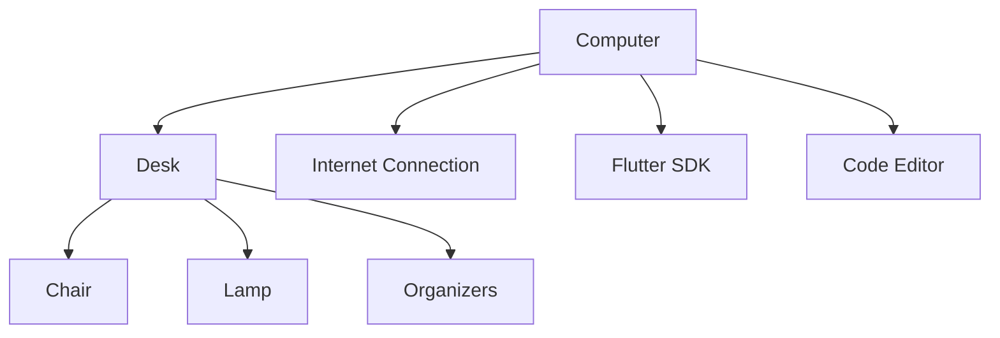

## 1.2.1 Getting the Right Tools

Welcome to the exciting world of coding! Before we dive into creating amazing apps with Flutter, let's make sure you have everything you need to set up your perfect coding space. This section will guide you through the essential tools and setup required to embark on your coding adventure.

### Objective

Our goal is to help you create a comfortable and efficient workspace where you can focus on learning and coding. We'll cover the physical and digital tools you'll need, along with some tips to keep your space organized and safe.

### Explanation: The Necessary Tools

To start coding, you'll need a few key items. Let's break them down:

#### 1. A Computer

Your computer is your main tool for coding. It doesn't have to be the latest model, but it should meet the following requirements:

- **Operating System:** Windows, macOS, or Linux.
- **Processor:** At least a dual-core processor.
- **RAM:** 4GB or more is recommended.
- **Storage:** Enough space to install software and save your projects.

#### 2. Internet Connection

A stable internet connection is crucial for downloading software, accessing online resources, and collaborating with others. Make sure your internet is reliable and fast enough for your needs.

#### 3. Comfortable Workspace

Create a space where you can work comfortably for extended periods. Consider the following:

- **Desk and Chair:** Ensure your desk is at a comfortable height and your chair provides good back support.
- **Lighting:** Good lighting reduces eye strain. Natural light is best, but a desk lamp can help if needed.
- **Organization:** Keep your workspace tidy. Use organizers for cables and stationery.

### Checklist: Items Needed

Here's a simple checklist to ensure you have everything ready:

- [ ] Computer with necessary specifications
- [ ] Reliable internet connection
- [ ] Desk and comfortable chair
- [ ] Adequate lighting
- [ ] Organizers for a tidy workspace
- [ ] Flutter SDK installed
- [ ] Code editor (e.g., Visual Studio Code)

### Safety Tips

Coding is fun, but it's important to stay safe and healthy. Here are some tips:

- **Take Breaks:** Every hour, take a short break to stretch and rest your eyes.
- **Ergonomics:** Adjust your chair and monitor to prevent strain.
- **Online Safety:** Be cautious when downloading software. Only use trusted sources.

### Visuals: Ideal Coding Setup

Let's visualize what an ideal coding setup looks like. Below is a diagram illustrating a well-organized workspace:

### Personalizing Your Workspace

Your workspace should reflect your personality. Add some personal touches:

- **Decorations:** Posters, plants, or photos can make your space inviting.
- **Colors:** Use colors that make you feel happy and focused.
- **Music:** If it helps you concentrate, play some background music.

By setting up your coding space thoughtfully, you'll create an environment that supports your learning and creativity. Now that you're equipped with the right tools, you're ready to start coding with Flutter!

## Quiz Time!



### What is the minimum recommended RAM for a computer used for coding?

- [ ] 2GB
- [x] 4GB
- [ ] 8GB
- [ ] 16GB

> **Explanation:** 4GB of RAM is recommended to ensure smooth operation of coding software and multitasking.

### Why is a stable internet connection important for coding?

- [x] For downloading software and accessing resources
- [ ] For playing online games
- [ ] For watching movies
- [ ] For sending emails

> **Explanation:** A stable internet connection is crucial for downloading necessary software, accessing online tutorials, and collaborating with others.

### Which of the following is NOT a recommended feature for a coding workspace?

- [ ] Comfortable chair
- [ ] Good lighting
- [x] Loud background noise
- [ ] Organized desk

> **Explanation:** Loud background noise can be distracting and is not recommended for a productive coding environment.

### What should you do every hour while coding?

- [x] Take a short break
- [ ] Drink coffee
- [ ] Check social media
- [ ] Watch TV

> **Explanation:** Taking short breaks helps prevent eye strain and keeps you refreshed.

### What is the purpose of organizers in a coding workspace?

- [x] To keep the workspace tidy
- [ ] To store snacks
- [ ] To display books
- [ ] To hold clothes

> **Explanation:** Organizers help keep your workspace tidy by managing cables and stationery.

### What is the role of the Flutter SDK in coding?

- [x] It provides the tools needed to build apps
- [ ] It is a type of computer hardware
- [ ] It is a music player
- [ ] It is a video editing software

> **Explanation:** The Flutter SDK is a software development kit that provides the necessary tools to build apps.

### Which code editor is recommended for Flutter development?

- [x] Visual Studio Code
- [ ] Microsoft Word
- [ ] Adobe Photoshop
- [ ] Google Chrome

> **Explanation:** Visual Studio Code is a popular code editor used for Flutter development due to its features and extensions.

### What should you adjust to prevent strain while coding?

- [x] Chair and monitor
- [ ] Keyboard and mouse
- [ ] Desk and lamp
- [ ] Internet connection

> **Explanation:** Adjusting your chair and monitor helps maintain good posture and prevent strain.

### What is a good way to personalize your workspace?

- [x] Add decorations
- [ ] Use a small desk
- [ ] Keep it dark
- [ ] Remove all personal items

> **Explanation:** Adding decorations like posters or plants can make your workspace more inviting and personalized.

### True or False: It's important to download software from trusted sources.

- [x] True
- [ ] False

> **Explanation:** Downloading software from trusted sources ensures that you avoid malware and other security risks.


