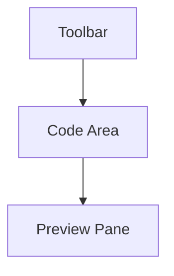
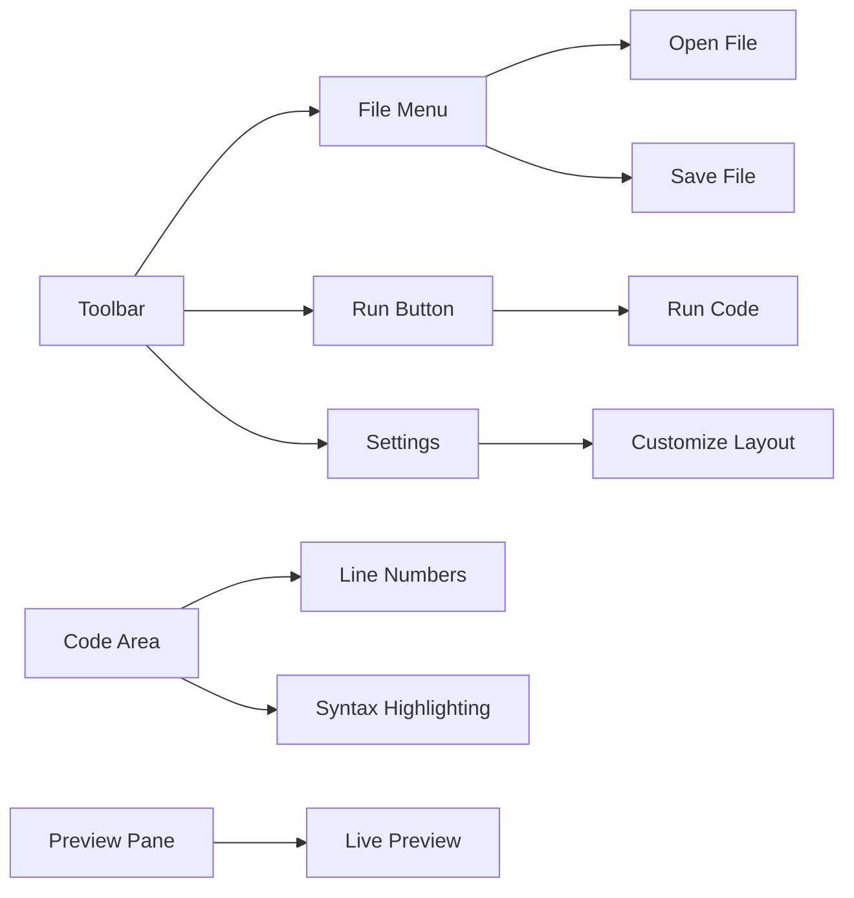

## 1.2.3 Exploring the Code Editor

Welcome to the exciting world of coding! In this section, we'll explore the code editor, the magical place where you'll write your Flutter code. Think of it as your creative canvas, ready for you to bring your ideas to life. Let's dive in and discover what makes the code editor such a powerful tool for young coders like you!

### Objective

Our goal is to help you become familiar with the code editor environment. By the end of this section, you'll know the main parts of the editor and feel confident navigating it as you start your coding journey.

### Overview of the Code Editor

A code editor is a special program where you write and edit your code. It's like a digital notebook, but much cooler! Here's a look at the main parts of the code editor:

- **Toolbar:** This is like the control panel of your editor. It has buttons and menus that help you perform various tasks, such as saving your work, running your code, and more.
- **Code Area:** This is your blank canvas where you type your code. It's where all the magic happens!
- **Preview Pane:** Some editors have a preview pane that shows you what your app will look like as you code. It's like having a window into your app's world.

Let's visualize these parts using a diagram:



### Hands-On Activity: Exploring the Code Editor

Now it's time to get hands-on! Follow these steps to explore your code editor:

1. **Open the Code Editor:** Launch the code editor on your computer. If you're using Visual Studio Code, you can open it by clicking its icon on your desktop or in your applications folder.

2. **Find the Toolbar:** Look at the top of the editor. You'll see the toolbar with various icons and menus. Try clicking on a few to see what they do.

3. **Type a Simple Line of Code:** In the code area, type the following line of code:

   ```dart
   print('Hello, Flutter!');
   ```

   This line of code tells the computer to display the message "Hello, Flutter!" on the screen.

4. **Run Your Code:** Use the toolbar to find the "Run" button or menu option. Click it to see your code in action!

5. **Explore the Preview Pane:** If your editor has a preview pane, take a look at how your app appears. Notice how changes in your code affect the preview.

### Visuals: Understanding the Code Editor Interface

Here's a more detailed diagram of the code editor interface, highlighting the key areas:



### Tips for Navigating the Code Editor

Navigating the code editor can be easy and fun with these beginner-friendly tips:

- **Use Shortcuts:** Many editors have keyboard shortcuts to help you work faster. For example, pressing `Ctrl + S` (or `Cmd + S` on a Mac) saves your work quickly.
- **Customize Your Layout:** Most editors let you change the layout to suit your preferences. Try moving panels around or changing the theme to make it more comfortable for you.
- **Explore the Settings:** Dive into the settings to discover features that can enhance your coding experience, like changing the font size or enabling line numbers.

### Language and Analogies

Let's use some analogies to make these concepts easier to understand:

- **Toolbar as a Control Panel:** Imagine the toolbar as the dashboard of a spaceship. It has all the buttons and controls you need to navigate your coding journey.
- **Code Area as a Blank Canvas:** Think of the code area as a blank canvas where you can paint your ideas with code. Each line you write adds a new stroke to your masterpiece.
- **Preview Pane as a Window:** The preview pane is like a window into your app's world, showing you how your code comes to life.

### Conclusion

Exploring the code editor is an exciting step in your coding adventure. By understanding its main parts and practicing with hands-on activities, you're well on your way to becoming a confident coder. Remember, the code editor is your creative space, so have fun experimenting and bringing your ideas to life!

## Quiz Time!



### What is the main purpose of the code editor?

- [x] To write and edit code
- [ ] To play games
- [ ] To browse the internet
- [ ] To watch videos

> **Explanation:** The code editor is a special program designed for writing and editing code, making it the primary tool for coding.

### What is the toolbar in a code editor compared to?

- [x] A control panel
- [ ] A blank canvas
- [ ] A window
- [ ] A notebook

> **Explanation:** The toolbar is like a control panel, providing buttons and menus to perform various tasks in the editor.

### What is the code area in the editor?

- [x] The space where you type your code
- [ ] The area where you see the app preview
- [ ] The section with buttons and menus
- [ ] The place to save files

> **Explanation:** The code area is where you type your code, serving as your creative canvas for coding.

### What does the preview pane show?

- [x] What your app will look like
- [ ] A list of files
- [ ] A menu of options
- [ ] A history of changes

> **Explanation:** The preview pane displays a live preview of your app, showing how your code affects its appearance.

### Which shortcut is commonly used to save your work?

- [x] Ctrl + S (or Cmd + S on Mac)
- [ ] Ctrl + P
- [ ] Ctrl + Z
- [ ] Ctrl + C

> **Explanation:** Ctrl + S (or Cmd + S on Mac) is a common shortcut for saving your work quickly in the editor.

### What can you do in the settings of a code editor?

- [x] Customize the layout
- [ ] Play music
- [ ] Watch videos
- [ ] Browse the internet

> **Explanation:** The settings allow you to customize the layout and other features of the code editor to suit your preferences.

### What analogy is used for the code area?

- [x] A blank canvas
- [ ] A control panel
- [ ] A window
- [ ] A spaceship

> **Explanation:** The code area is compared to a blank canvas, where you can paint your ideas with code.

### What is the first step in the hands-on activity?

- [x] Open the code editor
- [ ] Type a line of code
- [ ] Run the code
- [ ] Explore the preview pane

> **Explanation:** The first step is to open the code editor, which is necessary before you can start typing and running code.

### What does the line `print('Hello, Flutter!');` do?

- [x] Displays the message "Hello, Flutter!"
- [ ] Saves the file
- [ ] Opens a new window
- [ ] Closes the editor

> **Explanation:** The line `print('Hello, Flutter!');` is a simple command that tells the computer to display the message "Hello, Flutter!" on the screen.

### True or False: The preview pane is like a window into your app's world.

- [x] True
- [ ] False

> **Explanation:** True. The preview pane is like a window into your app's world, showing you how your code comes to life.


