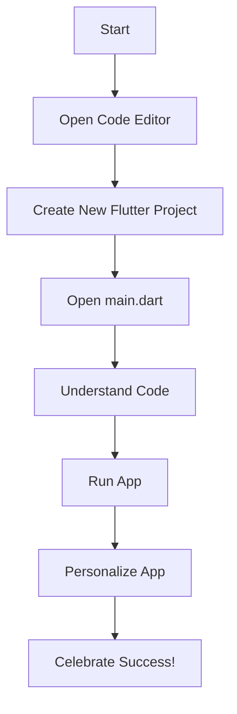

## 1.2.4 Creating Your First Project

Welcome to an exciting part of your coding adventure! Today, we're going to create your very first Flutter project. This is a big step, and it's going to be a lot of fun. We'll start with a simple "Hello, World!" app. This project will help you understand the basics of Flutter and give you the confidence to explore more complex projects in the future.

### Project Introduction: The "Hello, World!" App

The "Hello, World!" app is a classic first project for anyone learning to code. It's a simple program that displays the message "Hello, World!" on the screen. This project is perfect for beginners because it introduces you to the basic structure of a Flutter app and gives you a chance to see your code come to life.

### Step-by-Step Instructions

Let's dive into creating your first Flutter project. Follow these steps carefully, and you'll have your app up and running in no time!

#### Step 1: Open Your Code Editor

1. **Launch your code editor**: Open the code editor you installed earlier. This is where you'll write and manage your Flutter code.

#### Step 2: Create a New Flutter Project

2. **Start a new project**: In your code editor, find the option to create a new project. This might be under a menu labeled "File" or "Project."

3. **Select Flutter project**: Choose "Flutter" as the type of project you want to create. This tells the editor to set up everything you need for a Flutter app.

4. **Name your project**: Give your project a name. How about "HelloWorldApp"? Make sure to use lowercase letters and no spaces.

5. **Choose a location**: Decide where you want to save your project on your computer. Pick a folder that's easy to find.

#### Step 3: Set Up Your Project

6. **Wait for setup**: Your code editor will now set up the project. This might take a few moments, so be patient. It's creating all the files and folders you need.

7. **Explore the project structure**: Once setup is complete, you'll see a list of files and folders in your project. Don't worry if it looks complicated. We'll focus on the important parts.

#### Step 4: Open the Main File

8. **Find `main.dart`**: Look for a file named `main.dart` in the `lib` folder. This is the main file where you'll write your code.

9. **Open `main.dart`**: Double-click on `main.dart` to open it in the editor. You'll see some code already written there.

#### Step 5: Understand the Code

Let's take a closer look at the code in `main.dart`. Here's a simplified version of what you might see:

```dart
import 'package:flutter/material.dart';

void main() {
  runApp(MyApp());
}

class MyApp extends StatelessWidget {
  @override
  Widget build(BuildContext context) {
    return MaterialApp(
      home: Scaffold(
        appBar: AppBar(
          title: Text('Hello, World!'),
        ),
        body: Center(
          child: Text('Hello, World!'),
        ),
      ),
    );
  }
}
```

#### Code Explanation

- **Import Statement**: `import 'package:flutter/material.dart';` - This line brings in the Flutter material library, which provides many useful tools for building apps.

- **Main Function**: `void main() { runApp(MyApp()); }` - This is the starting point of your app. It runs the `MyApp` class.

- **MyApp Class**: `class MyApp extends StatelessWidget { ... }` - This class defines your app. It extends `StatelessWidget`, meaning it doesn't change over time.

- **Build Method**: `Widget build(BuildContext context) { ... }` - This method describes how to display your app. It returns a `MaterialApp` widget.

- **MaterialApp**: `MaterialApp( ... )` - This widget sets up the basic structure of your app.

- **Scaffold**: `Scaffold( ... )` - This widget provides a framework for your app's visual structure, including an app bar and body.

- **AppBar and Body**: `appBar: AppBar(...), body: Center(...)` - The `AppBar` displays a title, and the `body` contains a `Center` widget that centers its child, which is a `Text` widget displaying "Hello, World!".

#### Step 6: Run Your App

10. **Run the app**: Look for a "Run" button or menu option in your code editor. Click it to start your app. This might take a moment as the editor compiles your code and launches the app.

11. **See the result**: Once the app is running, you should see a screen with "Hello, World!" displayed. Congratulations, you've created your first Flutter app!

### Interactive Element: Personalize Your App

Now that you've got your app running, let's make it your own. Try changing the text in the `Text` widget to something personal, like "Hello, [Your Name]!" Here's how:

1. **Find the `Text` widget**: Look for the line `child: Text('Hello, World!'),`.

2. **Change the text**: Replace `'Hello, World!'` with your own message, like `'Hello, [Your Name]!'`.

3. **Run the app again**: Click the "Run" button to see your changes.

### Visuals: Project Structure and Code Flow

To help you visualize how your project is structured and how the code flows, here's a simple diagram:



### Celebrate Your Success!

You've just completed your first Flutter project! This is a huge accomplishment, and you should be very proud. You've learned how to set up a project, write basic code, and run your app. Keep experimenting and have fun with your new skills!

## Quiz Time!



### What is the purpose of the "Hello, World!" app?

- [x] To introduce beginners to the basic structure of a Flutter app
- [ ] To create a complex game
- [ ] To display a list of items
- [ ] To connect to the internet

> **Explanation:** The "Hello, World!" app is a simple project designed to introduce beginners to the basic structure of a Flutter app.

### What file do you write your main Flutter code in?

- [x] main.dart
- [ ] index.html
- [ ] style.css
- [ ] app.js

> **Explanation:** The main Flutter code is written in the `main.dart` file.

### What does the `runApp(MyApp())` function do?

- [x] It starts the Flutter app
- [ ] It stops the Flutter app
- [ ] It saves the Flutter app
- [ ] It deletes the Flutter app

> **Explanation:** The `runApp(MyApp())` function starts the Flutter app by running the `MyApp` class.

### What widget is used to provide a basic visual structure for the app?

- [x] Scaffold
- [ ] Container
- [ ] Row
- [ ] Column

> **Explanation:** The `Scaffold` widget provides a basic visual structure for the app, including an app bar and body.

### How can you personalize your "Hello, World!" app?

- [x] By changing the text in the `Text` widget
- [ ] By adding more files
- [ ] By deleting the `main.dart` file
- [ ] By closing the code editor

> **Explanation:** You can personalize your "Hello, World!" app by changing the text in the `Text` widget to display a custom message.

### What does the `MaterialApp` widget do?

- [x] It sets up the basic structure of the app
- [ ] It plays music
- [ ] It connects to the internet
- [ ] It saves data

> **Explanation:** The `MaterialApp` widget sets up the basic structure of the app.

### What is the role of the `AppBar` widget?

- [x] To display a title at the top of the app
- [ ] To play a video
- [ ] To show a list of items
- [ ] To connect to a database

> **Explanation:** The `AppBar` widget displays a title at the top of the app.

### What should you do if your app doesn't run correctly?

- [x] Check for errors in the code and try running it again
- [ ] Delete the project
- [ ] Ignore it
- [ ] Close the computer

> **Explanation:** If your app doesn't run correctly, check for errors in the code and try running it again.

### What does the `Center` widget do?

- [x] It centers its child widget on the screen
- [ ] It plays a sound
- [ ] It changes the background color
- [ ] It saves a file

> **Explanation:** The `Center` widget centers its child widget on the screen.

### True or False: The "Hello, World!" app is a good starting point for learning Flutter.

- [x] True
- [ ] False

> **Explanation:** True. The "Hello, World!" app is a simple and effective starting point for learning Flutter.


