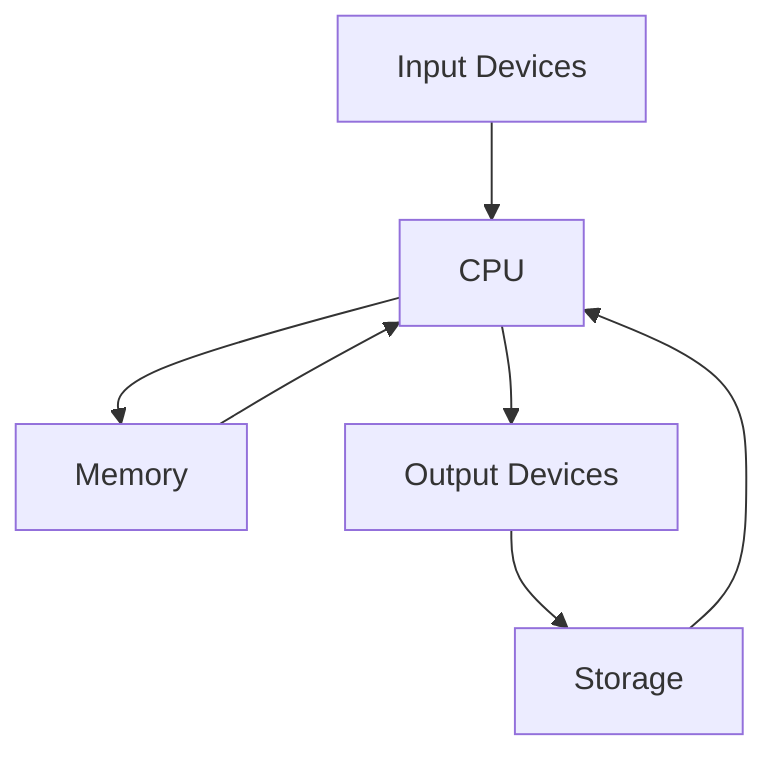

## 1.3.1 What is a Computer?

Welcome to the fascinating world of computers! In this section, we'll explore what a computer is, how it works, and why it's such an important tool in our everyday lives. We'll break down the complex parts of a computer into simple, easy-to-understand pieces, using fun analogies and visuals to help you grasp these concepts. So, let's dive in and discover the magic behind the machines that power our digital world!

### What is a Computer?

A computer is an electronic device that can perform a variety of tasks by following instructions given to it. These tasks can range from simple calculations to complex simulations, and they are made possible by the computer's ability to process information quickly and accurately.

### Parts of a Computer

To understand how a computer works, let's take a closer look at its main components:

#### 1. Central Processing Unit (CPU)

The CPU, often referred to as the "brain" of the computer, is responsible for executing instructions and processing data. Just like your brain helps you think and make decisions, the CPU processes information and makes decisions based on the instructions it receives.

#### 2. Memory (RAM)

Memory, or RAM (Random Access Memory), is like a notebook where the computer temporarily stores information it is currently working on. This allows the CPU to quickly access and process data without having to retrieve it from the slower storage.

#### 3. Storage

Storage is where the computer keeps all its data and files, even when it's turned off. Think of it as a giant filing cabinet where everything is neatly organized and stored for future use. Common types of storage include hard drives and solid-state drives.

#### 4. Peripherals

Peripherals are external devices that connect to the computer to perform specific functions. These include keyboards, mice, printers, and monitors. They help us interact with the computer and expand its capabilities.

### How Do These Parts Work Together?

Now that we know the main parts of a computer, let's see how they work together to perform tasks:

1. **Input:** When you type on a keyboard or click a mouse, you're sending instructions to the computer.
2. **Processing:** The CPU receives these instructions and processes them using data stored in memory.
3. **Output:** The results of the processing are displayed on the monitor or sent to a printer.
4. **Storage:** If you save your work, it's stored on the computer's storage for later use.

Here's a simple diagram to illustrate how these components interact:

### Fun Fact: The First Computer

Did you know that the first electronic computer, called the ENIAC, was built in 1945? It was as big as a room and used thousands of vacuum tubes to perform calculations. Today, computers are much smaller and more powerful, fitting into our pockets as smartphones!

### Analogies to Help You Understand

- **CPU as the Brain:** Just like your brain processes information and makes decisions, the CPU processes data and executes instructions.
- **Memory as a Notebook:** Imagine RAM as a notebook where you jot down notes for quick access while working on a project.
- **Storage as a Filing Cabinet:** Think of storage as a filing cabinet where you keep all your important documents and files for future reference.

### Why Are Computers Important?

Computers have become an essential part of our lives, helping us with everything from learning and communication to entertainment and work. By understanding how computers work, you can unlock the potential to create amazing things, like apps and games, using coding!

## Quiz Time!



### What is the CPU often referred to as?

- [x] The brain of the computer
- [ ] The heart of the computer
- [ ] The eyes of the computer
- [ ] The hands of the computer

> **Explanation:** The CPU is often called the "brain" of the computer because it processes information and executes instructions.

### What does RAM stand for?

- [ ] Read Access Memory
- [x] Random Access Memory
- [ ] Rapid Access Memory
- [ ] Real-time Access Memory

> **Explanation:** RAM stands for Random Access Memory, which is used for temporarily storing data that the CPU is currently working on.

### What is the main function of storage in a computer?

- [ ] To process data
- [x] To store data permanently
- [ ] To display data
- [ ] To input data

> **Explanation:** Storage is used to keep data and files permanently, even when the computer is turned off.

### Which of the following is a peripheral device?

- [ ] CPU
- [ ] RAM
- [x] Keyboard
- [ ] Motherboard

> **Explanation:** A keyboard is a peripheral device that allows users to input data into the computer.

### How do input devices interact with the CPU?

- [x] They send instructions to the CPU
- [ ] They receive instructions from the CPU
- [ ] They store data for the CPU
- [ ] They process data for the CPU

> **Explanation:** Input devices send instructions to the CPU, which processes them to perform tasks.

### What was the name of the first electronic computer?

- [ ] UNIVAC
- [ ] IBM 701
- [x] ENIAC
- [ ] Apple I

> **Explanation:** The first electronic computer was called ENIAC, built in 1945.

### What analogy is used to describe RAM in the article?

- [ ] A filing cabinet
- [x] A notebook
- [ ] A library
- [ ] A toolbox

> **Explanation:** RAM is compared to a notebook where temporary information is stored for quick access.

### What is the role of output devices in a computer?

- [ ] To input data
- [ ] To store data
- [x] To display or output data
- [ ] To process data

> **Explanation:** Output devices display or output the results of the computer's processing.

### Which component is responsible for executing instructions in a computer?

- [x] CPU
- [ ] RAM
- [ ] Storage
- [ ] Peripherals

> **Explanation:** The CPU is responsible for executing instructions and processing data.

### True or False: Storage is used to temporarily store data that the CPU is currently working on.

- [ ] True
- [x] False

> **Explanation:** Storage is used to permanently store data, while RAM is used for temporary storage.



By understanding these basic components and how they work together, you're on your way to becoming a tech-savvy coder! Keep exploring and experimenting with computers, and soon you'll be creating your own amazing projects.
