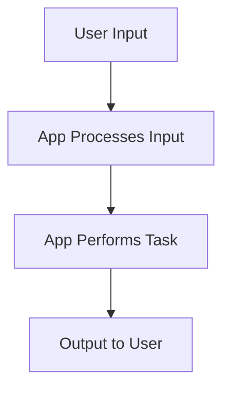

## 1.3.2 How Do Apps Work?

Welcome to the fascinating world of apps! Have you ever wondered how the games you play, the calculators you use, or the drawing tools you love actually work? Let's dive into the magical world of applications and discover how they function on your computer or mobile device.

### What Are Apps?

Apps, short for applications, are special programs designed to perform specific tasks. Think of them as little helpers on your device that can do everything from playing music to helping you learn math. Each app is created to solve a particular problem or provide a specific service, making our lives easier and more fun!

### How Do Apps Work?

At their core, apps are like a series of instructions that tell your device what to do. When you interact with an app, you're giving it inputs, like tapping a button or typing a message. The app then processes these inputs and provides outputs, such as displaying a new screen or playing a sound.

Let's break it down with a simple flowchart to see how this process works:

- **User Input:** This is where you come in! You might tap a button, swipe the screen, or type some text.
- **App Processes Input:** The app takes your input and figures out what to do with it. This is like the app's brain working to understand your request.
- **App Performs Task:** Based on your input, the app carries out a specific task. This could be anything from calculating a sum to loading a new level in a game.
- **Output to User:** Finally, the app shows you the result of your input. This could be a message, a new screen, or even a sound.

### Relatable Examples of Apps

Let's look at some apps you might use every day and see how they work:

1. **Games:** When you play a game, you're constantly giving inputs by moving characters or solving puzzles. The game processes these inputs to update the game world and show you new challenges.

2. **Calculator:** When you enter numbers and press the equals button, the calculator processes your inputs to perform mathematical operations and gives you the result.

3. **Drawing Tools:** As you draw on the screen, the app processes your touch inputs to create lines and shapes, allowing you to create beautiful art.

### Interactive Element: Think About Your Favorite App

Now it's your turn! Think about your favorite app. What does it do? How do you interact with it? Try to describe how it might take your inputs and provide outputs. This exercise will help you understand the magic behind the apps you love.

### Conclusion

Apps are amazing tools that help us in countless ways. By understanding how they work, you can start to see the possibilities of what you can create with coding. Remember, every app starts with an idea and a series of instructions that bring it to life. Who knows? Maybe one day you'll create an app that others will love!

## Quiz Time!



### What is an app?

- [x] A program that performs specific tasks on a device
- [ ] A type of computer hardware
- [ ] A physical book
- [ ] A television show

> **Explanation:** An app is a program designed to perform specific tasks on a computer or mobile device.

### What is the first step in how an app works?

- [x] User Input
- [ ] App Performs Task
- [ ] Output to User
- [ ] App Processes Input

> **Explanation:** The first step is user input, where the user interacts with the app by tapping, typing, or swiping.

### What does the app do after receiving user input?

- [ ] Outputs to User
- [ ] Performs Task
- [x] Processes Input
- [ ] Shuts Down

> **Explanation:** After receiving user input, the app processes the input to understand what action to take.

### Which of the following is an example of an app?

- [x] Calculator
- [ ] A pencil
- [ ] A chair
- [ ] A lamp

> **Explanation:** A calculator is an app that performs mathematical operations.

### What is the output in an app?

- [x] The result shown to the user
- [ ] The initial user input
- [ ] The app's code
- [ ] The device's battery level

> **Explanation:** The output is the result or response that the app provides to the user after processing the input.

### What might a drawing app do with your input?

- [x] Create lines and shapes on the screen
- [ ] Play a song
- [ ] Turn off the device
- [ ] Open a new app

> **Explanation:** A drawing app processes your touch inputs to create lines and shapes on the screen.

### What is the purpose of an app?

- [x] To perform specific tasks or solve problems
- [ ] To replace the device's operating system
- [ ] To delete files
- [ ] To make phone calls

> **Explanation:** Apps are designed to perform specific tasks or solve problems, making them useful tools.

### Which of these is NOT a step in how an app works?

- [ ] User Input
- [ ] App Processes Input
- [x] Device Shutdown
- [ ] Output to User

> **Explanation:** Device shutdown is not a step in how an app works. The steps involve user input, processing, performing tasks, and output.

### How can you interact with an app?

- [x] By tapping, typing, or swiping
- [ ] By speaking to it
- [ ] By looking at it
- [ ] By shaking the device

> **Explanation:** You interact with an app by providing inputs such as tapping, typing, or swiping.

### True or False: Every app starts with an idea and a series of instructions.

- [x] True
- [ ] False

> **Explanation:** True. Every app begins with an idea and is built using a series of instructions that tell the device what to do.


