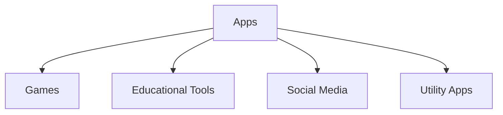

---

linkTitle: "1.3.3 Different Types of Apps"
title: "Exploring Different Types of Apps: Games, Educational Tools, Social Media, and Utilities"
description: "Discover the diverse world of apps, including games, educational tools, social media, and utility apps, and learn how each type can be both fun and useful."
categories:
- Coding for Kids
- App Development
- Educational Technology
tags:
- Apps
- Games
- Educational Tools
- Social Media
- Utility Apps
date: 2024-10-25
type: docs
nav_weight: 1330

canonical: "https://fluttermasterylibrary.com/5/1/3/3"
license: "© 2023 Tokenizer Inc. CC BY-NC-SA 4.0"
---

## 1.3.3 Different Types of Apps

Welcome to the exciting world of apps! In this section, we'll explore the different types of applications you can find on your devices. Apps are like magical tools that can entertain, educate, connect, and help us in many ways. Let's dive into the various categories of apps and see what makes each one special.

### Categories of Apps

Apps come in all shapes and sizes, each designed to serve a particular purpose. Here are some common categories:

#### 1. Games

Games are apps designed for fun and entertainment. They can be simple puzzles, adventurous quests, or competitive challenges. Games often test your skills, reflexes, and creativity. Whether you're solving a mystery or racing cars, games are a great way to have fun and relax.

**Example:** Angry Birds, Minecraft, Candy Crush

#### 2. Educational Tools

Educational apps are designed to help you learn new things. They can teach you math, science, languages, and much more. These apps make learning interactive and enjoyable, often using quizzes, videos, and interactive lessons to engage users.

**Example:** Duolingo, Khan Academy, ABCmouse

#### 3. Social Media

Social media apps connect people from all over the world. They allow you to share photos, videos, and messages with friends and family. These apps are great for staying in touch and discovering new communities and interests.

**Example:** Facebook, Instagram, Twitter

#### 4. Utility Apps

Utility apps are tools that help you perform specific tasks. They can be calculators, weather apps, or even apps that help you organize your schedule. These apps are designed to make your life easier and more efficient.

**Example:** Google Maps, Evernote, Weather Channel

### Visual Examples

Let's visualize these categories with a simple diagram:

### Interactive Activity: Categorize Your Apps

Now it's your turn! Think about the apps you use every day. Can you categorize them into the types we've discussed? Here's a list to get you started:

- YouTube
- Zoom
- Spotify
- TikTok
- Google Classroom

Try to place each app into one of the categories: Games, Educational Tools, Social Media, or Utility Apps. Discuss with a friend or family member why you placed each app in its category.

### Benefits of Different Types of Apps

Each type of app offers unique benefits:

- **Games**: Improve problem-solving skills, hand-eye coordination, and provide entertainment.
- **Educational Tools**: Enhance learning, offer new knowledge, and make studying fun.
- **Social Media**: Connect with others, share experiences, and discover new interests.
- **Utility Apps**: Increase productivity, help with daily tasks, and provide useful information.

By understanding the different types of apps, you can choose the ones that best fit your needs and interests. Whether you're looking to learn something new, stay connected, or just have fun, there's an app for that!

## Quiz Time!



### Which type of app is designed primarily for entertainment and fun?

- [x] Games
- [ ] Educational Tools
- [ ] Social Media
- [ ] Utility Apps

> **Explanation:** Games are apps designed for entertainment and fun, often involving challenges and interactive play.

### What type of app would you use to learn a new language?

- [ ] Games
- [x] Educational Tools
- [ ] Social Media
- [ ] Utility Apps

> **Explanation:** Educational tools are designed to help users learn new skills or subjects, such as languages.

### Which category does Facebook belong to?

- [ ] Games
- [ ] Educational Tools
- [x] Social Media
- [ ] Utility Apps

> **Explanation:** Facebook is a social media app that connects people and allows them to share content.

### What type of app is Google Maps?

- [ ] Games
- [ ] Educational Tools
- [ ] Social Media
- [x] Utility Apps

> **Explanation:** Google Maps is a utility app that helps users navigate and find locations.

### Which type of app is Duolingo?

- [ ] Games
- [x] Educational Tools
- [ ] Social Media
- [ ] Utility Apps

> **Explanation:** Duolingo is an educational tool designed to help users learn new languages.

### What is a common feature of social media apps?

- [ ] Solving puzzles
- [ ] Teaching math
- [x] Connecting people
- [ ] Calculating numbers

> **Explanation:** Social media apps are designed to connect people and allow them to share content.

### Which type of app is likely to have quizzes and interactive lessons?

- [ ] Games
- [x] Educational Tools
- [ ] Social Media
- [ ] Utility Apps

> **Explanation:** Educational tools often include quizzes and interactive lessons to engage users in learning.

### What type of app is Instagram?

- [ ] Games
- [ ] Educational Tools
- [x] Social Media
- [ ] Utility Apps

> **Explanation:** Instagram is a social media app where users can share photos and videos.

### Which category does a calculator app belong to?

- [ ] Games
- [ ] Educational Tools
- [ ] Social Media
- [x] Utility Apps

> **Explanation:** A calculator app is a utility app that helps perform mathematical calculations.

### True or False: Utility apps are mainly for entertainment.

- [ ] True
- [x] False

> **Explanation:** Utility apps are designed to help with specific tasks and increase productivity, not primarily for entertainment.


