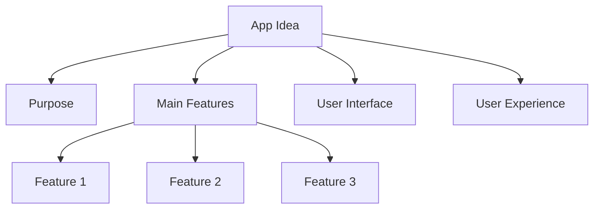

## 1.3.4 Planning to Build an App

Welcome to the exciting world of app development! In this section, we'll embark on a journey to plan your very first app. Whether you dream of creating a fun game, a helpful tool, or an educational app, the key to success is in the planning. Let's dive into the steps that will help you transform your ideas into reality.

### Setting Goals for Your App Development Journey

Before you start coding, it's important to set clear goals for what you want to achieve with your app. Here are some questions to consider:

- **What problem does your app solve?** Think about a challenge or need that your app can address.
- **Who is your app for?** Identify your target audience. Is it for kids, parents, teachers, or everyone?
- **What do you want users to feel or experience?** Consider the emotions or experiences you want your app to evoke.

Setting these goals will guide your decisions throughout the development process and keep you focused on creating an app that matters.

### Brainstorming: Unleash Your Creativity

Now that you have your goals in mind, it's time to brainstorm ideas for your app. This is where you let your imagination run wild! Here are some tips to help you brainstorm effectively:

- **Think about your interests:** What are you passionate about? Can you create an app related to your hobbies or favorite subjects?
- **Look for inspiration:** Explore existing apps to see what you like and what you think could be improved.
- **Ask for feedback:** Talk to friends, family, or teachers about your ideas. They might have valuable insights or suggestions.

Remember, no idea is too big or too small. Write down everything that comes to mind, and don't worry about making it perfect at this stage.

### Planning Steps: From Idea to Blueprint

Once you've brainstormed some ideas, it's time to start planning. Planning involves organizing your thoughts and deciding on the key elements of your app. Here are some basic planning steps to follow:

1. **Define the Purpose:** Clearly state what your app will do and why it's important.
2. **Identify Main Features:** List the essential features your app needs to have. For example, if you're creating a game, you might need levels, characters, and a scoring system.
3. **Design the User Interface:** Think about how your app will look. Sketch out the main screens and decide on the layout and colors.
4. **Plan the User Experience:** Consider how users will interact with your app. What actions will they take, and how will the app respond?

### Visual Aids: Creating a Mind Map

To help organize your ideas, let's create a simple mind map using Mermaid.js. A mind map is a visual tool that shows the relationships between different parts of your app.

This mind map helps you see the big picture and ensures that all aspects of your app are connected and aligned with your goals.

### Activity: Sketch Your App Ideas

Now it's your turn to bring your ideas to life! Use the template below to sketch your app ideas. You can draw the main screens, write down features, and describe how users will interact with your app.

**App Planning Worksheet:**

1. **App Name:**
2. **Purpose:**
3. **Target Audience:**
4. **Main Features:**
   - Feature 1:
   - Feature 2:
   - Feature 3:
5. **Design Sketch:**
   - Draw the main screen layout.
6. **User Experience:**
   - Describe how users will navigate your app.

### Inspiring Creativity and Organization

As you plan your app, remember that creativity and organization go hand in hand. Allow yourself to explore new ideas while keeping your goals in mind. Use motivating language to inspire yourself and others:

- "Every great app starts with a simple idea."
- "Your creativity is the key to innovation."
- "Stay organized, and your app will come to life."

By following these steps and using the tools provided, you're well on your way to creating an app that not only works but also makes a difference. Happy planning!

## Quiz Time!



### What is the first step in planning an app?

- [x] Setting goals for the app
- [ ] Writing the code
- [ ] Designing the user interface
- [ ] Testing the app

> **Explanation:** Setting goals helps define the purpose and direction of the app, which is crucial before moving on to other steps.

### Why is brainstorming important in app development?

- [x] It helps generate creative ideas
- [ ] It is the final step in app development
- [ ] It ensures the app is bug-free
- [ ] It replaces the need for coding

> **Explanation:** Brainstorming is important because it allows you to explore a wide range of ideas and possibilities for your app.

### What should you consider when defining the purpose of your app?

- [x] The problem it solves
- [ ] The color scheme
- [ ] The programming language
- [ ] The app store description

> **Explanation:** Defining the purpose involves understanding the problem your app will address, which guides the entire development process.

### What is a mind map used for in app planning?

- [x] Organizing and visualizing ideas
- [ ] Writing code
- [ ] Testing the app
- [ ] Marketing the app

> **Explanation:** A mind map helps organize and visualize the relationships between different parts of your app, making planning more effective.

### Which of the following is a main feature of an app?

- [x] Levels in a game
- [ ] The app's icon
- [ ] The developer's name
- [ ] The app's price

> **Explanation:** Main features are the core functionalities of the app, such as levels in a game.

### What is the purpose of sketching your app ideas?

- [x] To visualize the design and layout
- [ ] To finalize the coding
- [ ] To publish the app
- [ ] To test the app

> **Explanation:** Sketching helps visualize the design and layout, which is essential for planning the user interface and experience.

### How can you ensure your app is user-friendly?

- [x] Plan the user experience carefully
- [ ] Use complex code
- [ ] Add as many features as possible
- [ ] Focus only on the design

> **Explanation:** Planning the user experience ensures that the app is intuitive and easy to navigate, making it user-friendly.

### What is the benefit of setting clear goals for your app?

- [x] It provides direction and focus
- [ ] It eliminates the need for testing
- [ ] It guarantees instant success
- [ ] It allows for random changes

> **Explanation:** Clear goals provide direction and focus, helping to guide the development process and ensure the app meets its intended purpose.

### What should you do if you encounter challenges during app planning?

- [x] Stay motivated and seek feedback
- [ ] Give up on the idea
- [ ] Skip to coding
- [ ] Ignore the challenges

> **Explanation:** Staying motivated and seeking feedback can help overcome challenges and improve your app planning.

### True or False: Brainstorming is only necessary at the beginning of app development.

- [ ] True
- [x] False

> **Explanation:** Brainstorming can be useful at various stages of app development to refine ideas and solve problems.


