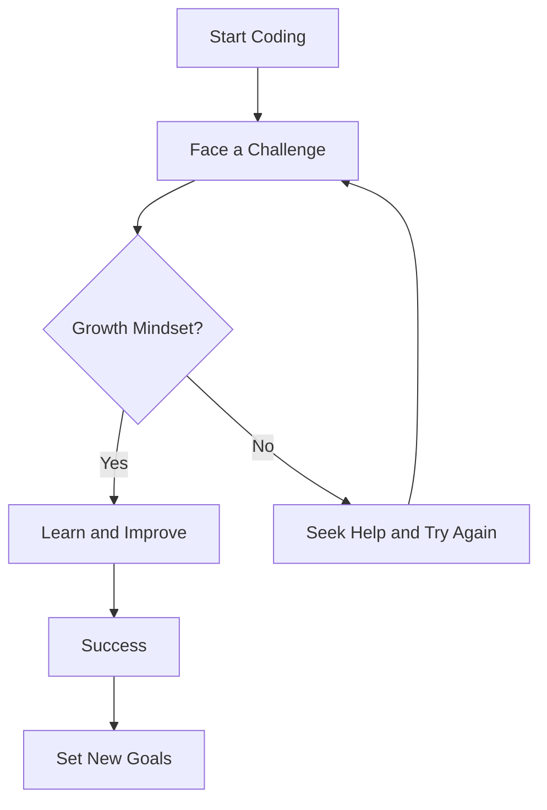

---

linkTitle: "1.4.1 The Coding Mindset"
title: "The Coding Mindset: Cultivating a Positive and Persistent Approach to Coding"
description: "Explore the essential coding mindset, focusing on growth, persistence, and resilience, with inspiring stories and practical exercises to empower young coders."
categories:
- Coding
- Education
- Mindset
tags:
- Growth Mindset
- Persistence
- Resilience
- Coding for Kids
- Inspirational Stories
date: 2024-10-25
type: docs
nav_weight: 141000
---

## 1.4.1 The Coding Mindset

Welcome to the exciting world of coding! As you embark on this journey, it's important to equip yourself with more than just technical skills. A positive and persistent mindset is your most powerful tool. Let's explore how adopting a growth mindset can transform your coding experience and lead you to success.

### Embracing the Growth Mindset

A growth mindset is the belief that your abilities and intelligence can be developed through dedication and hard work. This mindset is crucial in coding, where challenges and learning opportunities are abundant. Instead of seeing mistakes as failures, view them as stepping stones to improvement.

#### What is a Growth Mindset?

Imagine your brain as a muscle. Just like lifting weights makes your muscles stronger, tackling coding challenges strengthens your brain. With a growth mindset, you understand that effort and perseverance lead to mastery. You're not born a great coder; you become one through practice and persistence.

> **Motivational Quote:** "Success is not final, failure is not fatal: It is the courage to continue that counts." – Winston Churchill

### Stories of Persistence

Many famous coders and innovators have faced obstacles but persevered to achieve greatness. Let's look at a few inspiring examples:

- **Grace Hopper:** Known as the "Queen of Code," Grace Hopper was a pioneering computer scientist who developed the first compiler for a computer programming language. Despite facing skepticism and challenges, her persistence paved the way for modern programming.

- **Steve Jobs:** Co-founder of Apple Inc., Steve Jobs was fired from his own company. Instead of giving up, he used this setback as a springboard to innovate further, eventually returning to lead Apple to unprecedented success.

- **Margaret Hamilton:** As the lead software engineer for NASA's Apollo program, Margaret Hamilton faced numerous challenges. Her resilience and innovative thinking were crucial in landing humans on the moon.

These stories remind us that persistence and a growth mindset can overcome even the toughest obstacles.

### Building Resilience: Activities and Exercises

To cultivate a coding mindset, try these simple exercises and affirmations:

#### Set Small Goals

Break down your coding projects into smaller, manageable tasks. Celebrate each small victory to build momentum and confidence.

- **Exercise:** Choose a simple coding task, like creating a "Hello, World!" program. Once completed, set a slightly more challenging goal, such as modifying the text or adding a new feature.

#### Practice Positive Affirmations

Positive affirmations can reinforce a growth mindset. Repeat these affirmations to yourself daily:

- "I am capable of learning and growing."
- "Mistakes are opportunities to learn."
- "I will persist until I succeed."

#### Reflect on Challenges

After completing a coding task, reflect on what you learned and how you overcame difficulties. This reflection helps solidify your growth mindset.

- **Exercise:** Keep a coding journal where you note challenges faced, solutions found, and lessons learned.

### Visualizing Success

Visual aids can be powerful motivators. Consider creating a vision board with images and quotes that inspire perseverance and success in coding.

### Encouragement and Empowerment

Remember, every coder starts somewhere. Your journey is unique, and every step forward is progress. Embrace challenges with curiosity and determination. You're building skills that will serve you throughout your life, not just in coding.

> **Motivational Quote:** "The only way to do great work is to love what you do. If you haven't found it yet, keep looking. Don't settle." – Steve Jobs

### Conclusion

The coding mindset is about embracing challenges, learning from mistakes, and persisting through difficulties. With a growth mindset, you can achieve anything you set your mind to. Keep coding, keep growing, and remember: every great coder was once a beginner.

## Quiz Time!



### What is a growth mindset?

- [x] The belief that abilities can improve with effort
- [ ] The belief that abilities are fixed and cannot change
- [ ] The belief that only some people can learn to code
- [ ] The belief that coding is easy for everyone

> **Explanation:** A growth mindset is the belief that abilities can improve with effort and practice.

### Which of the following is an example of a famous coder who overcame challenges?

- [x] Grace Hopper
- [ ] Albert Einstein
- [ ] Leonardo da Vinci
- [ ] Marie Curie

> **Explanation:** Grace Hopper was a pioneering computer scientist who overcame challenges to develop the first compiler.

### What should you do when you make a mistake in coding?

- [x] View it as a learning opportunity
- [ ] Give up and try something else
- [ ] Ignore it and move on
- [ ] Blame someone else

> **Explanation:** Mistakes in coding should be viewed as learning opportunities to improve and grow.

### What is one way to build resilience in coding?

- [x] Set small, achievable goals
- [ ] Avoid difficult tasks
- [ ] Only work on easy projects
- [ ] Never ask for help

> **Explanation:** Setting small, achievable goals helps build resilience by allowing you to celebrate small victories.

### Which affirmation can help reinforce a growth mindset?

- [x] "I am capable of learning and growing."
- [ ] "I will never make mistakes."
- [x] "Mistakes are opportunities to learn."
- [ ] "I should be perfect at coding."

> **Explanation:** Positive affirmations like "I am capable of learning and growing" and "Mistakes are opportunities to learn" reinforce a growth mindset.

### What is the purpose of a vision board in coding?

- [x] To visualize success and stay motivated
- [ ] To track coding errors
- [ ] To list all coding languages
- [ ] To display completed projects only

> **Explanation:** A vision board helps visualize success and stay motivated by displaying inspirational images and quotes.

### How can reflecting on challenges help in coding?

- [x] It helps solidify a growth mindset
- [ ] It makes coding more difficult
- [ ] It is a waste of time
- [ ] It only helps advanced coders

> **Explanation:** Reflecting on challenges helps solidify a growth mindset by reinforcing learning and improvement.

### What is the role of persistence in coding?

- [x] To overcome obstacles and achieve success
- [ ] To avoid challenges
- [ ] To ensure coding is always easy
- [ ] To prevent mistakes

> **Explanation:** Persistence helps overcome obstacles and achieve success by encouraging continuous effort and learning.

### Which of the following is NOT a characteristic of a growth mindset?

- [ ] Believing abilities can improve with effort
- [ ] Viewing challenges as opportunities
- [x] Believing abilities are fixed
- [ ] Embracing mistakes as learning tools

> **Explanation:** A growth mindset involves believing abilities can improve with effort, viewing challenges as opportunities, and embracing mistakes as learning tools.

### True or False: Every great coder was once a beginner.

- [x] True
- [ ] False

> **Explanation:** True. Every great coder started as a beginner and improved through practice and persistence.


