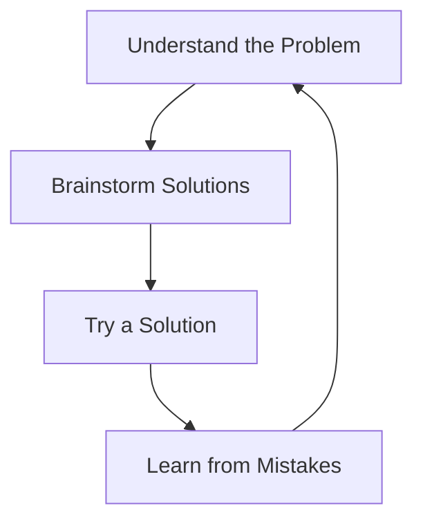

---

linkTitle: "1.4.2 Problem-Solving Skills"
title: "Problem-Solving Skills for Young Coders: A Step-by-Step Guide"
description: "Learn essential problem-solving skills for coding by breaking down complex problems into manageable parts, exploring solutions, and learning from mistakes."
categories:
- Coding
- Problem-Solving
- Education
tags:
- Problem-Solving
- Coding Skills
- Flutter
- Kids Coding
- Learning
date: 2024-10-25
type: docs
nav_weight: 1420

canonical: "https://fluttermasterylibrary.com/5/1/4/2"
license: "© 2023 Tokenizer Inc. CC BY-NC-SA 4.0"
---

## 1.4.2 Problem-Solving Skills

Welcome to the exciting world of problem-solving! As you embark on your coding journey, you'll discover that problem-solving is a crucial skill that helps you tackle challenges, both big and small. In this section, we'll explore how to break down problems, brainstorm solutions, and learn from our experiences. Let's dive in!

### Understanding Problem-Solving

Problem-solving is like being a detective. Imagine you have a big mystery to solve, and you need to gather clues, think of possible solutions, and test them out. In coding, problem-solving involves breaking down a complex problem into smaller, more manageable parts. This makes it easier to find solutions and build your app step by step.

### The Problem-Solving Process

Let's explore a simple, four-step process to help you become a problem-solving pro:

1. **Understand the Problem:** Before jumping into solutions, take a moment to understand what the problem is. Ask yourself questions like, "What am I trying to achieve?" and "What are the constraints?"

2. **Brainstorm Solutions:** Once you understand the problem, think of different ways to solve it. Don't worry about finding the perfect solution right away. The goal is to come up with as many ideas as possible.

3. **Try a Solution:** Pick one of your ideas and give it a try. This is where you get hands-on and start coding. Remember, it's okay if your first attempt doesn't work perfectly.

4. **Learn from Mistakes:** If your solution doesn't work, don't be discouraged. Mistakes are a valuable part of learning. Analyze what went wrong and use that knowledge to improve your solution.

### Interactive Exercise: Solve a Puzzle

Let's put your problem-solving skills to the test with a fun puzzle! Imagine you have a jar of candies. You need to divide them equally among your friends. Here's how you can apply the problem-solving steps:

- **Understand the Problem:** You have 12 candies and 3 friends. How can you divide the candies equally?

- **Brainstorm Solutions:** Think of different ways to divide the candies. You could give each friend one candy at a time or divide them into groups.

- **Try a Solution:** Let's try dividing the candies into groups. If you give each friend 4 candies, will it work?

- **Learn from Mistakes:** If you find that one friend gets more candies, adjust your solution. Keep trying until each friend has the same amount.

### Visualizing the Problem-Solving Process

To help you visualize the problem-solving process, here's a Mermaid.js diagram that outlines each step:

### Everyday Examples of Problem-Solving

Problem-solving isn't just for coding; it's a skill you use every day! Here are some relatable examples:

- **Getting Ready for School:** You need to decide what to wear. First, check the weather (understand the problem), think of outfit options (brainstorm solutions), try on an outfit (try a solution), and change if it doesn't fit the weather (learn from mistakes).

- **Making a Sandwich:** You want a delicious sandwich. Decide what ingredients you have (understand the problem), think of different combinations (brainstorm solutions), make the sandwich (try a solution), and adjust if it doesn't taste right (learn from mistakes).

### Encouragement for Young Coders

Remember, problem-solving is a skill that gets better with practice. Don't be afraid to make mistakes; they're stepping stones to success. As you continue your coding adventure, keep these problem-solving steps in mind, and you'll be well on your way to becoming a coding superstar!

## Quiz Time!



### What is the first step in the problem-solving process?

- [x] Understand the Problem
- [ ] Brainstorm Solutions
- [ ] Try a Solution
- [ ] Learn from Mistakes

> **Explanation:** The first step is to understand the problem, which involves identifying what you are trying to solve.

### Why is brainstorming solutions important?

- [x] It helps generate multiple ideas
- [ ] It guarantees the perfect solution
- [ ] It skips the need for understanding the problem
- [ ] It avoids making mistakes

> **Explanation:** Brainstorming is important because it helps generate multiple ideas, increasing the chances of finding a good solution.

### What should you do if your first solution doesn't work?

- [x] Learn from Mistakes
- [ ] Give up
- [ ] Ignore the problem
- [ ] Try the same solution again

> **Explanation:** If your first solution doesn't work, learn from mistakes and try to improve your approach.

### How can you apply problem-solving to everyday tasks?

- [x] By breaking tasks into smaller parts
- [ ] By ignoring the problem
- [ ] By doing everything at once
- [ ] By avoiding challenges

> **Explanation:** Problem-solving can be applied to everyday tasks by breaking them into smaller, manageable parts.

### Which of the following is an example of problem-solving?

- [x] Deciding what to wear based on the weather
- [ ] Ignoring a difficult homework assignment
- [x] Making a sandwich with available ingredients
- [ ] Avoiding new challenges

> **Explanation:** Deciding what to wear based on the weather and making a sandwich with available ingredients are examples of problem-solving.

### What is the benefit of learning from mistakes?

- [x] It helps improve future solutions
- [ ] It guarantees no future mistakes
- [ ] It avoids the need to try again
- [ ] It makes problems disappear

> **Explanation:** Learning from mistakes helps improve future solutions by understanding what went wrong.

### How does trying a solution help in problem-solving?

- [x] It tests if the idea works
- [ ] It guarantees success
- [x] It provides hands-on experience
- [ ] It avoids making mistakes

> **Explanation:** Trying a solution helps test if the idea works and provides hands-on experience.

### What is a key aspect of problem-solving in coding?

- [x] Breaking down complex problems
- [ ] Ignoring errors
- [ ] Avoiding challenges
- [ ] Skipping brainstorming

> **Explanation:** A key aspect of problem-solving in coding is breaking down complex problems into smaller parts.

### Can problem-solving skills be improved with practice?

- [x] Yes
- [ ] No

> **Explanation:** Yes, problem-solving skills can be improved with practice and experience.

### Is it okay to make mistakes while solving problems?

- [x] True
- [ ] False

> **Explanation:** True, making mistakes is a natural part of the learning process and helps improve problem-solving skills.


