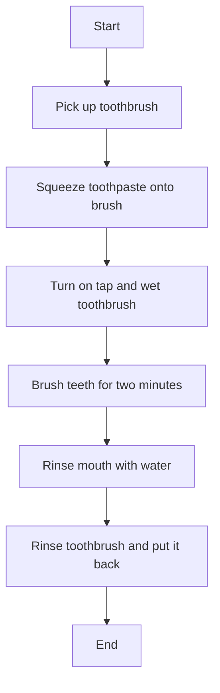

## 1.4.3 Understanding Algorithms

Welcome to the exciting world of algorithms! Today, we're going to learn about a concept that is at the heart of coding and problem-solving. Don't worry if this sounds a bit tricky at first—by the end of this section, you'll see that algorithms are all around us, and you might already be using them without even knowing it!

### What is an Algorithm?

An algorithm is simply a set of instructions that tells you how to do something or solve a problem. Think of it like a recipe in a cookbook. Just like a recipe gives you step-by-step directions to make a delicious cake, an algorithm gives a computer step-by-step instructions to complete a task.

### Real-Life Example: The Recipe for Success

Let's use a real-life example to understand algorithms better. Imagine you want to bake a cake. Here's a simple recipe you might follow:

1. Gather all your ingredients: flour, sugar, eggs, butter, and baking powder.
2. Preheat the oven to 350°F (175°C).
3. Mix the flour and baking powder in a bowl.
4. In another bowl, beat the sugar and butter until creamy.
5. Add eggs to the sugar and butter mixture and mix well.
6. Gradually add the flour mixture to the wet ingredients.
7. Pour the batter into a baking pan.
8. Bake for 30 minutes.

This recipe is an algorithm! It gives you a clear set of steps to follow to achieve your goal: a yummy cake.

### Activity: Create Your Own Algorithm

Now it's your turn to create an algorithm! Let's pick a simple daily task: brushing your teeth. Think about all the steps you take from start to finish. Here's an example to get you started:

1. Pick up your toothbrush.
2. Squeeze toothpaste onto the brush.
3. Turn on the tap and wet the toothbrush.
4. Brush your teeth for two minutes.
5. Rinse your mouth with water.
6. Rinse the toothbrush and put it back.

Try writing down your own algorithm for brushing your teeth or any other daily task you do. Remember, the key is to break it down into clear, simple steps.

### Visualizing Algorithms with Flowcharts

To make it even easier to understand, we can use a flowchart to visualize our algorithm. A flowchart is a diagram that shows the steps of an algorithm in a visual way. Let's create a flowchart for our tooth-brushing algorithm:

This flowchart shows each step as a box and uses arrows to show the order in which you perform the steps. It's a great way to see the whole process at a glance!

### Why Are Algorithms Important?

Algorithms are important because they help us solve problems efficiently. In coding, algorithms are used to tell computers what to do. Whether it's finding the shortest route on a map, sorting a list of names, or even playing a game, algorithms are the magic behind the scenes.

### Encouragement to Explore

Now that you know what algorithms are, try to spot them in your everyday life. Can you think of other tasks that have a set of steps? Maybe making a sandwich, tying your shoes, or even getting ready for school. Each of these tasks can be broken down into an algorithm.

Remember, the more you practice thinking in steps, the better you'll become at solving problems—not just in coding, but in everything you do!

## Quiz Time!



### What is an algorithm?

- [x] A set of instructions to solve a problem or perform a task
- [ ] A type of computer
- [ ] A programming language
- [ ] A mathematical equation

> **Explanation:** An algorithm is a set of instructions designed to solve a problem or perform a task.

### Which of the following is an example of an algorithm?

- [x] A recipe for baking a cake
- [ ] A picture of a cake
- [ ] A cake pan
- [ ] A cookbook

> **Explanation:** A recipe provides step-by-step instructions, making it an example of an algorithm.

### What tool can we use to visualize an algorithm?

- [x] A flowchart
- [ ] A calculator
- [ ] A ruler
- [ ] A pencil

> **Explanation:** A flowchart is a diagram that visually represents the steps of an algorithm.

### What is the first step in the tooth-brushing algorithm?

- [x] Pick up your toothbrush
- [ ] Squeeze toothpaste onto the brush
- [ ] Turn on the tap
- [ ] Rinse your mouth

> **Explanation:** The first step is to pick up your toothbrush, as per the algorithm example.

### Why are algorithms important in coding?

- [x] They help solve problems efficiently
- [ ] They make computers faster
- [ ] They are only used in games
- [ ] They are not important

> **Explanation:** Algorithms are crucial in coding because they provide efficient solutions to problems.

### What does a flowchart use to show the order of steps?

- [x] Arrows
- [ ] Numbers
- [ ] Letters
- [ ] Colors

> **Explanation:** Arrows in a flowchart indicate the sequence of steps in an algorithm.

### Which of these daily tasks can be an algorithm?

- [x] Tying your shoes
- [ ] Watching TV
- [ ] Sleeping
- [ ] Eating

> **Explanation:** Tying your shoes involves a series of steps, making it an algorithm.

### What is the purpose of breaking tasks into steps?

- [x] To make them easier to understand and follow
- [ ] To make them more complicated
- [ ] To confuse people
- [ ] To make them longer

> **Explanation:** Breaking tasks into steps simplifies them, making them easier to understand and follow.

### Can algorithms be found in everyday life?

- [x] Yes
- [ ] No

> **Explanation:** Algorithms are everywhere in daily life, from recipes to getting dressed.

### What should you do if you want to create your own algorithm?

- [x] Break the task into clear, simple steps
- [ ] Write a long essay
- [ ] Draw a picture
- [ ] Make a video

> **Explanation:** Creating an algorithm involves breaking a task into clear, simple steps.


