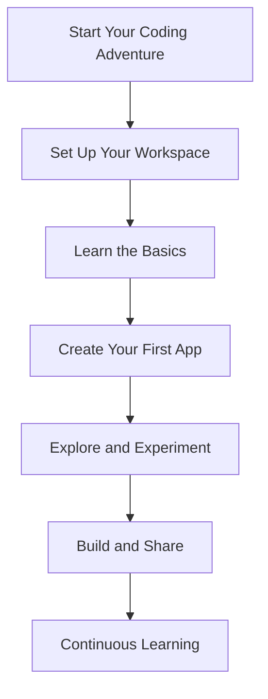

## 1.4.4 Let's Get Started!

Welcome, young coder, to the thrilling world of programming! You've taken the first step on an exciting journey that will open up endless possibilities. Let's dive into this adventure with enthusiasm and curiosity!

### Recap: What We've Learned So Far

Before we leap into the coding world, let's take a moment to reflect on what we've covered in Chapter 1:

- **Introduction to Coding:** We've explored what coding is and why it's such an important skill. Coding is like giving instructions to a computer to make it do what you want, and it's everywhere in our daily lives!
- **Setting Up Your Coding Space:** You've learned how to set up your computer and workspace, installed Flutter and Dart, and even created your first project. You're all set to start coding!
- **Understanding Computers and Apps:** We discussed the basics of how computers work and the different types of apps you can create. You've also started planning your first app.
- **Preparing for Our Coding Journey:** We've talked about the mindset needed for coding, including problem-solving skills and understanding algorithms.

### Encouragement: Stay Curious and Excited

Coding is like a magical journey where you can create anything you imagine. As you start this adventure, remember to stay curious and never be afraid to ask questions. Every coder, no matter how experienced, started just like you. Mistakes are part of learning, so embrace them as opportunities to grow.

Here's a little secret: the best coders are those who are always learning. So keep exploring, experimenting, and having fun with your code!

### Preview: What's Coming Next

In the next chapter, "Saying Hello to Flutter," you'll create your very first Flutter app. You'll learn how to write a simple program that displays "Hello, World!" on the screen. This is a classic first step in programming, and it's going to be a lot of fun!

You'll also get to know Dart, the programming language used with Flutter. We'll cover the basics like variables, data types, and simple math operations. By the end of the next chapter, you'll have built a mini calculator app and even a guessing game!

### Interactive Element: Your First Steps Checklist

To help you get started, here's a checklist of first steps to guide you:

1. **Review Your Setup:** Make sure Flutter and Dart are installed correctly on your computer.
2. **Create a Workspace:** Set up a comfortable and organized space where you can focus on coding.
3. **Explore the Code Editor:** Spend some time getting familiar with the code editor interface.
4. **Start a New Project:** Open your code editor and create a new Flutter project.
5. **Stay Curious:** Write down any questions or ideas you have as you explore.
6. **Celebrate Small Wins:** Every time you learn something new or solve a problem, take a moment to celebrate!

### Visuals: The Start of Your Adventure

Let's visualize your coding journey with a simple diagram that represents the exciting path ahead:

This diagram shows the steps you'll take as you embark on your coding adventure. Each step is an opportunity to learn and grow as a coder.

### Language: Enthusiastic and Supportive Tone

Remember, you're not alone on this journey. There are countless resources and communities ready to support you. Whether it's a friend, a teacher, or an online forum, don't hesitate to reach out for help or to share your successes.

You're ready to begin this incredible journey into the world of coding with Flutter. Let's get started and see where your imagination takes you!

## Quiz Time!



### What is the first step in starting your coding journey?

- [x] Setting up your workspace
- [ ] Writing complex code
- [ ] Publishing an app
- [ ] Learning advanced algorithms

> **Explanation:** Setting up your workspace is the first step to ensure you have a comfortable and organized place to code.

### Why is it important to stay curious while learning to code?

- [x] It helps you learn and grow
- [ ] It makes coding harder
- [ ] It slows down your progress
- [ ] It is not important

> **Explanation:** Staying curious encourages continuous learning and helps you overcome challenges.

### What will you create in the next chapter?

- [x] A "Hello, World!" app
- [ ] A complex game
- [ ] A social media app
- [ ] A weather app

> **Explanation:** In the next chapter, you'll create a simple "Hello, World!" app as your first Flutter project.

### What programming language will you learn with Flutter?

- [x] Dart
- [ ] Python
- [ ] JavaScript
- [ ] C++

> **Explanation:** Dart is the programming language used with Flutter.

### What should you do when you make a mistake in coding?

- [x] Learn from it
- [ ] Give up
- [ ] Ignore it
- [ ] Blame the computer

> **Explanation:** Mistakes are learning opportunities, so it's important to learn from them.

### What is a key mindset for coding?

- [x] Problem-solving
- [ ] Perfectionism
- [ ] Impatience
- [ ] Fear of failure

> **Explanation:** Problem-solving is crucial for coding as it helps you tackle challenges effectively.

### What is the purpose of the "First Steps Checklist"?

- [x] To guide you in starting your coding journey
- [ ] To confuse you
- [ ] To make coding difficult
- [ ] To discourage you

> **Explanation:** The checklist is designed to help you take the first steps in your coding journey.

### What is the classic first step in programming?

- [x] Writing a "Hello, World!" program
- [ ] Building a website
- [ ] Creating a database
- [ ] Designing a game

> **Explanation:** Writing a "Hello, World!" program is a traditional first step in learning to code.

### How can you celebrate small wins in coding?

- [x] Take a moment to acknowledge your progress
- [ ] Ignore them
- [ ] Wait until you finish a big project
- [ ] Only celebrate perfect code

> **Explanation:** Celebrating small wins helps you stay motivated and recognize your achievements.

### True or False: You should never ask for help while coding.

- [ ] True
- [x] False

> **Explanation:** It's important to ask for help when needed, as it can aid your learning and problem-solving.


