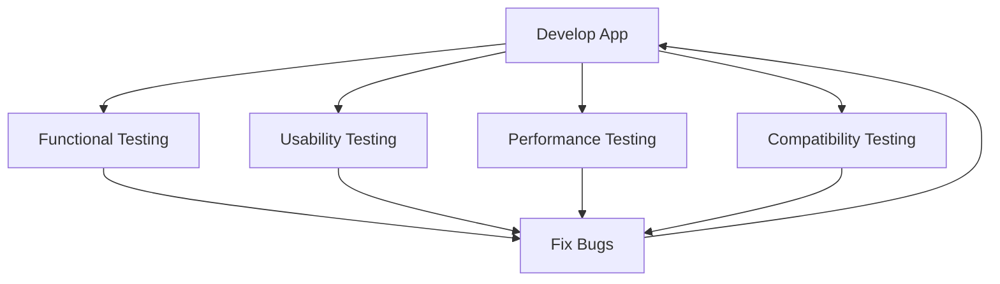

## 10.1.1 Final Testing

Congratulations! You've built your Flutter app and are almost ready to share it with the world. But before you do, there's an essential step you must take: **final testing**. This process ensures that your app works correctly and provides a smooth, enjoyable experience for your users. Let's dive into the importance of testing and explore the different types of testing you should perform.

### Importance of Testing

Testing is a crucial part of app development. It helps you find and fix bugs, ensuring that your app runs smoothly and meets user expectations. By thoroughly testing your app, you can:

- **Enhance User Experience:** Ensure that users have a positive experience with your app, leading to better reviews and more downloads.
- **Increase Reliability:** Identify and fix issues before they reach users, reducing the likelihood of crashes or errors.
- **Boost Confidence:** Feel confident in your app's performance and functionality, knowing it has been rigorously tested.

### Types of Testing

To ensure your app is ready for release, you should perform several types of testing:

#### Functional Testing

Functional testing checks that all features of your app work as intended. This includes:

- **Buttons and Interactions:** Ensure that all buttons respond correctly and perform the expected actions.
- **Data Handling:** Verify that data is saved, retrieved, and displayed correctly.
- **Navigation:** Test that users can navigate through the app without issues.

#### Usability Testing

Usability testing focuses on the user experience. It ensures that your app is easy to use and navigate, with intuitive interfaces and clear instructions. Consider the following:

- **User Interface (UI):** Is the layout clear and visually appealing?
- **User Experience (UX):** Can users easily find what they need and complete tasks without confusion?
- **Instructions and Feedback:** Are instructions clear, and does the app provide helpful feedback?

#### Performance Testing

Performance testing verifies that your app runs efficiently without lagging or crashing. Key aspects include:

- **Speed:** Does the app load quickly and respond promptly to user actions?
- **Stability:** Does the app remain stable under different conditions, such as low battery or poor network connectivity?
- **Resource Usage:** Is the app optimized to use minimal battery and memory?

#### Compatibility Testing

Compatibility testing ensures that your app looks good and functions properly on various devices and screen sizes. This involves:

- **Device Testing:** Test on different devices, including phones and tablets, to ensure consistent performance.
- **Screen Sizes:** Verify that the app's layout adapts to different screen sizes and orientations.
- **Operating Systems:** Ensure compatibility with different versions of Android and iOS.

### Testing Tools and Methods

To perform these tests, you can use a combination of tools and methods:

#### Emulators and Simulators

Emulators and simulators allow you to mimic different devices and operating systems on your computer. They are useful for:

- **Initial Testing:** Quickly test your app on various virtual devices.
- **Debugging:** Identify and fix issues in a controlled environment.

#### Real Devices

Testing on real devices is crucial for understanding how your app performs in real-world conditions. This helps you:

- **Identify Device-Specific Issues:** Some problems only appear on actual hardware.
- **Assess User Experience:** Experience the app as your users will.

#### Peer Testing

Encourage friends or family members to use your app and provide feedback. This can help you:

- **Gain Fresh Perspectives:** Others may notice issues you overlooked.
- **Receive Honest Feedback:** Users can provide insights into usability and functionality.

### Visualizing the Testing Process

To help you understand the testing process, here's a flowchart that visualizes the steps involved:

### Interactive Exercise: Create a Testing Checklist

Let's create a simple testing checklist for your app. This will help you organize your testing process and ensure you cover all necessary aspects.

1. **List Features to Test:** Write down all the features of your app, such as buttons, forms, and navigation paths.
2. **Define Test Cases:** For each feature, describe what you need to test. For example, "Ensure the 'Submit' button saves data correctly."
3. **Identify Devices:** List the devices and screen sizes you plan to test on.
4. **Gather Feedback:** Plan how you will collect feedback from peer testers.

### Visual Aids

To give you a better idea of how testing tools work, here are some screenshots showing testing tools in action and examples of bug reports or feedback forms:

- **Screenshot of an Emulator:** Show how to set up and run your app on a virtual device.
- **Bug Report Example:** Demonstrate how to document issues found during testing.
- **Feedback Form:** Provide a template for collecting feedback from testers.

By following these steps and using the tools and methods outlined, you'll be well on your way to ensuring your app is polished and ready for users. Remember, thorough testing is key to creating a successful app that delights users and stands out in the app store.

## Quiz Time!



### Why is testing important before releasing an app?

- [x] To find and fix bugs
- [x] To ensure the app runs smoothly
- [ ] To make the app look colorful
- [ ] To add more features

> **Explanation:** Testing helps identify and fix bugs, ensuring the app runs smoothly and provides a good user experience.

### What does functional testing focus on?

- [x] Checking that all features work as intended
- [ ] Ensuring the app is easy to use
- [ ] Verifying the app runs efficiently
- [ ] Testing on various devices

> **Explanation:** Functional testing ensures that all features of the app work as intended, such as buttons responding correctly.

### What is the goal of usability testing?

- [ ] To check for bugs
- [x] To ensure the app is easy to use and navigate
- [ ] To test on different devices
- [ ] To improve app performance

> **Explanation:** Usability testing focuses on making sure the app is easy to use and navigate, with intuitive interfaces and clear instructions.

### Which type of testing checks the app's speed and stability?

- [ ] Functional Testing
- [ ] Usability Testing
- [x] Performance Testing
- [ ] Compatibility Testing

> **Explanation:** Performance testing verifies that the app runs efficiently without lagging or crashing, checking speed and stability.

### What does compatibility testing involve?

- [ ] Checking for bugs
- [ ] Ensuring the app is easy to use
- [x] Testing on various devices and screen sizes
- [ ] Improving app performance

> **Explanation:** Compatibility testing ensures the app looks good and functions properly on various devices and screen sizes.

### What tools can mimic different devices and operating systems?

- [x] Emulators and Simulators
- [ ] Real Devices
- [ ] Peer Testing
- [ ] Feedback Forms

> **Explanation:** Emulators and simulators allow you to mimic different devices and operating systems on your computer for initial testing.

### Why is testing on real devices important?

- [x] To identify device-specific issues
- [ ] To make the app colorful
- [ ] To add more features
- [ ] To collect feedback

> **Explanation:** Testing on real devices helps identify issues that may only appear on actual hardware and assess the user experience.

### What is the benefit of peer testing?

- [ ] To find bugs
- [ ] To improve app performance
- [x] To gain fresh perspectives and receive honest feedback
- [ ] To test on various devices

> **Explanation:** Peer testing allows others to provide insights into usability and functionality, offering fresh perspectives and honest feedback.

### What should be included in a testing checklist?

- [x] List of features to test
- [x] Test cases for each feature
- [ ] Color schemes for the app
- [x] Devices and screen sizes for testing

> **Explanation:** A testing checklist should include features to test, test cases, and devices/screen sizes for testing to organize the process.

### True or False: Performance testing checks if the app is easy to use.

- [ ] True
- [x] False

> **Explanation:** Performance testing focuses on the app's speed, stability, and resource usage, not its ease of use.


