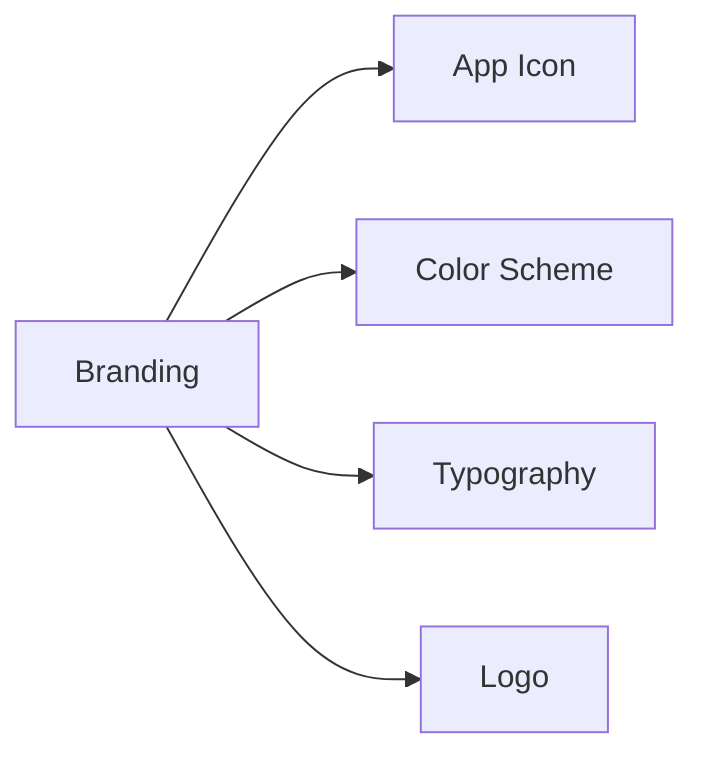

## 10.1.2 App Icons and Branding

Creating an app is not just about coding; it's also about making your app visually appealing and recognizable. This is where app icons and branding come into play. In this section, we'll explore how to create an attractive app icon and develop a consistent branding style that will make your app stand out in the crowd.

### What is Branding?

Branding is the unique identity of your app. It includes everything from the app's name and logo to its colors and overall look. Branding is what makes your app recognizable and memorable. Think of it as your app's personality that users will remember and associate with.

### Creating an App Icon

An app icon is the small image that represents your app on a device's home screen. It's often the first thing users see, so it's important to make a good impression.

#### Design Principles

When designing an app icon, keep these principles in mind:

- **Simplicity:** Use simple and clear images that represent the app’s purpose. Avoid clutter and focus on a single concept.
- **Recognizability:** Ensure the icon is easily recognizable, even at smaller sizes. It should stand out and be memorable.
- **Relevance:** The icon should reflect the app's function or theme.

#### Tools for Designing Icons

There are many tools available to help you design your app icon. Here are a few kid-friendly options:

- **Canva:** A user-friendly design tool with templates and elements to create stunning icons.
- **Online Icon Generators:** Websites that allow you to create icons quickly with pre-made shapes and designs.

#### Example Walkthrough

Let's design a basic app icon using Canva:

1. **Open Canva:** Go to Canva's website and create a free account if you don't have one.
2. **Choose a Template:** Search for "app icon" templates and select one that you like.
3. **Customize the Design:** Use Canva's tools to change colors, add shapes, and insert text. Remember to keep it simple and relevant to your app.
4. **Download Your Icon:** Once you're happy with your design, download it in the appropriate format for your app.

### Consistent Branding

Consistent branding helps users recognize your app across different platforms and materials. Here are some key elements to consider:

#### Color Scheme

Choose a set of colors that will be used consistently throughout your app and promotional materials. Colors can convey emotions and set the tone for your app. For example, bright colors might suggest fun and excitement, while softer tones might convey calmness and relaxation.

#### Typography

Select fonts that are easy to read and match the app’s personality. Consistent typography helps maintain a cohesive look across your app. Consider using one or two fonts to keep things simple.

#### Logo Design

If applicable, create a simple logo that complements the app icon. A logo can be a stylized version of your app's name or a unique symbol that represents your app.

### Visualizing Branding Elements

To better understand the elements of branding, let's look at a visual representation using Mermaid.js:

This diagram shows how different elements come together to form the overall branding of your app.

### Interactive Exercise

Now it's your turn! Grab a piece of paper and sketch your app icon. Think about the colors and shapes that best represent your app. Once you have a design in mind, choose a color palette that matches your app’s theme. This exercise will help you visualize your app's branding and make it more cohesive.

### Visual Aids

To inspire you, here are some examples of well-designed app icons and branding styles from popular kids’ apps:

- **Duolingo:** Uses a bright green color and a simple owl icon that is easily recognizable.
- **Khan Academy Kids:** Features a playful and colorful logo that appeals to children.
- **PBS Kids:** Utilizes bold colors and a friendly character to create an inviting look.

These examples show how effective branding can make an app stand out and be easily remembered by users.

By following these guidelines and using the tools and exercises provided, you'll be well on your way to creating an app icon and branding style that truly represents your app and makes it shine.

## Quiz Time!



### What is the main purpose of an app icon?

- [x] To represent the app on a device's home screen
- [ ] To provide detailed information about the app
- [ ] To serve as the app's main user interface
- [ ] To replace the app's name

> **Explanation:** An app icon is a small image that represents the app on a device's home screen, making it easily recognizable.

### Which of the following is NOT a design principle for app icons?

- [ ] Simplicity
- [x] Complexity
- [ ] Recognizability
- [ ] Relevance

> **Explanation:** Complexity is not a design principle for app icons. Icons should be simple and clear.

### What tool can be used to design app icons?

- [x] Canva
- [ ] Microsoft Word
- [ ] Excel
- [ ] PowerPoint

> **Explanation:** Canva is a user-friendly design tool that can be used to create app icons.

### What is the role of a color scheme in branding?

- [x] To maintain a consistent look across the app
- [ ] To make the app more complex
- [ ] To confuse users
- [ ] To change the app's functionality

> **Explanation:** A color scheme helps maintain a consistent look across the app and promotional materials.

### Why is typography important in branding?

- [x] It helps maintain a cohesive look
- [ ] It makes the app more difficult to read
- [ ] It changes the app's functionality
- [ ] It is not important

> **Explanation:** Typography helps maintain a cohesive look and ensures that text is easy to read.

### What should a logo do in relation to an app icon?

- [x] Complement the app icon
- [ ] Replace the app icon
- [ ] Confuse users
- [ ] Be completely different

> **Explanation:** A logo should complement the app icon and contribute to the overall branding.

### Which of the following is a key element of branding?

- [x] App Icon
- [ ] App Size
- [ ] App Speed
- [ ] App Price

> **Explanation:** An app icon is a key element of branding as it represents the app visually.

### What is the first step in designing an app icon using Canva?

- [x] Open Canva and choose a template
- [ ] Download the app icon
- [ ] Print the app icon
- [ ] Share the app icon

> **Explanation:** The first step is to open Canva and choose a template to start designing.

### What does the Mermaid.js diagram illustrate?

- [x] Elements of branding
- [ ] Steps to code an app
- [ ] How to publish an app
- [ ] User feedback process

> **Explanation:** The Mermaid.js diagram illustrates the elements of branding, such as app icon, color scheme, typography, and logo.

### True or False: Branding is only about the app's color scheme.

- [ ] True
- [x] False

> **Explanation:** False. Branding includes the app's name, logo, colors, typography, and overall look.


