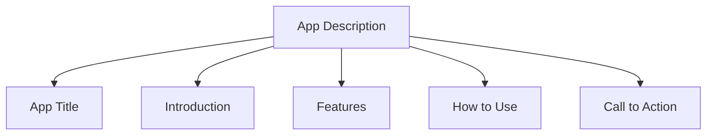

## 10.1.3 Writing App Descriptions

When you've put your heart and creativity into building an app, you want to make sure people know about it and are excited to try it out. Writing a great app description is like creating a friendly invitation for others to explore your app. In this section, we'll learn how to craft an engaging app description that tells people what your app does, why it's fun or useful, and how they can start using it.

### Purpose of an App Description

An app description serves as a bridge between your app and potential users. It's your chance to make a great first impression and convince people to download and try your app. A well-written description can highlight the app's purpose, showcase its unique features, and guide users on how to get started.

### Key Components of an App Description

Let's break down the essential parts of an app description:

#### 1. App Title

The app title is the first thing users see. It should be catchy, relevant, and give a hint about what your app does. Think of it as the name of a book or a movie—something that grabs attention and makes people curious.

#### 2. Introduction

Start with a brief summary that captures the essence of your app. This is your chance to hook the reader with a few sentences that explain what the app is about and why it's worth their time.

#### 3. Features

List the main features of your app. What makes it unique? Highlight the cool things users can do with your app. Be sure to focus on the features that set your app apart from others.

#### 4. How to Use

Provide simple instructions on how to navigate and use the app. This helps users understand what to expect and how to get started quickly.

#### 5. Call to Action

Encourage people to download and try the app. A call to action is a friendly nudge that invites users to take the next step.

### Writing Tips

Here are some tips to help you write an effective app description:

- **Keep It Simple:** Use clear and concise language. Avoid jargon and technical terms that might confuse users.
- **Be Honest:** Accurately describe what the app does without overpromising. Users appreciate honesty and transparency.
- **Highlight Benefits:** Focus on why users will enjoy or need the app. What problems does it solve, or what fun experiences does it offer?
- **Use Keywords:** Include relevant keywords that people might use to search for the app. This helps improve the app's visibility in app stores.

### Mermaid.js Checklist Diagram

Here's a visual checklist to guide you through writing an effective app description:

### Interactive Exercise

Now it's your turn! Use the structure we've discussed to draft an app description for your app. Start with a catchy title, write a brief introduction, list the main features, explain how to use the app, and finish with a call to action. Once you've written your draft, revise it to make it more appealing. Consider asking a friend or family member to read it and give feedback.

### Visual Aids: Examples of Good and Bad App Descriptions

Let's look at some examples to see what makes an app description effective or ineffective:

**Good Example:**

- **Title:** "Colorful Adventures: A Puzzle Game"
- **Introduction:** "Dive into a world of vibrant puzzles and exciting challenges with Colorful Adventures!"
- **Features:** "Match colors to solve puzzles, unlock new levels, and compete with friends."
- **How to Use:** "Simply tap to match colors and clear the board. Easy to learn, hard to master!"
- **Call to Action:** "Download now and start your colorful journey!"

**Bad Example:**

- **Title:** "Puzzle Game"
- **Introduction:** "This is a puzzle game."
- **Features:** "You can play puzzles."
- **How to Use:** "Play the game."
- **Call to Action:** "Download."

In the good example, the description is engaging, informative, and inviting. It clearly explains what the app is about and why users should try it. The bad example, on the other hand, is vague and uninteresting, lacking details that would entice users to download the app.

By following these guidelines and using the checklist, you'll be able to write an app description that captures the attention of potential users and encourages them to explore your creation.

## Quiz Time!



### What is the main purpose of an app description?

- [x] To tell people what the app does and why it's worth downloading
- [ ] To provide technical specifications of the app
- [ ] To list all the programming languages used
- [ ] To describe the history of app development

> **Explanation:** The main purpose of an app description is to inform potential users about what the app does, why it's fun or useful, and encourage them to download it.

### Which of the following is NOT a key component of an app description?

- [ ] App Title
- [ ] Introduction
- [ ] Features
- [x] Developer's Biography

> **Explanation:** A developer's biography is not a key component of an app description. The focus should be on the app itself.

### Why is it important to keep the app description simple?

- [x] To ensure it's easy to understand for all users
- [ ] To make it look professional
- [ ] To reduce the number of words
- [ ] To avoid using any technical terms

> **Explanation:** Keeping the app description simple ensures that it is accessible and easy to understand for all potential users, regardless of their technical background.

### What should you focus on when listing the features of your app?

- [x] Highlighting what makes the app unique
- [ ] Including every single feature, no matter how small
- [ ] Describing the technical details of each feature
- [ ] Listing features in alphabetical order

> **Explanation:** When listing features, focus on what makes the app unique and appealing to users.

### What is a "call to action" in an app description?

- [x] Encouraging users to download and try the app
- [ ] Asking users to read more about the app
- [ ] Requesting feedback from users
- [ ] Providing a technical overview of the app

> **Explanation:** A call to action encourages users to take the next step, which is usually to download and try the app.

### Why is it important to use keywords in your app description?

- [x] To improve the app's visibility in app stores
- [ ] To make the description longer
- [ ] To impress users with technical terms
- [ ] To confuse competitors

> **Explanation:** Using relevant keywords helps improve the app's visibility in app stores, making it easier for users to find.

### What should you avoid when writing an app description?

- [x] Overpromising what the app can do
- [ ] Using clear and concise language
- [ ] Highlighting the app's benefits
- [ ] Including a call to action

> **Explanation:** It's important to be honest and avoid overpromising what the app can do, as this can lead to user disappointment.

### How can you make your app description more appealing?

- [x] By revising it based on feedback
- [ ] By using complex language
- [ ] By focusing only on technical details
- [ ] By making it as short as possible

> **Explanation:** Revising the app description based on feedback can help make it more appealing and effective.

### What is the benefit of providing simple instructions on how to use the app?

- [x] It helps users understand what to expect and how to get started quickly
- [ ] It makes the app description longer
- [ ] It provides a technical overview of the app
- [ ] It highlights the developer's expertise

> **Explanation:** Providing simple instructions helps users understand what to expect and how to get started quickly, enhancing their experience.

### True or False: An app description should include a detailed history of the app's development process.

- [ ] True
- [x] False

> **Explanation:** An app description should focus on what the app does, its features, and why users should download it, rather than the history of its development.


