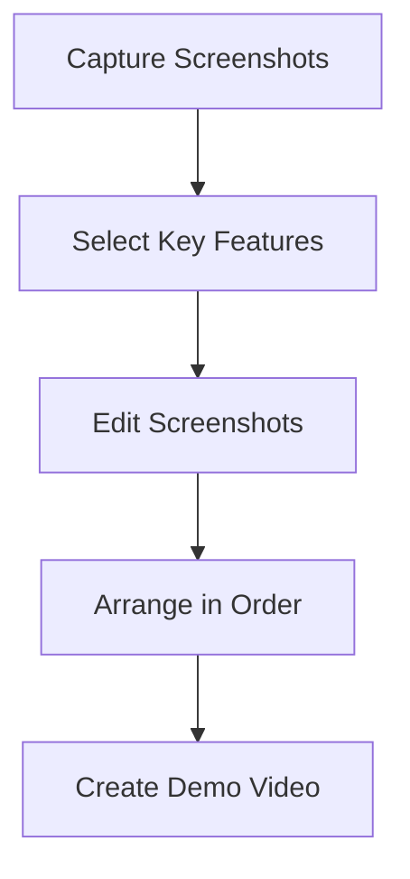

## 10.1.4 Screenshots and Previews

Congratulations on reaching the exciting stage of preparing your app for the world! One of the most important steps in this process is creating compelling screenshots and previews. These visuals are your app's first impression, helping potential users understand what your app looks like and what it can do before they decide to download it. Let's dive into how you can capture and present these visuals effectively.

### Importance of Screenshots and Previews

Screenshots and previews are like the cover of a book. They provide a glimpse into your app's world and entice users to explore further. A well-crafted set of visuals can:

- **Attract Attention:** Catch the eye of potential users browsing the app store.
- **Showcase Features:** Highlight the unique aspects and functionalities of your app.
- **Demonstrate Usability:** Give users a sense of how easy and enjoyable your app is to use.

### Choosing What to Showcase

When deciding what to include in your screenshots and previews, focus on these key areas:

#### Key Features

Identify the main features that make your app special. These could be unique tools, interactive elements, or anything that sets your app apart from others. Highlighting these features will help users understand the value your app offers.

#### User Interface

Show off your app's design by capturing screenshots that display its layout and visual style. A clean, intuitive interface can be a major selling point, so make sure to showcase it well.

#### User Experience

Include screenshots that demonstrate how users interact with your app. This could be a sequence of actions or a particular workflow that highlights the app's ease of use and functionality.

### How to Capture Screenshots

Capturing screenshots can vary depending on the device or tool you are using. Here are some methods:

#### Using Devices

- **Android:** Press the Power and Volume Down buttons simultaneously.
- **iOS:** Press the Side button and the Volume Up button at the same time.

#### Emulators and Simulators

Flutter provides built-in emulators and simulators that allow you to run your app on a virtual device. You can capture screenshots directly from these tools:

- **Android Emulator:** Use the "Take Screenshot" button in the emulator toolbar.
- **iOS Simulator:** Use the "Command + S" shortcut to capture a screenshot.

#### Editing Screenshots

Once you've captured your screenshots, you might need to edit them to focus on the most important parts. Basic editing can include:

- **Cropping:** Remove unnecessary parts of the image to focus on key elements.
- **Highlighting:** Use arrows or circles to draw attention to specific features.

### Creating Previews and Demo Videos

A demo video can provide a dynamic view of your app in action. Here's how to create one:

#### Storyboarding the Preview

Plan the sequence of screenshots or video clips to tell a story about your app. Think about the journey you want to take your viewers on, from opening the app to using its key features.

#### Tools for Creating Previews

There are many tools available for creating demo videos. Some beginner-friendly options include:

- **iMovie:** A simple video editing tool available on macOS and iOS.
- **Online Video Creators:** Websites like Canva or Animoto offer easy-to-use interfaces for creating videos.

#### Mermaid.js Flowchart

Here's a visual representation of the process of creating a preview:

### Interactive Exercise

Now it's your turn! Follow these steps to create your own set of screenshots:

1. **Capture Three Screenshots:** Choose three parts of your app that best represent its features.
2. **Edit Your Screenshots:** Use basic editing tools to crop and highlight important elements.
3. **Arrange Them in Order:** Think about the story you want to tell with your screenshots.

### Visual Aids

To inspire you, here are some examples of effective app screenshots and demo videos. Notice how they highlight key features, showcase the user interface, and demonstrate user experience:

- **Example 1:** A screenshot showing a clean, intuitive interface with highlighted interactive elements.
- **Example 2:** A demo video that walks through a key feature, showing how easy it is to use.

By following these guidelines, you'll be able to create compelling visuals that showcase your app's best features and attract potential users. Happy capturing!

## Quiz Time!



### Why are screenshots and previews important for your app?

- [x] They help users understand what the app looks like and what it can do.
- [ ] They are not necessary for app promotion.
- [ ] They only show the app's code.
- [ ] They are used only for internal testing.

> **Explanation:** Screenshots and previews provide a visual representation of the app, helping users decide if they want to download it.

### What should you focus on when choosing screenshots to showcase?

- [x] Key features, user interface, and user experience.
- [ ] Only the app's code.
- [ ] The app's loading screen.
- [ ] Random parts of the app.

> **Explanation:** Highlighting key features, user interface, and user experience helps users understand the app's value.

### How can you capture screenshots on an Android device?

- [x] Press the Power and Volume Down buttons simultaneously.
- [ ] Use the Home button.
- [ ] Press the Power and Volume Up buttons.
- [ ] Shake the device.

> **Explanation:** On Android devices, pressing the Power and Volume Down buttons together captures a screenshot.

### What is a storyboard in the context of creating a preview?

- [x] A plan for the sequence of screenshots or video clips.
- [ ] A type of app feature.
- [ ] A tool for editing screenshots.
- [ ] A coding language.

> **Explanation:** A storyboard helps plan the sequence of visuals to tell a story about the app.

### Which tool can you use to create a demo video on macOS?

- [x] iMovie
- [ ] Photoshop
- [ ] Excel
- [ ] Notepad

> **Explanation:** iMovie is a video editing tool available on macOS, suitable for creating demo videos.

### What is the purpose of editing screenshots?

- [x] To focus on key elements and highlight important parts.
- [ ] To change the app's code.
- [ ] To make the app look different.
- [ ] To add sound effects.

> **Explanation:** Editing screenshots helps emphasize important features and improve clarity.

### What is the shortcut for capturing a screenshot in the iOS Simulator?

- [x] Command + S
- [ ] Control + S
- [ ] Alt + S
- [ ] Shift + S

> **Explanation:** In the iOS Simulator, Command + S captures a screenshot.

### How can you make your app's screenshots more appealing?

- [x] By highlighting key features and showing the user interface.
- [ ] By using only black and white images.
- [ ] By showing only the app's loading screen.
- [ ] By including random images.

> **Explanation:** Highlighting key features and showing the user interface makes screenshots more appealing.

### What does the Mermaid.js flowchart illustrate?

- [x] The process of creating a preview.
- [ ] The app's code structure.
- [ ] The app's user interface.
- [ ] The app's loading process.

> **Explanation:** The flowchart illustrates the steps involved in creating a preview.

### True or False: Screenshots are only necessary for internal testing.

- [ ] True
- [x] False

> **Explanation:** Screenshots are important for showcasing the app to potential users, not just for internal testing.


