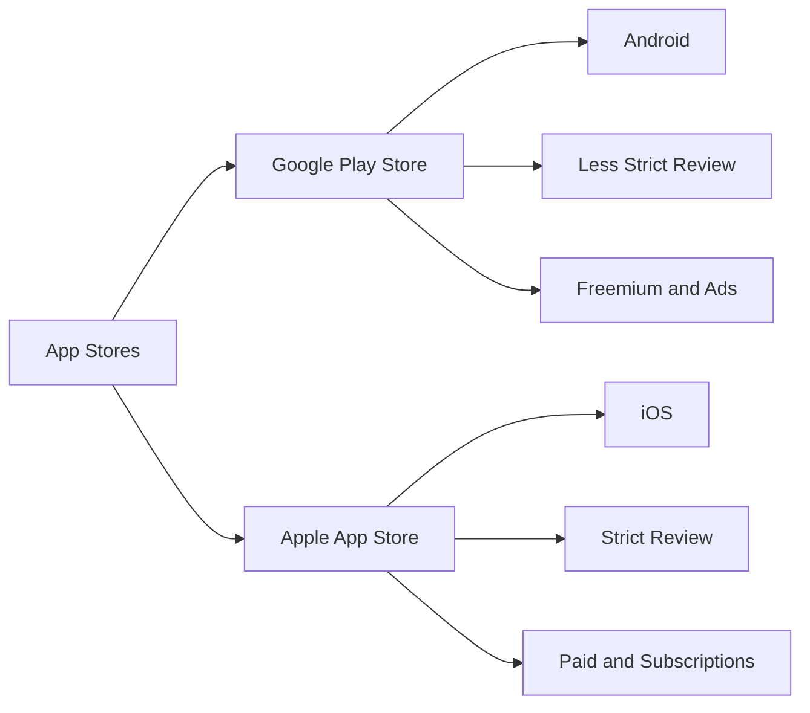

## 10.2.1 Understanding App Stores

Welcome to the exciting world of app stores! As you prepare to share your amazing Flutter apps with the world, it's important to understand where and how people will find and download them. App stores are digital marketplaces that connect developers like you with users eager to explore new apps. Let's dive into what app stores are, explore some popular options, and understand the differences between them.

### What are App Stores?

App stores are online platforms where users can browse, download, and install applications on their devices. These stores serve as a bridge between app developers and users, providing a secure and convenient way to distribute software. Whether you're using a smartphone, tablet, or even a smart TV, app stores are the go-to places for discovering new apps.

### Popular App Stores

There are several app stores available, each catering to different devices and operating systems. Here are some of the most popular ones:

#### Google Play Store (Android)

The Google Play Store is the primary app store for Android devices. It offers a vast selection of apps, games, movies, books, and more. As an Android developer, the Google Play Store is likely where you'll publish your apps to reach millions of users worldwide.

#### Apple App Store (iOS)

The Apple App Store is the main app store for Apple devices, such as iPhones and iPads. Known for its strict review process, the Apple App Store ensures that apps meet high standards of quality and security before they become available to users.

#### Alternative App Stores

In addition to the Google Play Store and Apple App Store, there are other app stores that offer unique opportunities for app distribution. For example, the Amazon Appstore is popular among Kindle and Fire device users. Exploring alternative app stores can help you reach a broader audience.

### Differences Between App Stores

While all app stores serve the same basic purpose, they differ in several key areas:

#### Submission Requirements

Each app store has its own set of rules and guidelines for submitting apps. These requirements ensure that apps are safe, functional, and provide a good user experience. It's important to familiarize yourself with these guidelines before submitting your app to avoid rejection.

#### Review Processes

App stores review apps to ensure they meet quality and safety standards. The review process can vary significantly between stores. For example, the Apple App Store is known for its strict and thorough review process, while the Google Play Store tends to be more lenient.

#### Monetization Options

App stores offer various ways to monetize your apps. You can choose to offer your app for free, charge a one-time fee, or include in-app purchases and ads. Each store has different policies and tools to help you monetize your app effectively.

### Mermaid.js Comparison Diagram

To better understand the differences between the Google Play Store and the Apple App Store, let's take a look at a comparison diagram:

### Interactive Exercise

Now it's your turn! Think about the app stores you know. Can you list them and identify one key feature of each? This exercise will help you become more familiar with the app store landscape and prepare you for publishing your own apps.

### Visual Aids

To help you visualize these concepts, here are the logos of some popular app stores:

- 
- 
- 

These logos represent the gateways to millions of users who are eager to discover new apps like yours!

## Quiz Time!



### What is the primary app store for Android devices?

- [x] Google Play Store
- [ ] Apple App Store
- [ ] Amazon Appstore
- [ ] Microsoft Store

> **Explanation:** The Google Play Store is the main app store for Android devices, offering a wide range of apps and digital content.

### Which app store is known for its strict review process?

- [ ] Google Play Store
- [x] Apple App Store
- [ ] Amazon Appstore
- [ ] Samsung Galaxy Store

> **Explanation:** The Apple App Store is known for its strict review process, ensuring high-quality and secure apps for users.

### What is a key feature of the Google Play Store?

- [ ] Strict Review Process
- [x] Freemium and Ads
- [ ] Paid and Subscriptions
- [ ] Limited App Selection

> **Explanation:** The Google Play Store supports freemium models and ads, allowing developers to monetize their apps in various ways.

### Which app store is primarily used for iOS devices?

- [ ] Google Play Store
- [x] Apple App Store
- [ ] Amazon Appstore
- [ ] Huawei AppGallery

> **Explanation:** The Apple App Store is the primary app store for iOS devices, including iPhones and iPads.

### What is an alternative app store mentioned in the article?

- [x] Amazon Appstore
- [ ] Google Play Store
- [ ] Apple App Store
- [ ] Samsung Galaxy Store

> **Explanation:** The Amazon Appstore is an alternative app store that offers apps for Kindle and Fire devices.

### What is a common monetization option in app stores?

- [x] In-app purchases
- [ ] Free only
- [ ] Paid only
- [ ] No monetization

> **Explanation:** In-app purchases are a common monetization option, allowing users to buy additional features or content within an app.

### Which app store is associated with Android devices?

- [x] Google Play Store
- [ ] Apple App Store
- [ ] Amazon Appstore
- [ ] Microsoft Store

> **Explanation:** The Google Play Store is associated with Android devices, providing a platform for app distribution.

### What is a benefit of publishing on multiple app stores?

- [x] Reaching a broader audience
- [ ] Limiting app availability
- [ ] Reducing app visibility
- [ ] Increasing submission complexity

> **Explanation:** Publishing on multiple app stores can help reach a broader audience by making your app available to more users.

### What is a key difference between Google Play Store and Apple App Store?

- [x] Review process strictness
- [ ] Device compatibility
- [ ] App categories
- [ ] User interface design

> **Explanation:** A key difference is the strictness of the review process, with Apple App Store being more stringent compared to Google Play Store.

### True or False: All app stores have the same submission requirements.

- [ ] True
- [x] False

> **Explanation:** False. Each app store has its own submission requirements and guidelines that developers must follow.



By understanding app stores, you're taking a big step towards sharing your apps with the world. Keep exploring, and soon your app will be ready for users everywhere!
