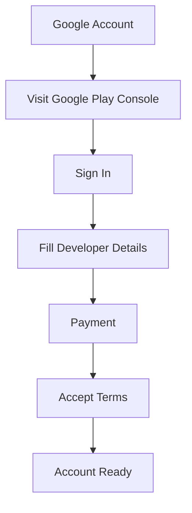

## 10.2.2 Account Setup

Publishing your app to the world is an exciting step in your coding journey! To make your app available on platforms like Google Play and the Apple App Store, you'll need to set up developer accounts. This guide will walk you through the process, helping you understand the requirements and steps involved.

### Why Do You Need a Developer Account?

Before you can share your app with users around the globe, you need to create a developer account on the app store where you plan to publish. This account acts as your gateway to the app store, allowing you to manage your apps, track their performance, and receive feedback from users. Setting up a developer account usually involves registering and paying a fee, which supports the services provided by the app store.

### Setting Up a Google Play Developer Account

To publish your app on the Google Play Store, you'll need a Google Play Developer Account. Here's how you can set it up:

#### Requirements

- **Google Account:** You need a Google account to sign in to the Google Play Console.
- **One-Time Registration Fee:** A fee of $25 is required to register as a developer.

#### Steps to Create a Google Play Developer Account

1. **Visit Google Play Console:**
   - Navigate to the [Google Play Console](https://play.google.com/console/about/).

2. **Sign In with Google Account:**
   - Use an existing Google account or create a new one if you don't have one.

3. **Complete Registration:**
   - Fill out the required details, such as your developer name and contact information.

4. **Pay the Registration Fee:**
   - A one-time fee of $25 is required. This fee allows you to publish apps on the Google Play Store.

5. **Accept Agreements:**
   - Agree to the Developer Program Policies and Terms of Service.

6. **Account Ready:**
   - Once you've completed these steps, your account will be ready to use.

Here's a visual representation of the process:

### Setting Up an Apple Developer Account

If you want to publish your app on the Apple App Store, you'll need an Apple Developer Account. Here's how you can set it up:

#### Requirements

- **Apple ID:** You need an Apple ID to sign in to the Apple Developer Program.
- **Annual Fee:** An annual fee of $99 is required to maintain your developer account.

#### Steps to Create an Apple Developer Account

1. **Visit Apple Developer Program:**
   - Navigate to the [Apple Developer website](https://developer.apple.com/programs/).

2. **Sign In with Apple ID:**
   - Use an existing Apple ID or create a new one if you don't have one.

3. **Enroll as Individual or Organization:**
   - Choose whether you want to enroll as an individual or as an organization. Most young developers will enroll as individuals.

4. **Complete Registration and Payment:**
   - Fill out the necessary details and pay the annual fee of $99.

5. **Account Ready:**
   - Once you've completed these steps, your account will be ready to use.

### Exploring Alternative App Stores

While Google Play and Apple App Store are the most popular platforms, there are other app stores where you can publish your apps. Each store will have its own registration process and requirements, so be sure to research and follow their guidelines if you choose to explore these options.

### Interactive Exercise

Even if you're not ready to set up a developer account just yet, it's a good idea to outline the steps you would take. Think about the information you would need and the decisions you would make. This exercise will prepare you for the future when you're ready to publish your app.

### Visual Aids

When setting up your accounts, you'll encounter various registration pages. Here are some tips for navigating them:

- **Read Carefully:** Make sure you understand each step before proceeding.
- **Keep Information Secure:** Protect your personal information and use secure passwords.
- **Ask for Help:** If you're unsure about any part of the process, ask a parent, guardian, or teacher for assistance.

Setting up a developer account is an important step in your journey as a young coder. It opens the door to sharing your creations with the world and receiving valuable feedback from users. Remember to involve a parent or guardian in the process, especially when it comes to handling payments and personal information.

## Quiz Time!



### Why do you need a developer account to publish apps?

- [x] To manage and publish apps on app stores
- [ ] To download apps from the app store
- [ ] To get free apps
- [ ] To play games online

> **Explanation:** A developer account is necessary to manage and publish apps on app stores, allowing you to share your creations with users.

### What is the one-time registration fee for a Google Play Developer Account?

- [x] $25
- [ ] $50
- [ ] $99
- [ ] $10

> **Explanation:** The Google Play Developer Account requires a one-time registration fee of $25.

### What is required to sign in to the Google Play Console?

- [x] A Google account
- [ ] An Apple ID
- [ ] A Facebook account
- [ ] A Twitter account

> **Explanation:** You need a Google account to sign in to the Google Play Console.

### What is the annual fee for an Apple Developer Account?

- [x] $99
- [ ] $25
- [ ] $50
- [ ] $150

> **Explanation:** The Apple Developer Account requires an annual fee of $99.

### Which of the following is NOT a step in setting up a Google Play Developer Account?

- [ ] Visit Google Play Console
- [ ] Sign In with Google Account
- [x] Enroll as Individual or Organization
- [ ] Accept Agreements

> **Explanation:** Enrolling as an individual or organization is a step in setting up an Apple Developer Account, not a Google Play Developer Account.

### What should you do if you're unsure about any part of the account setup process?

- [x] Ask a parent, guardian, or teacher for assistance
- [ ] Skip the step
- [ ] Guess and proceed
- [ ] Cancel the setup

> **Explanation:** If you're unsure about any part of the process, it's best to ask a parent, guardian, or teacher for help.

### Which website do you visit to set up an Apple Developer Account?

- [x] Apple Developer website
- [ ] Google Play Console
- [ ] Microsoft Store
- [ ] Amazon Appstore

> **Explanation:** To set up an Apple Developer Account, you visit the Apple Developer website.

### What is the purpose of the registration fee for developer accounts?

- [x] To support the services provided by the app store
- [ ] To buy apps
- [ ] To get discounts on apps
- [ ] To play games

> **Explanation:** The registration fee supports the services provided by the app store, allowing developers to publish and manage their apps.

### Can you publish apps on the Google Play Store without a developer account?

- [ ] Yes
- [x] No

> **Explanation:** You need a developer account to publish apps on the Google Play Store.

### True or False: You can use the same account to publish apps on both Google Play and Apple App Store.

- [ ] True
- [x] False

> **Explanation:** You need separate developer accounts for Google Play and Apple App Store, as they are different platforms.


