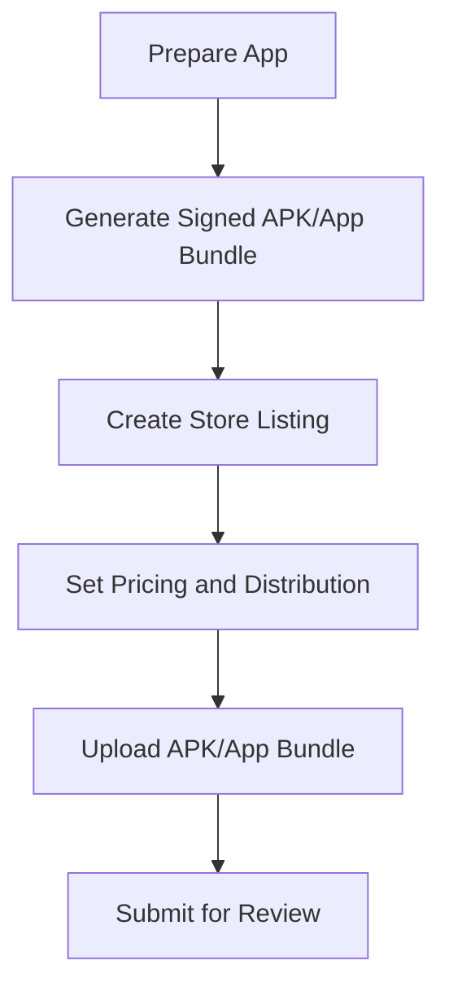

## 10.2.3 Submission Process

Congratulations on reaching the exciting stage of submitting your app to the world! Publishing your app on major platforms like the Google Play Store and Apple App Store is a significant milestone. This guide will walk you through the submission process, ensuring your app is ready for review and publication.

### Overview of the Submission Process

Submitting an app involves several key steps, which can vary slightly between app stores. Generally, the process includes preparing your app for release, generating a signed app file, creating a store listing, setting pricing and distribution options, uploading the app, and finally, submitting it for review. Let's dive into the specifics for each platform.

### Steps to Submit an App to Google Play Store

#### 1. Prepare App for Release

Before submitting your app, ensure it is production-ready. This means all features should be thoroughly tested, and any bugs should be fixed. Your app should comply with Google's guidelines, ensuring a smooth review process.

#### 2. Generate a Signed APK or App Bundle

To publish your app, you need to create a signed APK (Android Package) or an App Bundle. This step ensures your app is secure and ready for distribution.

```bash
flutter build apk --release
flutter build appbundle --release
```

These commands use Flutter tools to build a release version of your app, which is optimized for performance and security.

#### 3. Create a Store Listing

In the Google Play Console, you'll need to provide detailed information about your app. This includes:

- **Title:** The name of your app.
- **Description:** A brief overview of what your app does.
- **Screenshots:** Visuals that showcase your app's features.
- **App Icon:** A unique icon that represents your app.

#### 4. Set Pricing and Distribution

Decide whether your app will be free or paid. You can also select the countries where your app will be available. Consider your target audience and market when making these decisions.

#### 5. Upload the APK/App Bundle

Submit the signed app file through the Google Play Console. This step involves uploading the APK or App Bundle you generated earlier.

#### 6. Submit for Review

Once all the necessary information is filled out, submit your app for Google's review process. The review ensures your app meets all guidelines and is safe for users.

### Steps to Submit an App to Apple App Store

#### 1. Prepare App for Release

Ensure your app meets all of Apple's guidelines and is free of bugs. Apple's review process is known for being stringent, so thorough testing is crucial.

#### 2. Generate a Signed IPA File

Use Xcode to build a signed version of your app for iOS devices.

```bash
flutter build ios --release
```

This command prepares your app for distribution on the Apple App Store.

#### 3. Create an App Store Connect Listing

In App Store Connect, provide detailed information about your app, including:

- **Name:** The official name of your app.
- **Description:** A detailed explanation of your app's features.
- **Screenshots:** Images that highlight your app's functionality.
- **App Icon:** A distinctive icon for your app.

#### 4. Set Pricing and Availability

Choose your app's pricing model and select the regions where it will be available. Consider factors like market demand and competition.

#### 5. Upload the IPA File

Submit your app file through Xcode or Transporter. This step involves uploading the IPA file you generated earlier.

#### 6. Submit for Review

Complete all required information and submit your app for Apple's review process. This step ensures your app complies with Apple's standards.

### Visualizing the Submission Process

Here's a flowchart illustrating the submission steps for the Google Play Store:



### Real-World Example: Submitting the "Counter App"

Let's use the "Counter App" as a case study. Imagine you've completed your app, and it's ready for the world. You would:

1. **Prepare the App:** Ensure it's bug-free and meets all guidelines.
2. **Generate a Signed File:** Use Flutter to create a signed APK or IPA.
3. **Create a Store Listing:** Write a catchy description and take screenshots of your app in action.
4. **Set Pricing:** Decide if your app will be free or paid.
5. **Upload the File:** Submit the signed file through the respective console.
6. **Submit for Review:** Wait for feedback and approval from the app store.

### Interactive Exercise

Take a moment to outline what information you would need to prepare for submitting your app. Consider the following:

- **App Description:** How would you describe your app to potential users?
- **Screenshots:** What features would you highlight in your screenshots?
- **App Icon:** How will your icon stand out in the app store?

### Visual Aids

Below are examples of what the submission forms and interfaces look like in the Google Play Console and Apple App Store Connect. (Note: Screenshots should have sensitive information blurred for privacy.)


By following these steps and preparing thoroughly, you'll be well on your way to sharing your app with the world. Good luck with your submission!

## Quiz Time!



### What is the first step in submitting an app to the Google Play Store?

- [x] Prepare the app for release
- [ ] Generate a signed APK
- [ ] Create a store listing
- [ ] Set pricing and distribution

> **Explanation:** The first step is to ensure the app is production-ready, with all features tested and bugs fixed.

### Which command is used to generate a signed APK in Flutter?

- [x] `flutter build apk --release`
- [ ] `flutter build ios --release`
- [ ] `flutter run apk --release`
- [ ] `flutter deploy apk --release`

> **Explanation:** The command `flutter build apk --release` is used to build a signed APK for Android.

### What information is required for a store listing on Google Play?

- [x] Title, description, screenshots, and app icon
- [ ] Only the app icon
- [ ] Just the title and description
- [ ] Screenshots and pricing

> **Explanation:** A store listing requires the app's title, description, screenshots, and app icon.

### How do you submit an app to the Apple App Store?

- [x] Through Xcode or Transporter
- [ ] Directly from Flutter
- [ ] Using Google Play Console
- [ ] By emailing Apple

> **Explanation:** Apps are submitted to the Apple App Store through Xcode or Transporter.

### What is the purpose of setting pricing and distribution?

- [x] To choose whether the app is free or paid and select available countries
- [ ] To determine the app's size
- [ ] To decide the app's color scheme
- [ ] To set the app's language

> **Explanation:** Pricing and distribution settings determine if the app is free or paid and in which countries it will be available.

### Which tool is used to generate a signed IPA file for iOS?

- [x] Xcode
- [ ] Flutter Console
- [ ] Android Studio
- [ ] Google Play Console

> **Explanation:** Xcode is used to build a signed IPA file for iOS apps.

### What is the final step before an app is published on an app store?

- [x] Submit for review
- [ ] Generate a signed app file
- [ ] Create a store listing
- [ ] Set pricing and distribution

> **Explanation:** The final step is to submit the app for review by the app store.

### What is the purpose of the review process in app submission?

- [x] To ensure the app meets guidelines and is safe for users
- [ ] To set the app's price
- [ ] To create the app's icon
- [ ] To generate screenshots

> **Explanation:** The review process ensures the app complies with guidelines and is safe for users.

### What should be included in an app's description?

- [x] A brief overview of what the app does
- [ ] The app's color scheme
- [ ] The app's file size
- [ ] The developer's biography

> **Explanation:** The description should provide a brief overview of the app's functionality.

### True or False: The submission process for Google Play and Apple App Store is exactly the same.

- [ ] True
- [x] False

> **Explanation:** The submission processes for Google Play and Apple App Store have similarities but also distinct differences, such as the tools and guidelines used.


