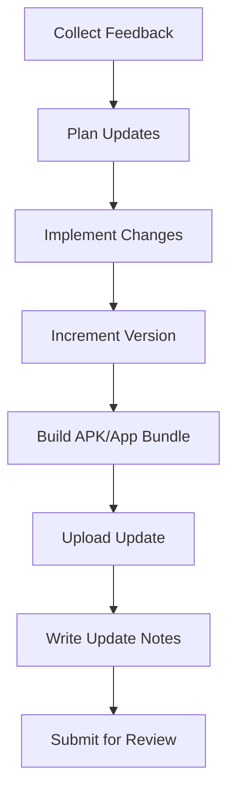

## 10.2.4 Managing App Updates

Congratulations on publishing your app! But the journey doesn't end there. Keeping your app updated is crucial for maintaining user satisfaction and staying competitive. In this section, we'll explore why updates are important, how to plan them, and the steps to update your app on both the Google Play Store and Apple App Store.

### Why Update Apps?

Updating your app is like giving it a fresh coat of paint or adding new features to a game. Here are some reasons why updates are essential:

- **Fix Bugs:** No app is perfect. Updates allow you to fix any bugs or issues that users might encounter.
- **Add New Features:** Keep your app exciting by adding new features that enhance user experience.
- **Improve User Experience:** Based on user feedback, you can make changes that make your app easier and more enjoyable to use.
- **Stay Competitive:** Regular updates show users that you are committed to improving your app, which can help you stand out in the crowded app market.

### Planning Updates

Effective updates require careful planning. Here's how you can prepare:

#### Collect Feedback

Start by gathering feedback from your users. This can be done through:

- **User Reviews:** Check the reviews on the app stores to see what users like and dislike.
- **Surveys and Polls:** Conduct surveys to get direct feedback from your users.
- **Analytics:** Use app analytics to understand how users interact with your app and identify areas for improvement.

#### Prioritize Features

Once you have feedback, prioritize the features or fixes that will have the most significant impact. Consider:

- **Urgency:** Address critical bugs first.
- **User Demand:** Focus on features that users frequently request.
- **Feasibility:** Assess the time and resources required to implement changes.

#### Set Goals

Define clear objectives for each update. For example:

- **Fix a specific bug that causes crashes.**
- **Add a new feature like a dark mode.**
- **Improve the app's loading speed.**

### Steps to Update an App on Google Play Store

Updating your app on the Google Play Store involves several steps:

1. **Make Changes to the App:** Implement the necessary bug fixes or new features in your Flutter project.

2. **Increment the App Version:** Update the version number in your `pubspec.yaml` file. This helps users know that there's a new version available.
   ```yaml
   version: 2.0.0+2
   ```

3. **Build the Updated APK/App Bundle:** Use Flutter to build the updated version of your app.
   ```bash
   flutter build apk --release
   ```

4. **Upload the New APK/App Bundle:** Go to the Google Play Console and upload the updated file under the same app listing.

5. **Write Update Notes:** Clearly describe what has changed or been fixed in the update. This helps users understand the benefits of updating.

6. **Submit for Review:** Send the updated app for Google’s review process. Once approved, it will be available to users.

### Steps to Update an App on Apple App Store

Updating your app on the Apple App Store is similar but has its own steps:

1. **Make Changes to the App:** Implement the necessary bug fixes or new features in your Flutter project.

2. **Increment the App Version:** Update the version number in your `pubspec.yaml` file.
   ```yaml
   version: 2.0.0+2
   ```

3. **Build the Updated IPA File:** Use Flutter to build the updated version of your app for iOS.
   ```bash
   flutter build ios --release
   ```

4. **Upload the New IPA File:** Use Xcode or Transporter to submit the updated file to App Store Connect.

5. **Write Update Notes:** Provide information about what has changed or been fixed in the update.

6. **Submit for Review:** Send the updated app for Apple’s review process. Once approved, it will be available to users.

### Visualizing the Update Process

Here's a flowchart to help you visualize the update process for the Google Play Store:



### Interactive Exercise

Think about potential future updates for your app. What improvements would you like to make? List them out and prioritize them based on user feedback and feasibility.

### Visual Aids

Below are screenshots showing where to upload updates in the Google Play Console and Apple App Store Connect. These visuals will guide you through the process of managing your app updates effectively.


*Google Play Console: Uploading your updated APK/App Bundle.*


*Apple App Store Connect: Uploading your updated IPA file.*

By following these steps and using the tools available, you can ensure that your app remains up-to-date, functional, and engaging for your users. Remember, the key to successful updates is listening to your users and continuously improving your app based on their feedback.

## Quiz Time!



### Why is it important to update your app?

- [x] To fix bugs and improve user experience
- [ ] To make the app more expensive
- [ ] To delete user data
- [ ] To remove features

> **Explanation:** Updating your app helps fix bugs, add new features, and improve the overall user experience.

### What should you do first when planning an update?

- [x] Collect feedback from users
- [ ] Delete the app
- [ ] Change the app's name
- [ ] Increase the app's price

> **Explanation:** Collecting feedback from users helps identify areas for improvement and prioritize updates.

### What file do you update to change the app version in Flutter?

- [x] `pubspec.yaml`
- [ ] `main.dart`
- [ ] `config.json`
- [ ] `index.html`

> **Explanation:** The `pubspec.yaml` file contains the version number, which should be updated for new app releases.

### What command is used to build an APK for release in Flutter?

- [x] `flutter build apk --release`
- [ ] `flutter run`
- [ ] `flutter test`
- [ ] `flutter clean`

> **Explanation:** The `flutter build apk --release` command is used to build the APK for release.

### What should you include in your update notes?

- [x] Information about changes and fixes
- [ ] Personal stories
- [ ] Random jokes
- [ ] User passwords

> **Explanation:** Update notes should clearly describe what has changed or been fixed in the update.

### How do you submit an updated app to the Apple App Store?

- [x] Use Xcode or Transporter to upload the IPA file
- [ ] Email it to Apple
- [ ] Post it on social media
- [ ] Print it out and mail it

> **Explanation:** Use Xcode or Transporter to submit the updated IPA file to App Store Connect.

### What is the purpose of incrementing the app version?

- [x] To indicate a new version is available
- [ ] To confuse users
- [ ] To reset user data
- [ ] To change the app's name

> **Explanation:** Incrementing the app version helps users know that a new version is available with updates or fixes.

### What is the final step in updating an app on the Google Play Store?

- [x] Submit for review
- [ ] Delete the app
- [ ] Change the app's name
- [ ] Increase the app's price

> **Explanation:** The final step is to submit the updated app for Google's review process.

### What tool can you use to gather user feedback?

- [x] Surveys and polls
- [ ] Random guesses
- [ ] Ignoring users
- [ ] Deleting reviews

> **Explanation:** Surveys and polls are effective tools for gathering user feedback.

### True or False: Regular updates show users that you are committed to improving your app.

- [x] True
- [ ] False

> **Explanation:** Regular updates demonstrate your commitment to enhancing the app and addressing user needs.


