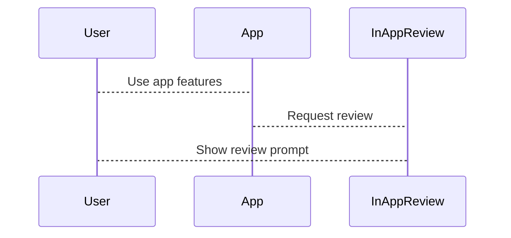

## 10.3.1 Encouraging App Reviews: Boosting Your App's Popularity

As young developers, one of the most rewarding experiences is seeing others enjoy and appreciate the apps you've created. Encouraging users to leave positive reviews and ratings is a crucial step in sharing your app with the world. Reviews not only provide valuable feedback but also help attract more users by serving as social proof. In this section, we'll explore why reviews are important, how to encourage them effectively, and how to implement a review prompt in your Flutter app using the `in_app_review` package.

### The Importance of Reviews

Reviews and ratings are like a digital word-of-mouth. They help potential users decide whether to download your app by providing insights into the experiences of others. A high rating and positive reviews can significantly increase your app's visibility and credibility in app stores. Here's why reviews matter:

- **Social Proof:** Positive reviews reassure potential users that your app is worth downloading.
- **Feedback for Improvement:** Constructive criticism can guide you in making your app even better.
- **Increased Visibility:** Apps with higher ratings are more likely to be featured or recommended in app stores.

### Tips to Encourage Reviews

Encouraging users to leave reviews can be done thoughtfully and effectively. Here are some strategies to consider:

#### Ask at the Right Time

Timing is everything. Prompt users to leave a review after they've had a positive experience with your app. For example, you might ask for a review after a user completes a level in a game or uses a feature multiple times. This ensures that the request feels natural and not intrusive.

#### Make It Easy

Simplify the process for users to leave a review. Include a dedicated button within your app that directs users to the review page. This reduces friction and increases the likelihood of users taking action.

#### Be Polite and Positive

Use friendly and encouraging language when asking for feedback. A polite request can make users feel appreciated and more inclined to leave a review.

#### Incentivize Feedback

While it's important to avoid inappropriate incentives, consider offering small rewards for leaving a review. For instance, you could unlock a special feature or provide a bonus in-game item. Ensure that the incentive is ethical and does not manipulate users into leaving dishonest reviews.

### Flutter Implementation: Using the `in_app_review` Package

Flutter provides a convenient way to prompt users for reviews using the `in_app_review` package. This package allows you to request reviews directly within your app, making it easy for users to provide feedback.

#### Adding the `in_app_review` Package

First, add the `in_app_review` package to your `pubspec.yaml` file:

```yaml
dependencies:
  in_app_review: ^2.0.3
```

Then, run `flutter pub get` to install the package.

#### Implementing the Review Request

Here's how you can implement a review request in your Flutter app:

```dart
import 'package:in_app_review/in_app_review.dart';

void requestReview() async {
  final InAppReview inAppReview = InAppReview.instance;
  if (await inAppReview.isAvailable()) {
    inAppReview.requestReview();
  }
}
```

This code checks if the review feature is available on the device and then requests a review if possible. You can call this function at an appropriate moment in your app, such as after a user completes a task or achieves a milestone.

#### Adding the Review Prompt

Integrate the review prompt into your app by triggering it after a successful task. For example, you might call `requestReview()` after a user completes a level in your game.

### Visualizing the Review Process

To better understand the flow of prompting for a review, let's look at a sequence diagram:



This diagram illustrates how the app interacts with the `InAppReview` package to prompt the user for a review after they engage with the app.

### Interactive Exercise

Now it's your turn! Implement a review prompt in your app. Decide when it makes sense to ask users for feedback. Consider the user journey and identify a moment when they are likely to be satisfied with their experience.

### Visual Aids

Include screenshots in your app showing where the review prompt appears. This visual aid will help users understand when and how they will be asked for reviews.

By following these steps, you can effectively encourage users to leave positive reviews, helping your app gain more visibility and attract a larger audience. Remember, the key is to be thoughtful and considerate in your approach, ensuring that users feel valued and appreciated.

## Quiz Time!



### Why are reviews important for your app?

- [x] They provide social proof and increase visibility.
- [ ] They are not important at all.
- [ ] They make the app slower.
- [ ] They are only for decoration.

> **Explanation:** Reviews provide social proof, helping potential users decide to download the app, and can increase the app's visibility in app stores.

### When is the best time to ask for a review?

- [x] After a user has a positive experience.
- [ ] As soon as the app is opened.
- [ ] During a difficult level.
- [ ] When the user is frustrated.

> **Explanation:** Asking for a review after a positive experience increases the likelihood of receiving positive feedback.

### What is a good way to make it easy for users to leave a review?

- [x] Provide a dedicated button within the app.
- [ ] Hide the review option in settings.
- [ ] Require users to email their reviews.
- [ ] Ask them to write a letter.

> **Explanation:** A dedicated button within the app simplifies the process, making it easy for users to leave a review.

### How should you phrase your request for a review?

- [x] Use polite and positive language.
- [ ] Demand a review immediately.
- [ ] Use negative language.
- [ ] Ignore user feedback.

> **Explanation:** Polite and positive language encourages users to leave a review and makes them feel appreciated.

### What is an ethical way to incentivize reviews?

- [x] Offer a small reward like unlocking a feature.
- [ ] Pay users for reviews.
- [ ] Force users to review before using the app.
- [ ] Ignore ethical considerations.

> **Explanation:** Offering a small reward like unlocking a feature is an ethical way to encourage reviews without manipulating users.

### Which Flutter package can be used to prompt users for reviews?

- [x] `in_app_review`
- [ ] `flutter_reviews`
- [ ] `app_feedback`
- [ ] `review_prompt`

> **Explanation:** The `in_app_review` package is used in Flutter to prompt users for reviews.

### What should you check before requesting a review using `in_app_review`?

- [x] If the review feature is available on the device.
- [ ] If the user is online.
- [ ] If the app is closed.
- [ ] If the user is asleep.

> **Explanation:** Checking if the review feature is available ensures that the request can be made successfully.

### What does the sequence diagram illustrate?

- [x] The flow of prompting for a review.
- [ ] The app's main menu.
- [ ] The user's login process.
- [ ] The app's shutdown sequence.

> **Explanation:** The sequence diagram shows the interaction between the user, app, and `InAppReview` package during the review prompt process.

### How can you visualize where the review prompt appears in your app?

- [x] Include screenshots.
- [ ] Use only text descriptions.
- [ ] Ignore visual aids.
- [ ] Use audio descriptions.

> **Explanation:** Screenshots help users understand when and where they will be asked for reviews.

### True or False: Offering inappropriate incentives for reviews is a good practice.

- [ ] True
- [x] False

> **Explanation:** Offering inappropriate incentives can lead to dishonest reviews and is not an ethical practice.


