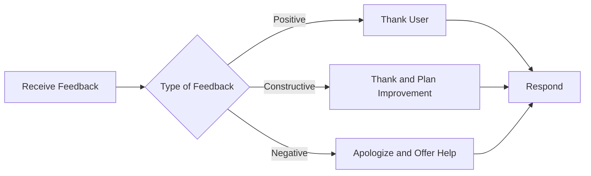

## 10.3.2 Responding to Feedback

In the world of app development, feedback from users is a treasure trove of insights. Whether it's a glowing review or a critical bug report, each piece of feedback provides an opportunity to improve your app and strengthen your relationship with your users. In this section, we'll explore why responding to feedback is crucial, how to handle different types of feedback, and provide practical examples and exercises to help you master this important skill.

### Why Respond to Feedback?

Responding to feedback is more than just good manners; it's a vital part of the app development process. Here's why:

- **Shows Users They Are Valued:** When you respond to feedback, you demonstrate that you care about your users' opinions and experiences. This can lead to increased user loyalty and positive word-of-mouth.
- **Improves Your App:** Feedback often highlights areas for improvement that you might not have noticed. By listening to your users, you can make your app better and more user-friendly.
- **Builds Trust and Community:** Engaging with users fosters a sense of community and trust. Users are more likely to stick with an app when they feel heard and appreciated.

### Types of Feedback

Understanding the different types of feedback is the first step in crafting effective responses. Feedback generally falls into three categories:

- **Positive Feedback:** This includes praise or compliments about your app. It's important to acknowledge and appreciate these comments as they can boost morale and encourage continued use.
  
- **Constructive Criticism:** These are suggestions for improvements or reports of bugs. Constructive criticism is invaluable as it provides specific insights into how your app can be enhanced.

- **Negative Feedback:** Complaints or expressions of dissatisfaction can be challenging to handle but are crucial for identifying and addressing user pain points.

### How to Respond Effectively

Responding to feedback effectively requires a thoughtful approach. Here are some tips to guide you:

- **Be Polite and Grateful:** Always start by thanking the user for their feedback. This sets a positive tone and shows appreciation for their input.

- **Acknowledge the Issue:** Whether the feedback is positive or negative, acknowledge what the user has said. This shows that you have read and understood their comments.

- **Provide Solutions:** If the feedback highlights a problem, explain how you plan to address it. If you need more information, ask the user for additional details.

- **Encourage Continued Interaction:** Invite users to continue providing feedback or to reach out with further questions. This keeps the lines of communication open and shows that you value ongoing dialogue.

### Interaction Flowchart

To visualize the process of responding to feedback, let's look at a simple interaction flowchart:

### Real-World Example

Let's see how these principles apply in real-world scenarios with examples of positive and negative reviews:

- **Positive Review Example:**
  - **Review:** "I love using your app! It made my homework so much easier."
  - **Response:** "Thank you so much for your kind words! We're thrilled that our app is helping you with your homework. Keep up the great work!"

- **Negative Review Example:**
  - **Review:** "The app crashes every time I try to add a new item."
  - **Response:** "We're sorry to hear you're experiencing crashes. Please try reinstalling the app, and if the problem continues, contact us at [support email]. We're here to help!"

### Interactive Exercise

Now it's your turn! Try writing sample responses to the following fictional feedback:

1. **Feedback:** "The new update is fantastic! The app runs much smoother now."
   - **Your Response:**

2. **Feedback:** "I can't find the settings menu. It's really frustrating."
   - **Your Response:**

3. **Feedback:** "Great app, but it would be even better if it had a dark mode."
   - **Your Response:**

### Visual Aids

To help you visualize how feedback is typically presented, here are some screenshots of review sections on app stores along with example responses. These visuals can guide you in crafting your own responses.

### Conclusion

Responding to feedback is an essential skill for any app developer. By engaging with your users, you not only improve your app but also build a community of loyal users who feel valued and heard. Remember, every piece of feedback is an opportunity to learn and grow.

## Quiz Time!



### Why is it important to respond to user feedback?

- [x] It shows users that their opinions are valued.
- [ ] It allows you to ignore negative comments.
- [ ] It helps you avoid making any changes to your app.
- [ ] It guarantees your app will become popular.

> **Explanation:** Responding to feedback shows users that their opinions are valued and helps improve the app based on real user experiences.

### What should you do when you receive positive feedback?

- [x] Thank the user for their kind words.
- [ ] Ignore it because it's not helpful.
- [ ] Ask the user to provide negative feedback instead.
- [ ] Delete the feedback to keep the app unbiased.

> **Explanation:** Thanking the user for positive feedback acknowledges their appreciation and encourages continued use.

### How should you handle constructive criticism?

- [x] Thank the user and plan improvements.
- [ ] Argue with the user about their suggestions.
- [ ] Ignore the feedback and move on.
- [ ] Delete the feedback to avoid negativity.

> **Explanation:** Constructive criticism provides specific insights into how your app can be enhanced, so it's important to thank the user and plan improvements.

### What is a good response to negative feedback?

- [x] Apologize and offer help.
- [ ] Ignore the feedback to avoid confrontation.
- [ ] Argue with the user to defend your app.
- [ ] Delete the feedback to maintain a positive image.

> **Explanation:** Apologizing and offering help shows that you care about resolving the user's issue and improving their experience.

### What is the first step in responding to any type of feedback?

- [x] Be polite and grateful.
- [ ] Argue with the user.
- [ ] Ignore the feedback.
- [ ] Delete the feedback.

> **Explanation:** Being polite and grateful sets a positive tone and shows appreciation for the user's input.

### How can you encourage continued interaction with users?

- [x] Invite them to reach out with further feedback or questions.
- [ ] Ignore their feedback after the first response.
- [ ] Argue with them to prove your point.
- [ ] Delete their feedback to avoid further interaction.

> **Explanation:** Encouraging continued interaction keeps the lines of communication open and shows that you value ongoing dialogue.

### What should you do if a user reports a bug?

- [x] Acknowledge the issue and explain how you plan to fix it.
- [ ] Ignore the report and hope it goes away.
- [ ] Argue with the user about the existence of the bug.
- [ ] Delete the report to avoid dealing with it.

> **Explanation:** Acknowledging the issue and explaining how you plan to fix it shows that you are proactive in resolving problems.

### What is a benefit of responding to feedback?

- [x] It builds trust and community with users.
- [ ] It allows you to ignore user opinions.
- [ ] It helps you avoid making any changes to your app.
- [ ] It guarantees your app will become popular.

> **Explanation:** Responding to feedback builds trust and community with users, fostering loyalty and engagement.

### What is an appropriate response to a user who loves your app?

- [x] "Thank you so much for your kind words! We're thrilled that our app is helping you."
- [ ] "We don't need your feedback."
- [ ] "Please provide negative feedback instead."
- [ ] "Your opinion doesn't matter."

> **Explanation:** Thanking the user for their kind words acknowledges their appreciation and encourages continued use.

### True or False: Responding to feedback can help improve your app.

- [x] True
- [ ] False

> **Explanation:** True. Responding to feedback can help improve your app by providing insights into user experiences and areas for enhancement.


