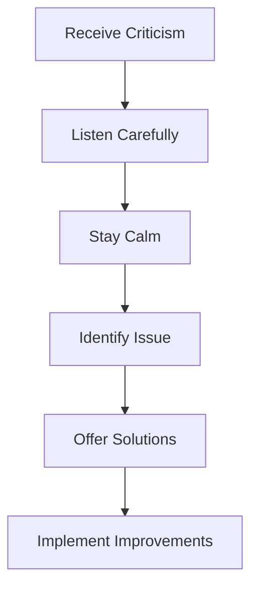

## 10.3.3 Handling Criticism

Creating an app is an exciting journey, but sharing it with the world means opening yourself up to feedback, both positive and negative. Handling criticism constructively is a vital skill for any developer. Let's explore how you can turn criticism into an opportunity for growth and improvement.

### Understanding Criticism

Criticism is a way for users to share their honest opinions about your app. While it might feel uncomfortable at times, it's important to remember that feedback is a valuable tool for making your app better. Users who take the time to provide feedback are helping you see your app from a different perspective.

### Emotional Responses

Receiving negative feedback can be tough. It's natural to feel upset or defensive, but it's crucial to stay positive and not take it personally. Remember, the criticism is about the app, not you as a person. By maintaining a positive attitude, you can focus on using the feedback to improve your app.

### Strategies for Handling Criticism

Here are some strategies to help you handle criticism constructively:

#### Listen Carefully

When you receive criticism, read the feedback thoroughly. Try to understand the user's perspective and what they are experiencing. This will help you identify the real issue behind their comments.

#### Stay Calm and Professional

It's important to respond calmly and professionally. Avoid becoming defensive or angry. A calm response shows that you value the user's opinion and are willing to consider their feedback.

#### Identify the Issue

Determine the root cause of the criticism. Is there a specific feature that's not working as expected? Is the user having trouble understanding how to use the app? Identifying the issue will help you address it effectively.

#### Offer Solutions

Once you've identified the issue, provide practical solutions. If you're unsure about the problem, ask questions to gather more information. Let the user know that you're working on a fix and appreciate their patience.

#### Learn and Improve

Use the criticism as a learning opportunity. What can you do to enhance the app? Implementing improvements based on feedback will make your app better and show users that you value their input.

### Strategy Diagram

Here's a visual representation of the process of handling criticism:

### Real-World Example

Let's look at a scenario where a user criticizes a specific feature and see how to respond constructively:

**Scenario:** "The text in the app is too small and hard to read."

**Response:** "Thank you for your feedback. We're sorry the text is difficult to read. We're working on making the text larger and more readable in the next update. We appreciate your patience!"

This response acknowledges the user's concern, provides a solution, and shows appreciation for their feedback.

### Interactive Exercise

Let's practice drafting responses to fictional negative reviews. Here are some examples:

1. **Review:** "The app crashes every time I try to open it."
   - **Response:** "Thank you for letting us know about the issue. We're investigating the cause and will release a fix soon. We appreciate your patience and understanding."

2. **Review:** "The app is too slow and takes forever to load."
   - **Response:** "We apologize for the slow performance. We're working on optimizing the app to improve loading times. Thank you for your feedback!"

3. **Review:** "I can't find the feature I need. It's too complicated."
   - **Response:** "We're sorry to hear you're having trouble. Could you let us know which feature you're looking for? We'd love to help you find it and make the app easier to use."

### Visual Aids

Imagine illustrations showing positive and professional responses to criticism. These visuals can depict a friendly character responding to feedback with a smile and a helpful attitude, reinforcing the importance of staying positive and constructive.

### Conclusion

Handling criticism is an essential skill for any developer. By listening carefully, staying calm, identifying issues, offering solutions, and learning from feedback, you can turn criticism into an opportunity for growth. Remember, every piece of feedback is a chance to make your app even better!

## Quiz Time!



### What is the primary purpose of criticism?

- [x] To provide honest opinions that can help improve the app.
- [ ] To discourage developers from continuing their work.
- [ ] To highlight only the negative aspects of an app.
- [ ] To make developers feel bad about their work.

> **Explanation:** Criticism is meant to provide honest feedback that can help developers improve their apps by seeing them from a user's perspective.

### How should you respond to criticism?

- [x] Calmly and professionally.
- [ ] Defensively and angrily.
- [ ] By ignoring it completely.
- [ ] By arguing with the user.

> **Explanation:** Responding calmly and professionally shows that you value the user's opinion and are willing to consider their feedback.

### What should you do after identifying the issue in criticism?

- [x] Offer practical solutions.
- [ ] Ignore the issue.
- [ ] Blame the user for not understanding.
- [ ] Delete the feedback.

> **Explanation:** Offering practical solutions helps address the user's concerns and shows that you are actively working to improve the app.

### Why is it important to stay positive when receiving criticism?

- [x] It helps you focus on using feedback to improve the app.
- [ ] It makes the criticism disappear.
- [ ] It shows that you don't care about the feedback.
- [ ] It prevents you from making any changes.

> **Explanation:** Staying positive allows you to focus on using the feedback constructively to enhance your app.

### What is the final step in the strategy diagram for handling criticism?

- [x] Implement Improvements
- [ ] Offer Solutions
- [ ] Identify Issue
- [ ] Stay Calm

> **Explanation:** Implementing improvements is the final step, where you use the feedback to make your app better.

### How can you use criticism as a learning opportunity?

- [x] By identifying areas for improvement and making changes.
- [ ] By ignoring the feedback and continuing as before.
- [ ] By arguing with the user about their opinion.
- [ ] By deleting the app entirely.

> **Explanation:** Criticism can highlight areas for improvement, allowing you to make changes that enhance your app.

### What should you do if you're unsure about the problem mentioned in criticism?

- [x] Ask questions to gather more information.
- [ ] Assume the user is wrong.
- [ ] Ignore the feedback.
- [ ] Make random changes to the app.

> **Explanation:** Asking questions helps you understand the user's perspective better and address the issue effectively.

### How can you show users that you value their feedback?

- [x] By responding positively and making improvements.
- [ ] By ignoring their feedback.
- [ ] By arguing with them.
- [ ] By deleting their comments.

> **Explanation:** Responding positively and making improvements based on feedback shows users that you value their input.

### What is a good response to a user who finds the app too complicated?

- [x] "We're sorry to hear you're having trouble. Could you let us know which feature you're looking for? We'd love to help you find it and make the app easier to use."
- [ ] "The app is fine; you're just not using it correctly."
- [ ] "We don't think the app is complicated."
- [ ] "Please read the instructions again."

> **Explanation:** Acknowledging the user's difficulty and offering help shows that you care about their experience and are willing to assist.

### True or False: Criticism should always be taken personally.

- [ ] True
- [x] False

> **Explanation:** Criticism should not be taken personally. It's about the app, not you as a person, and can be used constructively to improve the app.


