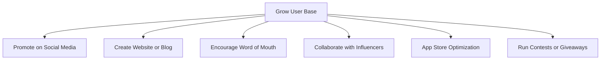

## 10.3.4 Growing Your User Base

Congratulations on creating your app! Now, it's time to share it with the world and watch your user base grow. Having more users not only brings more feedback and potential improvements but also increases the app's success and reach. Let's explore some effective strategies to expand your app's audience.

### Importance of a Growing User Base

A growing user base is crucial for several reasons:

- **Feedback and Improvement:** More users mean more feedback, which can help you identify areas for improvement and new features to add.
- **Increased Visibility:** As more people use and talk about your app, it gains visibility, attracting even more users.
- **Monetization Opportunities:** A larger user base can open up opportunities for monetization, such as ads or in-app purchases.
- **Community Building:** A thriving user base can form a community around your app, fostering loyalty and engagement.

### Strategies to Grow Users

#### Promote on Social Media

Social media platforms like Instagram, Twitter, and TikTok are powerful tools for reaching a wide audience. Here are some tips:

- **Create Engaging Content:** Share interesting posts, stories, and videos about your app. Highlight its features, benefits, and any updates.
- **Use Hashtags:** Use relevant hashtags to increase the visibility of your posts.
- **Engage with Your Audience:** Respond to comments and messages to build a relationship with your followers.

#### Create a Website or Blog

A website or blog can serve as a hub for your app, providing information and updates. Consider the following:

- **Showcase Features:** Highlight the unique features and benefits of your app.
- **Share Tutorials and Stories:** Provide tutorials on how to use the app and share stories about its development.
- **SEO Optimization:** Use search engine optimization (SEO) techniques to make your website more discoverable.

#### Encourage Word of Mouth

Word of mouth is a powerful marketing tool. Encourage your users to share the app with their friends and family:

- **Incentivize Sharing:** Offer rewards or incentives for users who refer others to your app.
- **Create Shareable Content:** Develop content that users will want to share with their networks.

#### Collaborate with Influencers

Partnering with influencers can significantly boost your app's visibility:

- **Identify Relevant Influencers:** Look for influencers whose audience aligns with your app's target users.
- **Offer Value:** Provide influencers with something valuable, such as exclusive access or features, to encourage them to promote your app.

#### App Store Optimization (ASO)

Improve your app's visibility in app stores with ASO:

- **Use Relevant Keywords:** Include keywords that potential users might search for in your app's title and description.
- **Engaging Descriptions:** Write a compelling description that highlights your app's features and benefits.
- **Attractive Visuals:** Use eye-catching icons and screenshots to draw users' attention.

#### Run Contests or Giveaways

Contests and giveaways can generate excitement and attract new users:

- **Organize Events:** Host events where users can win prizes for participating or sharing the app.
- **Promote Widely:** Use social media and your website to promote the contest or giveaway.

### Strategy Flowchart

Here's a visual representation of the strategies to grow your user base:

### Real-World Example

Consider the success story of the app "Calm," a meditation and relaxation app. Calm grew its user base by leveraging social media, collaborating with wellness influencers, and optimizing its app store presence. By creating engaging content and offering free trials, Calm attracted millions of users worldwide.

### Interactive Exercise

Now it's your turn! Think about how you can promote your app. List three strategies from the ones discussed that you can implement. Consider your app's unique features and target audience.

1. ________________________________________________________
2. ________________________________________________________
3. ________________________________________________________

### Visual Aids

To inspire your promotional efforts, here are some examples:

- **Social Media Post Example:**

  

- **App Website Screenshot:**

  

- **Word of Mouth Illustration:**

  

By implementing these strategies, you'll be well on your way to growing your app's user base and achieving greater success. Remember, the key is to be creative, persistent, and responsive to your users' needs.

## Quiz Time!



### Why is a growing user base important for an app?

- [x] It provides more feedback and potential improvements.
- [ ] It makes the app harder to manage.
- [ ] It decreases the app's visibility.
- [ ] It limits monetization opportunities.

> **Explanation:** A growing user base provides more feedback, increases visibility, and opens up monetization opportunities.

### Which social media platform is NOT mentioned as a tool for promoting your app?

- [ ] Instagram
- [ ] Twitter
- [x] LinkedIn
- [ ] TikTok

> **Explanation:** Instagram, Twitter, and TikTok are mentioned, but LinkedIn is not.

### What is the purpose of creating a website or blog for your app?

- [x] To showcase features and provide updates.
- [ ] To hide information about the app.
- [ ] To discourage user interaction.
- [ ] To limit app visibility.

> **Explanation:** A website or blog can showcase features, provide updates, and engage users.

### How can you encourage word of mouth promotion?

- [x] Incentivize sharing and create shareable content.
- [ ] Discourage users from talking about the app.
- [ ] Limit the app's features.
- [ ] Avoid engaging with users.

> **Explanation:** Incentivizing sharing and creating shareable content encourages word of mouth promotion.

### What is App Store Optimization (ASO)?

- [x] Improving app visibility in app stores.
- [ ] Decreasing app visibility in app stores.
- [ ] Limiting app features.
- [ ] Discouraging downloads.

> **Explanation:** ASO involves improving app visibility in app stores through keywords, descriptions, and visuals.

### Which of the following is a benefit of collaborating with influencers?

- [x] Increased app visibility.
- [ ] Decreased user engagement.
- [ ] Limited audience reach.
- [ ] Reduced app features.

> **Explanation:** Collaborating with influencers can increase app visibility and reach a wider audience.

### What should you include in your app's description for ASO?

- [x] Relevant keywords and a compelling description.
- [ ] Irrelevant information.
- [ ] Negative reviews.
- [ ] Random text.

> **Explanation:** Including relevant keywords and a compelling description helps with ASO.

### What is a benefit of running contests or giveaways?

- [x] Attracting new users and generating excitement.
- [ ] Discouraging user participation.
- [ ] Limiting app features.
- [ ] Reducing app visibility.

> **Explanation:** Contests and giveaways can attract new users and generate excitement.

### Which app is mentioned as a real-world example of successful user base growth?

- [x] Calm
- [ ] Angry Birds
- [ ] Candy Crush
- [ ] Instagram

> **Explanation:** Calm is mentioned as a successful example of user base growth.

### True or False: A larger user base can lead to community building around your app.

- [x] True
- [ ] False

> **Explanation:** A larger user base can indeed lead to community building and increased engagement.


