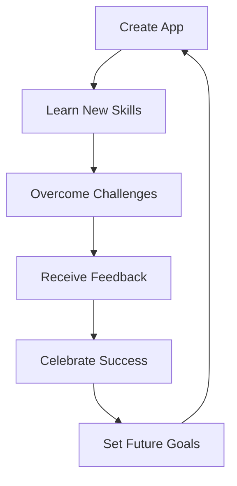

## 10.4.1 Reflecting on Achievements: Celebrating Your Coding Success

Congratulations! You've reached a significant milestone in your coding journey by creating and sharing your app with the world. It's time to pause and reflect on your achievements, recognizing the growth and successes you've experienced along the way. Reflecting on what you've accomplished is not only a way to appreciate your progress but also a powerful tool for learning and setting future goals.

### The Importance of Reflection

Reflection is an essential part of any learning journey. It allows you to look back on what you've done, understand your experiences, and appreciate how far you've come. By reflecting on your achievements, you can:

- **Appreciate Progress:** Recognize the skills and knowledge you've gained.
- **Learn from Experiences:** Identify what worked well and what could be improved.
- **Set Future Goals:** Use your reflections to plan your next steps and continue growing.

### Key Achievements to Reflect On

As you think about your journey, here are some key achievements to consider:

#### Learning New Skills

Creating an app is a fantastic way to learn new programming and design skills. Reflect on the technical abilities you've developed, such as:

- **Programming Languages:** Mastering Flutter and Dart.
- **Design Principles:** Understanding user interface and user experience design.
- **Problem-Solving:** Developing logical thinking and debugging skills.

#### Problem-Solving

Every coder faces challenges, and overcoming them is a significant achievement. Reflect on the problems you solved, such as:

- **Debugging:** Fixing bugs and errors in your code.
- **Design Challenges:** Finding creative solutions to design issues.
- **Technical Hurdles:** Learning new tools or technologies to enhance your app.

#### User Feedback

Receiving feedback from users is invaluable. Reflect on how positive feedback contributed to your app's improvement:

- **User Reviews:** Celebrating positive comments and constructive criticism.
- **Feature Requests:** Implementing new features based on user suggestions.
- **Engagement:** Noticing how users interact with your app and making improvements.

#### App Success

Celebrate the milestones your app has achieved, such as:

- **First Download:** The excitement of seeing your app downloaded for the first time.
- **Positive Reviews:** Receiving praise and high ratings from users.
- **User Growth:** Reaching a certain number of users or downloads.

### Reflection Cycle Diagram

To visualize the reflection process, consider the following diagram:

This cycle illustrates how each step in your journey leads to the next, creating a continuous loop of learning and growth.

### Interactive Exercise

To help you reflect on your achievements, try this exercise:

- **Write a Short Paragraph:** Describe what you've learned and achieved by developing your app. Consider the skills you've gained, the challenges you've overcome, and the feedback you've received.
- **Create a Mind Map:** Visualize your journey by creating a mind map. Include key milestones, skills, challenges, and successes.

### Visual Aids

Imagine yourself celebrating your app's success. Picture yourself holding a trophy or surrounded by happy characters who are cheering you on. These visualizations can inspire you to continue your coding journey with enthusiasm and confidence.

### Conclusion

Reflecting on your achievements is a rewarding experience that helps you appreciate your hard work and dedication. By recognizing your growth and successes, you can set new goals and continue to thrive in your coding journey. Remember, every step you take is a step towards becoming a more skilled and confident coder. Keep celebrating your achievements and look forward to the exciting adventures ahead!

## Quiz Time!



### Why is reflecting on achievements important?

- [x] It helps appreciate progress, learn from experiences, and set future goals.
- [ ] It allows you to forget past mistakes.
- [ ] It is only necessary for professional developers.
- [ ] It is a way to show off to others.

> **Explanation:** Reflecting on achievements helps you appreciate your progress, learn from experiences, and set future goals, which are essential for continuous growth.

### What is one key achievement to reflect on when creating an app?

- [x] Learning new programming and design skills.
- [ ] Buying a new computer.
- [ ] Watching coding tutorials.
- [ ] Reading about app development.

> **Explanation:** Learning new programming and design skills is a significant achievement when creating an app, as it contributes to your growth as a coder.

### How can user feedback contribute to your app's improvement?

- [x] By providing insights for new features and improvements.
- [ ] By discouraging you from making changes.
- [ ] By making you delete the app.
- [ ] By ignoring user suggestions.

> **Explanation:** User feedback provides valuable insights that can help you implement new features and make improvements to your app.

### What is a milestone you can celebrate in your app's success?

- [x] The first download of your app.
- [ ] The first time you opened your code editor.
- [ ] The first time you thought about coding.
- [ ] The first time you watched a coding video.

> **Explanation:** Celebrating the first download of your app is a significant milestone, as it marks the beginning of your app's journey in the real world.

### What does the reflection cycle diagram illustrate?

- [x] The continuous loop of learning and growth.
- [ ] The end of your coding journey.
- [ ] The steps to uninstall an app.
- [ ] The process of forgetting what you've learned.

> **Explanation:** The reflection cycle diagram illustrates the continuous loop of learning and growth, showing how each step in your journey leads to the next.

### What is an interactive exercise suggested for reflecting on achievements?

- [x] Writing a short paragraph about your learning and achievements.
- [ ] Deleting your app and starting over.
- [ ] Ignoring your past experiences.
- [ ] Watching a movie about coding.

> **Explanation:** Writing a short paragraph about your learning and achievements helps you reflect on your journey and recognize your growth.

### What can a mind map help you visualize?

- [x] Your journey, including milestones, skills, challenges, and successes.
- [ ] The movies you want to watch.
- [ ] The games you want to play.
- [ ] The books you want to read.

> **Explanation:** A mind map can help you visualize your journey, including key milestones, skills, challenges, and successes.

### What should you do after reflecting on your achievements?

- [x] Set future goals and continue growing.
- [ ] Stop coding and take a break.
- [ ] Forget about your past experiences.
- [ ] Only focus on what went wrong.

> **Explanation:** After reflecting on your achievements, it's important to set future goals and continue growing as a coder.

### What is a visual aid suggested for celebrating your app's success?

- [x] Imagining yourself holding a trophy or surrounded by happy characters.
- [ ] Drawing a picture of a computer.
- [ ] Writing a list of coding terms.
- [ ] Creating a chart of coding languages.

> **Explanation:** Imagining yourself holding a trophy or surrounded by happy characters can inspire you to celebrate your app's success and continue your coding journey.

### True or False: Reflecting on achievements is only important for experienced developers.

- [ ] True
- [x] False

> **Explanation:** False. Reflecting on achievements is important for coders of all levels, as it helps appreciate progress, learn from experiences, and set future goals.


