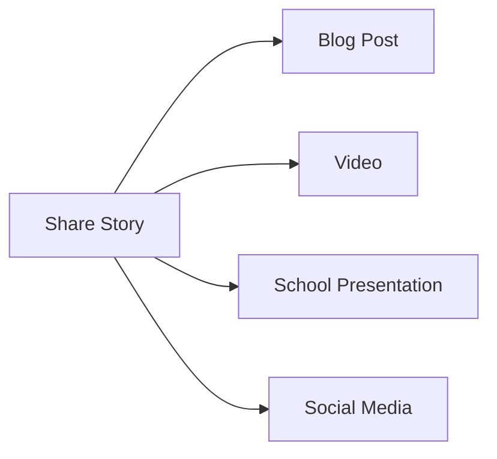

## 10.4.2 Sharing Your Story

Congratulations on creating and publishing your app! This is a significant achievement, and now it's time to share your journey with the world. Sharing your story can inspire others, create connections, and build a supportive community of young developers. Let's explore why and how you can share your app development journey.

### Why Share Your Story?

Sharing your story is more than just showcasing your app; it's about inspiring others and contributing to a community of learners and creators. Here are some reasons why sharing your story is important:

- **Inspiration:** Your journey can motivate others to start their own coding adventures. Seeing someone their age succeed can encourage peers to take on new challenges.
- **Learning and Growth:** By reflecting on your experiences, you gain insights into your learning process, which can help you grow as a developer.
- **Community Building:** Sharing your story helps you connect with other young developers, exchanging ideas and support.
- **Feedback and Improvement:** Engaging with others can provide valuable feedback, helping you improve your app and future projects.

### Ways to Share Your Story

There are many creative ways to share your app development journey. Here are some ideas to get you started:

#### Write a Blog Post

Writing a blog post is a great way to document your development process. You can share the challenges you faced, how you overcame them, and what you learned along the way. Here’s a simple structure for your blog post:

1. **Introduction:** Briefly introduce yourself and your app.
2. **Development Journey:** Describe the process of creating your app, including any obstacles and how you solved them.
3. **Lessons Learned:** Share what you learned from the experience.
4. **Future Plans:** Discuss what you plan to do next, either with this app or future projects.

#### Create a Video

A video can be an engaging way to showcase your app and share your story. You can create a short video highlighting your app’s features and discussing your creation journey. Here’s a basic outline for your video:

1. **Introduction:** Introduce yourself and your app.
2. **App Demo:** Show the main features of your app.
3. **Behind the Scenes:** Share clips or images from your development process.
4. **Conclusion:** Reflect on your journey and share any future plans.

#### Present at School or Community Events

Consider sharing your app and story at school or community events, such as tech fairs or presentations. This is a fantastic opportunity to practice public speaking and engage with others interested in technology.

1. **Prepare a Presentation:** Create slides or a demo to showcase your app.
2. **Engage Your Audience:** Share interesting stories from your development process.
3. **Invite Questions:** Encourage your audience to ask questions and provide feedback.

#### Use Social Media

Social media platforms like Instagram, Facebook, or Twitter can be powerful tools for sharing your journey. You can post updates, behind-the-scenes looks, and success stories.

1. **Regular Updates:** Share progress updates during your development process.
2. **Behind-the-Scenes:** Post photos or videos of your coding setup or design sketches.
3. **Launch Announcement:** Celebrate your app’s release with a special post.

### Mermaid.js Sharing Flowchart

Here's a visual representation of the different ways you can share your story:

### Real-World Example

Let's look at a real-world example of a young developer who shared their app story. Meet Alex, a 12-year-old who developed a simple game app. Alex wrote a blog post detailing the development process, including the challenges of learning new coding concepts and the excitement of seeing the app come to life. Alex's story received positive feedback from peers and even inspired a few classmates to start their own coding projects.

### Interactive Exercise

Now it's your turn! Choose one method of sharing your story and outline what you would include. Here’s a simple exercise to get you started:

1. **Choose Your Method:** Decide whether you want to write a blog post, create a video, present at an event, or use social media.
2. **Outline Your Content:** Make a list of key points you want to include, such as challenges, solutions, and lessons learned.
3. **Plan Your Presentation:** Think about how you will present your story, whether through writing, visuals, or speaking.

### Visual Aids

To help you visualize how to share your story, here are some examples:

- **Blog Post Example:** A screenshot of a well-structured blog post with sections for introduction, development journey, and lessons learned.
- **Video Thumbnail:** An engaging thumbnail image for a video showcasing the app.
- **Social Media Post:** A creative Instagram post with a photo of the app and a caption sharing a success story.

### Conclusion

Sharing your story is a powerful way to inspire others and connect with a community of young developers. Whether you choose to write, speak, or create videos, your journey can motivate others to embark on their own coding adventures. Remember, every story has the potential to make a difference!

## Quiz Time!



### Why is sharing your app development story important?

- [x] It can inspire others and create connections.
- [ ] It helps you earn money immediately.
- [ ] It guarantees your app will be featured on the app store.
- [ ] It ensures you will win coding competitions.

> **Explanation:** Sharing your story can inspire others, provide insights, and help build a community of developers.

### Which of the following is a way to share your app development journey?

- [x] Write a blog post
- [x] Create a video
- [x] Present at school events
- [ ] Keep it a secret

> **Explanation:** Writing a blog post, creating a video, and presenting at events are all effective ways to share your story.

### What should you include in a blog post about your app?

- [x] Introduction, development journey, lessons learned, future plans
- [ ] Only the app's name and download link
- [ ] A list of all the bugs in the app
- [ ] A detailed history of coding

> **Explanation:** A blog post should include an introduction, development journey, lessons learned, and future plans to provide a comprehensive story.

### What is a benefit of presenting your app at school events?

- [x] Engaging with others interested in technology
- [ ] Winning a prize every time
- [ ] Avoiding public speaking
- [ ] Keeping your app secret

> **Explanation:** Presenting at school events allows you to engage with others interested in technology and share your story.

### How can social media be used to share your app journey?

- [x] Posting updates and behind-the-scenes looks
- [ ] Only posting about unrelated topics
- [ ] Keeping your profile private
- [ ] Deleting all app-related content

> **Explanation:** Social media can be used to post updates, behind-the-scenes looks, and success stories to share your journey.

### What is the first step in creating a video about your app?

- [x] Introduce yourself and your app
- [ ] Show only the app's code
- [ ] Discuss unrelated topics
- [ ] Avoid showing the app

> **Explanation:** The first step is to introduce yourself and your app to provide context for the video.

### What is a key component of a school presentation about your app?

- [x] Engaging your audience with interesting stories
- [ ] Reading from a script without interaction
- [ ] Avoiding questions from the audience
- [ ] Only showing the app's code

> **Explanation:** Engaging your audience with interesting stories helps make your presentation more impactful.

### What is an example of a real-world benefit of sharing your app story?

- [x] Receiving positive feedback and inspiring others
- [ ] Guaranteeing financial success
- [ ] Ensuring no one else can create similar apps
- [ ] Keeping your app secret

> **Explanation:** Sharing your story can lead to positive feedback and inspire others to start their own projects.

### What should you do after choosing a method to share your story?

- [x] Outline the key points you want to include
- [ ] Immediately publish without planning
- [ ] Keep your ideas to yourself
- [ ] Avoid sharing any details

> **Explanation:** Outlining key points helps you organize your thoughts and create a compelling story.

### True or False: Sharing your story can help you connect with other young developers.

- [x] True
- [ ] False

> **Explanation:** Sharing your story can help you connect with other young developers, creating a supportive community.


