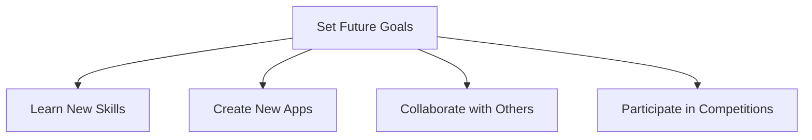

## 10.4.3 Planning for the Future

As you reach the end of this exciting journey in learning Flutter and coding, it's time to look ahead and plan your next steps. Setting goals for the future is a powerful way to maintain your motivation, continue learning, and achieve even greater successes. Let's explore how you can plan for your future in coding and app development.

### The Importance of Future Planning

Planning for the future is like setting a roadmap for your journey. It helps you stay focused, motivated, and excited about what's to come. By setting clear goals, you can track your progress, celebrate your achievements, and push yourself to reach new heights. Whether you're dreaming of creating the next big app or learning a new programming language, having a plan will guide you along the way.

### Types of Future Plans

There are many ways to continue your coding adventure. Here are some ideas to consider as you plan your future:

#### Learning New Skills

The world of technology is always evolving, and there's always something new to learn. Here are some areas you might want to explore:

- **Advanced Flutter Features:** Dive deeper into Flutter by learning about animations, state management, or custom widgets.
- **Other Programming Languages:** Expand your skills by learning languages like Python, JavaScript, or Swift.
- **Design Principles:** Improve your app design skills by studying user interface (UI) and user experience (UX) design.

#### Creating New Apps

Your journey doesn't end with the apps you've already created. Here are some ways to keep building:

- **Brainstorm New Ideas:** Think about problems you can solve or fun games you can create.
- **Enhance Existing Apps:** Add new features or improve the design of apps you've already built.

#### Collaborating with Others

Working with others can be a great way to learn and grow. Consider these options:

- **Join Coding Clubs:** Find local or online coding clubs where you can meet other young coders.
- **Work with Friends:** Team up with friends to create projects together.

#### Participating in Competitions

Competitions can be a fun way to challenge yourself and showcase your skills:

- **Coding Challenges:** Look for online coding challenges that test your problem-solving skills.
- **Hackathons:** Participate in events where you can build apps in a short amount of time.
- **App Development Contests:** Enter contests to see how your apps stack up against others.

### Goal-Setting Diagram

To help visualize your future plans, here's a simple diagram that outlines different paths you can take:

### Interactive Exercise

Let's put these ideas into action! Take a moment to write down three specific goals you want to achieve in your coding journey. For each goal, outline the steps you need to take to reach it. Here's an example to get you started:

1. **Goal:** Learn advanced Flutter animations.
   - **Step 1:** Find online tutorials or courses about Flutter animations.
   - **Step 2:** Practice by creating small animation projects.
   - **Step 3:** Implement animations in a new or existing app.

2. **Goal:** Create a new educational app.
   - **Step 1:** Brainstorm ideas for an app that helps kids learn math.
   - **Step 2:** Sketch the app's design and features.
   - **Step 3:** Start coding the app and test it with friends.

3. **Goal:** Participate in a coding competition.
   - **Step 1:** Research upcoming coding competitions for beginners.
   - **Step 2:** Register for the competition and prepare by practicing coding challenges.
   - **Step 3:** Participate and learn from the experience.

### Visual Aids

Imagine yourself planning your next big project or learning a new skill. Picture yourself sitting at your desk, surrounded by notes and sketches, excited about the possibilities. Use this vision to inspire your planning and remind yourself of the fun and creativity that coding brings.

### Conclusion

Planning for the future is an exciting part of your coding journey. By setting goals and taking steps to achieve them, you're setting yourself up for success. Remember, the skills you've learned in this book are just the beginning. The world of coding is vast and full of opportunities, and your adventure is only just beginning. Keep dreaming big, stay curious, and continue to explore the endless possibilities that coding offers.

## Quiz Time!



### Why is planning for the future important in coding?

- [x] It helps maintain motivation and track progress.
- [ ] It makes coding more difficult.
- [ ] It ensures you never make mistakes.
- [ ] It guarantees you will become a professional coder.

> **Explanation:** Planning for the future helps maintain motivation, track progress, and set clear goals for continued learning and success.

### Which of the following is a type of future plan for young coders?

- [x] Learning new skills
- [ ] Ignoring new technologies
- [ ] Avoiding collaboration
- [ ] Stopping app development

> **Explanation:** Learning new skills is a key part of future planning for young coders, helping them stay updated and improve their abilities.

### What is one benefit of collaborating with others in coding?

- [x] Learning and growing through teamwork
- [ ] Keeping all ideas to yourself
- [ ] Working in isolation
- [ ] Avoiding feedback

> **Explanation:** Collaborating with others allows young coders to learn and grow through teamwork, sharing ideas, and gaining new perspectives.

### What is a hackathon?

- [x] An event where you build apps in a short amount of time
- [ ] A place to hack into computers
- [ ] A coding school
- [ ] A type of computer virus

> **Explanation:** A hackathon is an event where participants build apps or projects in a short amount of time, often focusing on creativity and collaboration.

### Which of the following is a step in creating a new app?

- [x] Brainstorming ideas
- [ ] Deleting all previous work
- [ ] Avoiding user feedback
- [ ] Ignoring design principles

> **Explanation:** Brainstorming ideas is an essential step in creating a new app, allowing you to explore different concepts and solutions.

### What should you do if you want to learn advanced Flutter features?

- [x] Find online tutorials or courses
- [ ] Stop learning Flutter
- [ ] Only read books
- [ ] Avoid practicing

> **Explanation:** Finding online tutorials or courses is a great way to learn advanced Flutter features and improve your skills.

### How can participating in competitions benefit young coders?

- [x] By challenging themselves and showcasing skills
- [ ] By avoiding new challenges
- [ ] By focusing only on winning
- [ ] By working alone

> **Explanation:** Participating in competitions challenges young coders and allows them to showcase their skills, learn from others, and gain valuable experience.

### What is one way to enhance an existing app?

- [x] Add new features or improve the design
- [ ] Delete all features
- [ ] Ignore user feedback
- [ ] Stop updating the app

> **Explanation:** Enhancing an existing app by adding new features or improving the design can make it more useful and appealing to users.

### What is the first step in the interactive exercise for setting goals?

- [x] Write down three specific goals
- [ ] Start coding immediately
- [ ] Avoid setting any goals
- [ ] Only think about goals without writing them down

> **Explanation:** The first step in the interactive exercise is to write down three specific goals, which helps clarify your intentions and plan your actions.

### True or False: Joining coding clubs can help young coders collaborate and learn from others.

- [x] True
- [ ] False

> **Explanation:** True. Joining coding clubs provides opportunities for young coders to collaborate, share ideas, and learn from others in a supportive environment.


