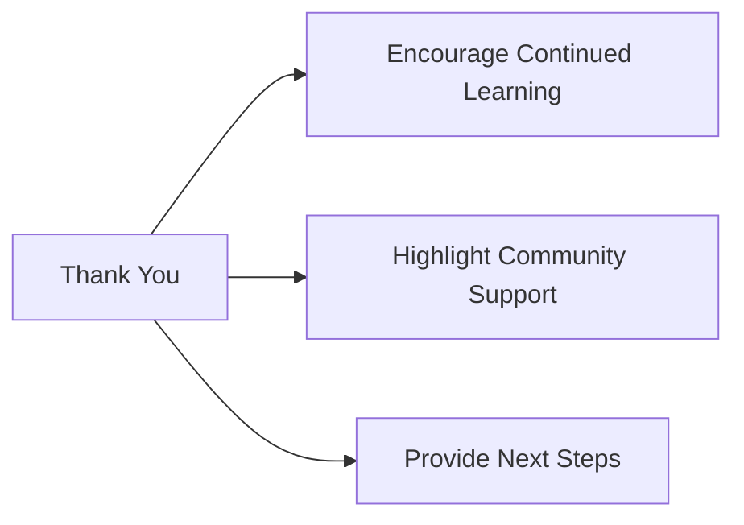

## 10.4.4 Thank You and Next Steps

Congratulations on reaching the end of this exciting journey through the world of Flutter and app development! You've learned so much, from writing your first lines of code to creating interactive apps that you can share with the world. Let's take a moment to reflect on your accomplishments and look forward to the exciting adventures that await you in the world of coding.

### Expressing Gratitude

First and foremost, thank you for embarking on this journey with us. Your dedication, curiosity, and creativity have brought you to this point, and that's something to be incredibly proud of. Whether you followed every chapter or explored the sections that interested you most, your efforts have laid a strong foundation for your future in technology.

### Encouraging Continued Learning

The world of coding is vast and ever-evolving, and your journey doesn't end here. In fact, it's just beginning! As you continue to explore new technologies, languages, and projects, remember that learning is a lifelong adventure. Each new skill you acquire opens up more possibilities and opportunities for innovation.

### Highlighting Community Support

Coding is not just about writing code; it's about being part of a vibrant community. Connecting with other developers can provide you with support, inspiration, and new perspectives. Don't hesitate to seek help when you need it, and remember that your contributions can also help others. Whether it's through online forums, local coding clubs, or open-source projects, being part of a community can enrich your coding experience.

### Providing Next Steps

As you look to the future, here are some exciting next steps to consider:

- **Explore More Flutter Features:** Dive deeper into Flutter's capabilities. Experiment with animations, state management, and integrations to enhance your apps.
- **Learn New Programming Languages:** Broaden your coding knowledge by exploring languages like Python, JavaScript, or C++. Each language offers unique features and strengths.
- **Start New Projects:** Think of new app ideas or expand your existing projects with new features. Let your imagination guide you.
- **Join Coding Communities:** Engage with online forums, local clubs, or coding groups where you can share ideas, collaborate, and learn from others.

Here's a visual representation of your next steps:

### Interactive Exercise

Take a moment to write a short thank-you note to yourself. Acknowledge the hard work and perseverance that brought you here. Then, list your next steps. What new skills do you want to learn? What projects do you want to start? This exercise will help you set clear goals and keep you motivated.

### Inspirational Quotes and Visuals

As you move forward, keep these inspirational quotes in mind:

- "The beautiful thing about learning is that no one can take it away from you." – B.B. King
- "The only way to do great work is to love what you do." – Steve Jobs
- "Coding is today's language of creativity. All our children deserve a chance to become creators instead of consumers of computer science." – Maria Klawe

Imagine yourself as a young innovator, moving forward in your coding journey. Picture the apps you'll create, the problems you'll solve, and the impact you'll have on the world.

### Safety Considerations

As you explore online communities and share your projects, remember to involve your parents or guardians. They can help ensure that you participate safely and responsibly, protecting your privacy and well-being.

### Progressive Learning

This book has equipped you with the skills and knowledge to build amazing apps. As you continue to learn, remember to reinforce the concepts you've learned here while embracing new ideas and challenges. Your coding journey is a progressive one, and each step builds upon the last.

### Real-World Relevance

The skills you've developed can be applied to solve real-world problems and create impactful projects. Whether you're building apps for fun, education, or social good, your work has the potential to make a difference.

### Inclusion of Best Practices

As you continue coding, remember the importance of ethical coding, continuous learning, and community engagement. These practices will support your ongoing development as a young coder and help you make a positive impact in the world.

Thank you once again for joining us on this journey. We can't wait to see where your coding adventures take you next!

## Quiz Time!



### What is the main purpose of this section?

- [x] To thank readers and motivate them for future coding adventures
- [ ] To introduce new coding languages
- [ ] To provide a detailed coding tutorial
- [ ] To discuss the history of Flutter

> **Explanation:** This section is designed to express gratitude to readers and inspire them to continue their coding journey.

### Why is community support important in coding?

- [x] It provides support, inspiration, and new perspectives
- [ ] It makes coding more competitive
- [ ] It is necessary for publishing apps
- [ ] It is required for learning new languages

> **Explanation:** Community support is important because it offers encouragement, new ideas, and collaboration opportunities.

### What is one suggested next step for readers?

- [x] Explore more Flutter features
- [ ] Stop coding for a while
- [ ] Focus only on one language
- [ ] Avoid joining coding communities

> **Explanation:** Exploring more Flutter features is a suggested next step to deepen understanding and skills.

### Which programming language is NOT mentioned as a suggestion for further learning?

- [x] Ruby
- [ ] Python
- [ ] JavaScript
- [ ] C++

> **Explanation:** Ruby is not mentioned in the suggested languages for further learning in this section.

### What should readers do to ensure safe participation in online communities?

- [x] Involve parents or guardians
- [ ] Share personal information freely
- [ ] Avoid asking for help
- [ ] Use only one online platform

> **Explanation:** Involving parents or guardians helps ensure safe and responsible participation in online communities.

### What is the benefit of writing a thank-you note to oneself?

- [x] It acknowledges hard work and sets future goals
- [ ] It is a requirement for app publishing
- [ ] It helps in learning new languages
- [ ] It is necessary for joining coding clubs

> **Explanation:** Writing a thank-you note to oneself helps recognize achievements and plan future steps.

### Which of the following is NOT a quote mentioned in the section?

- [x] "The only limit to our realization of tomorrow is our doubts of today."
- [ ] "The beautiful thing about learning is that no one can take it away from you."
- [ ] "The only way to do great work is to love what you do."
- [ ] "Coding is today's language of creativity."

> **Explanation:** The quote about doubts is not mentioned in this section.

### What is the purpose of the Mermaid.js diagram in this section?

- [x] To visually represent the next steps
- [ ] To show a coding algorithm
- [ ] To explain a Flutter feature
- [ ] To illustrate a coding error

> **Explanation:** The diagram is used to visually represent the next steps for readers.

### How can readers apply their coding skills in the real world?

- [x] By solving real-world problems and creating impactful projects
- [ ] By only focusing on theoretical knowledge
- [ ] By avoiding new challenges
- [ ] By not sharing their work

> **Explanation:** Applying coding skills to solve real-world problems and create projects can have a significant impact.

### True or False: The section encourages readers to stop learning after finishing the book.

- [ ] True
- [x] False

> **Explanation:** The section encourages continued learning and exploration beyond the book.


