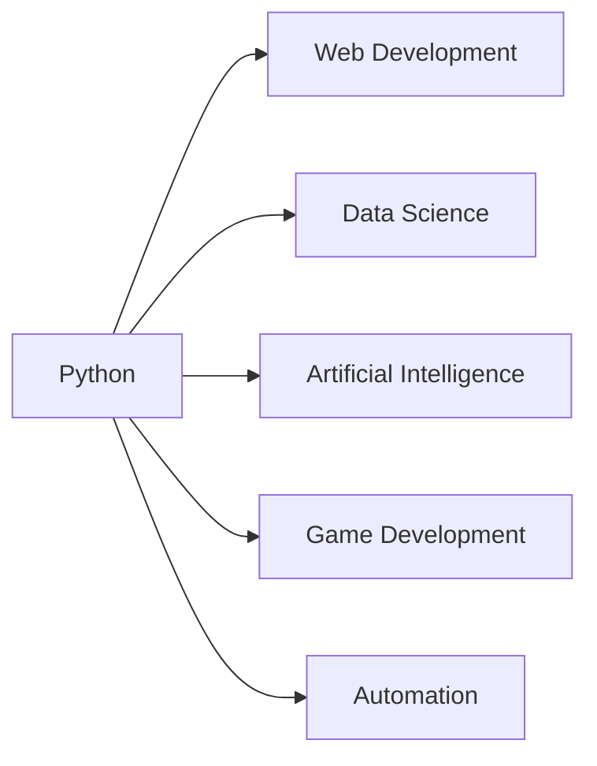

## 11.1.1 Python for Kids

Welcome to the exciting world of Python! If you've enjoyed learning Flutter and Dart, you're going to love exploring Python. It's a versatile and beginner-friendly programming language that's used in many exciting fields. Let's dive in and see what makes Python so special!

### What is Python?

Python is a popular programming language known for its simplicity and readability. It's used in various fields such as web development, data science, artificial intelligence, game development, and more. Python's easy-to-understand syntax makes it a great choice for beginners and experienced programmers alike.

### Why Learn Python?

Learning Python comes with many benefits:

- **Readability:** Python's syntax is clear and easy to read, which makes it an excellent language for beginners.
- **Large Community:** Python has a vast community of users who contribute to its development and offer support through forums and online resources.
- **Extensive Libraries:** Python has a rich set of libraries and frameworks that make it powerful for tasks like data analysis, machine learning, and web development.
- **Versatility:** Python can be used for a wide range of applications, from simple scripts to complex machine learning models.

### Basic Syntax Comparison

Let's compare some basic syntax between Python and Dart to see how they relate. This will help you understand how learning Python can complement your Flutter skills.

#### Example: Hello World

Here's how you print "Hello, World!" in both Python and Dart:

```python
print("Hello, World!")
```

```dart
// Dart
print('Hello, World!');
```

As you can see, both languages use the `print` function to display text, but Python uses double quotes while Dart uses single quotes. Both are correct, and you can use either in both languages.

### Fun Python Projects

Python is not just about writing code; it's about creating fun and interactive projects. Here are some simple projects you can try:

- **Calculator:** Create a basic calculator that can perform addition, subtraction, multiplication, and division.
- **Guessing Game:** Write a program that asks the user to guess a number and gives hints if the guess is too high or too low.
- **Drawing Shapes:** Use the `turtle` module to draw shapes and patterns on the screen.

### Python's Versatility

Python's versatility is one of its greatest strengths. Here's a flowchart illustrating the various applications of Python:



As you can see, Python can be used in many fields, making it a valuable skill to learn.

### Interactive Exercise

Let's try a simple Python script. Modify the code below to change the greeting message or add a new feature:

```python
name = input("What's your name? ")
print(f"Hello, {name}!")
```

**Exercise:** Try changing the greeting to say "Welcome to Python programming, [name]!" or add a feature that asks the user for their favorite color and responds with a message.

### Visual Aids

To help you get started with Python, here are some screenshots of Python coding environments like IDLE and Thonny. These environments make it easy to write and run Python code.


*IDLE: A simple Python coding environment.*


*Thonny: A beginner-friendly Python IDE.*

### Conclusion

Python is a fantastic language to learn, especially if you're just starting your coding journey. Its simplicity, versatility, and supportive community make it an ideal choice for young programmers. So, grab your computer, open a Python environment, and start coding!

## Quiz Time!



### What is Python primarily known for?

- [x] Its simplicity and readability
- [ ] Its complexity and difficulty
- [ ] Its limited use cases
- [ ] Its high cost

> **Explanation:** Python is known for its simplicity and readability, making it a great language for beginners.

### Which of the following is a benefit of learning Python?

- [x] Large community support
- [ ] Limited libraries
- [ ] Difficult syntax
- [ ] High learning curve

> **Explanation:** Python has a large community that provides support and resources, making it easier to learn.

### What is the output of the following Python code: `print("Hello, World!")`?

- [x] Hello, World!
- [ ] Hello World
- [ ] "Hello, World!"
- [ ] Error

> **Explanation:** The `print` function in Python outputs the text inside the parentheses, so it will print "Hello, World!".

### Which module can be used in Python to draw shapes?

- [x] turtle
- [ ] math
- [ ] random
- [ ] os

> **Explanation:** The `turtle` module in Python is used for drawing shapes and patterns.

### In Python, how do you get input from the user?

- [x] Using the `input()` function
- [ ] Using the `print()` function
- [ ] Using the `scan()` function
- [ ] Using the `read()` function

> **Explanation:** The `input()` function is used in Python to get input from the user.

### What is a common use of Python in the tech industry?

- [x] Data Science
- [ ] Cooking
- [ ] Carpentry
- [ ] Gardening

> **Explanation:** Python is widely used in data science for data analysis and machine learning.

### Which of the following is a Python IDE?

- [x] Thonny
- [ ] Visual Studio
- [ ] Eclipse
- [ ] NetBeans

> **Explanation:** Thonny is a Python IDE that is beginner-friendly and easy to use.

### How does Python's syntax compare to Dart's?

- [x] Python uses indentation for blocks
- [ ] Python uses semicolons to end statements
- [ ] Python uses curly braces for blocks
- [ ] Python uses dollar signs for variables

> **Explanation:** Python uses indentation to define blocks of code, unlike Dart which uses curly braces.

### What is the purpose of the `print()` function in Python?

- [x] To display output to the user
- [ ] To read input from the user
- [ ] To perform calculations
- [ ] To define variables

> **Explanation:** The `print()` function is used to display output to the user in Python.

### True or False: Python can be used for web development.

- [x] True
- [ ] False

> **Explanation:** Python can be used for web development, often with frameworks like Django and Flask.


