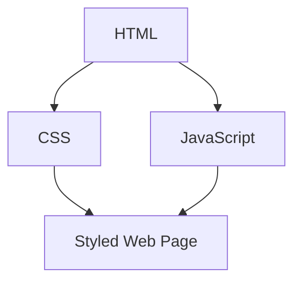

## 11.1.2 Web Development Basics

Welcome to the exciting world of web development! In this section, we'll explore how websites are built using three core technologies: HTML, CSS, and JavaScript. We'll also touch on how Flutter can be used to create web applications, combining these technologies to build interactive and responsive websites.

### What is Web Development?

Web development is the process of creating websites and web applications that run on browsers. It's like building a digital home where people can visit, interact, and find information. Just like a house needs a strong structure, beautiful design, and functional utilities, a website needs HTML, CSS, and JavaScript to come to life.

### Core Technologies of Web Development

#### HTML (HyperText Markup Language)

HTML is the backbone of any web page. It provides the structure and layout by using tags to define elements like headings, paragraphs, and images. Think of HTML as the skeleton of a website.

Here's a simple HTML example:

```html
<!-- Simple HTML Example -->
<html>
  <head>
    <title>My First Web Page</title>
  </head>
  <body>
    <h1>Hello, World!</h1>
    <p>Welcome to my website.</p>
  </body>
</html>
```

In this example, the `<html>` tag wraps the entire document, `<head>` contains meta-information like the title, and `<body>` holds the content that appears on the page.

#### CSS (Cascading Style Sheets)

CSS is what makes web pages look beautiful. It controls the colors, fonts, and layout, transforming the plain structure provided by HTML into something visually appealing. Think of CSS as the paint and decorations of your digital home.

Here's a simple CSS example:

```css
/* Simple CSS Example */
body {
  background-color: lightblue;
}
h1 {
  color: white;
  text-align: center;
}
p {
  font-family: verdana;
  font-size: 20px;
}
```

This CSS snippet changes the background color of the page, centers the heading, and styles the paragraph text.

#### JavaScript

JavaScript is the programming language that adds interactivity to web pages. It allows for dynamic content and user interactions, making websites more engaging and functional. Think of JavaScript as the electricity that powers your digital home.

Here's a simple JavaScript example:

```javascript
// Simple JavaScript Example
function greet() {
  alert("Hello, World!");
}
```

This JavaScript function displays an alert box with the message "Hello, World!" when called.

### How HTML, CSS, and JavaScript Work Together

To understand how these technologies collaborate, let's look at a simple workflow diagram:



In this diagram, HTML provides the structure, CSS styles the page, and JavaScript adds interactivity. Together, they create a complete and functional web page.

### Flutter for Web

Flutter isn't just for mobile apps; it can also create web applications! By combining Dart with HTML, CSS, and JavaScript, Flutter allows developers to build interactive and responsive websites. This means you can use your Flutter skills to create beautiful web apps that work across different devices.

### Interactive Exercise: Create Your Personal Homepage

Let's put your new knowledge into practice by creating a simple web page using HTML and CSS. Follow these steps to build your personal homepage:

1. **Create an HTML File:**
   - Open a text editor and save a new file as `index.html`.
   - Add the following HTML structure:

     ```html
     <!DOCTYPE html>
     <html>
     <head>
       <title>My Personal Homepage</title>
     </head>
     <body>
       <h1>Welcome to My Homepage</h1>
       
       <p>Hello! I'm [Your Name]. I love coding and creating new things.</p>
     </body>
     </html>
     ```

2. **Create a CSS File:**
   - Save another file as `styles.css` in the same directory.
   - Add the following CSS to style your page:

     ```css
     body {
       background-color: #f0f0f0;
       font-family: Arial, sans-serif;
     }
     h1 {
       color: #333;
       text-align: center;
     }
     p {
       font-size: 18px;
       text-align: center;
     }
     img {
       display: block;
       margin: 0 auto;
     }
     ```

3. **Link CSS to HTML:**
   - In your `index.html`, link the CSS file by adding this line inside the `<head>` section:

     ```html
     <link rel="stylesheet" type="text/css" href="styles.css">
     ```

4. **Open Your Web Page:**
   - Open the `index.html` file in a web browser to see your personal homepage in action!

### Visual Aids

To help you visualize the concepts, here are some screenshots of web pages showing HTML structure and CSS styling. You can also see demonstrations of JavaScript interactions, like buttons triggering alerts.

### Best Practices and Tips

- **Keep Your Code Organized:** Use comments and indentation to make your code easy to read.
- **Test Your Web Pages:** Always check how your web pages look and behave in different browsers.
- **Stay Curious:** Explore more about HTML, CSS, and JavaScript to enhance your web development skills.

### Common Pitfalls

- **Forgetting to Close Tags:** Always ensure your HTML tags are properly closed to avoid errors.
- **Mismatched CSS Selectors:** Double-check your CSS selectors to ensure they match the HTML elements you want to style.
- **JavaScript Errors:** Use browser developer tools to debug JavaScript errors and understand what's going wrong.

### Encouragement

Web development is a powerful skill that allows you to create amazing things on the internet. Keep experimenting, learning, and building your skills. Who knows? You might create the next big website or web app!

## Quiz Time!



### What is the primary role of HTML in web development?

- [x] To provide the structure of a web page
- [ ] To style the web page
- [ ] To add interactivity to the web page
- [ ] To store data for the web page

> **Explanation:** HTML is used to define the structure and layout of a web page using tags.

### Which language is used to style web pages?

- [ ] HTML
- [x] CSS
- [ ] JavaScript
- [ ] Dart

> **Explanation:** CSS (Cascading Style Sheets) is used to style web pages by adding colors, fonts, and layouts.

### What does JavaScript add to a web page?

- [ ] Structure
- [ ] Style
- [x] Interactivity
- [ ] Data storage

> **Explanation:** JavaScript adds interactivity to web pages, allowing for dynamic content and user interactions.

### In the provided HTML example, what does the `<h1>` tag represent?

- [x] A heading
- [ ] A paragraph
- [ ] An image
- [ ] A link

> **Explanation:** The `<h1>` tag is used to define a top-level heading on a web page.

### How do HTML, CSS, and JavaScript work together?

- [x] HTML provides structure, CSS adds style, and JavaScript adds interactivity
- [ ] HTML adds style, CSS provides structure, and JavaScript stores data
- [ ] HTML adds interactivity, CSS provides structure, and JavaScript adds style
- [ ] HTML stores data, CSS adds interactivity, and JavaScript provides structure

> **Explanation:** HTML provides the structure, CSS adds style, and JavaScript adds interactivity to create a complete web page.

### What is the purpose of the `<link>` tag in HTML?

- [x] To link a CSS file to an HTML document
- [ ] To create a hyperlink
- [ ] To add a JavaScript file
- [ ] To define a paragraph

> **Explanation:** The `<link>` tag is used to link external resources like CSS files to an HTML document.

### What does the `alert()` function do in JavaScript?

- [x] Displays a message box with a specified message
- [ ] Changes the background color of a page
- [ ] Adds a new paragraph to the page
- [ ] Links a CSS file to the HTML document

> **Explanation:** The `alert()` function in JavaScript displays a message box with a specified message.

### Which of the following is a correct CSS selector for styling all `<p>` elements?

- [x] `p { }`
- [ ] `.p { }`
- [ ] `#p { }`
- [ ] `p() { }`

> **Explanation:** The correct CSS selector for styling all `<p>` elements is `p { }`.

### What is the main advantage of using Flutter for web development?

- [x] It allows for building interactive and responsive websites using Dart
- [ ] It only works for mobile apps
- [ ] It replaces HTML and CSS
- [ ] It is used for data storage

> **Explanation:** Flutter for web allows developers to build interactive and responsive websites using Dart, HTML, CSS, and JavaScript.

### True or False: CSS can be used to add interactivity to web pages.

- [ ] True
- [x] False

> **Explanation:** CSS is used for styling web pages, not for adding interactivity. JavaScript is used for interactivity.


