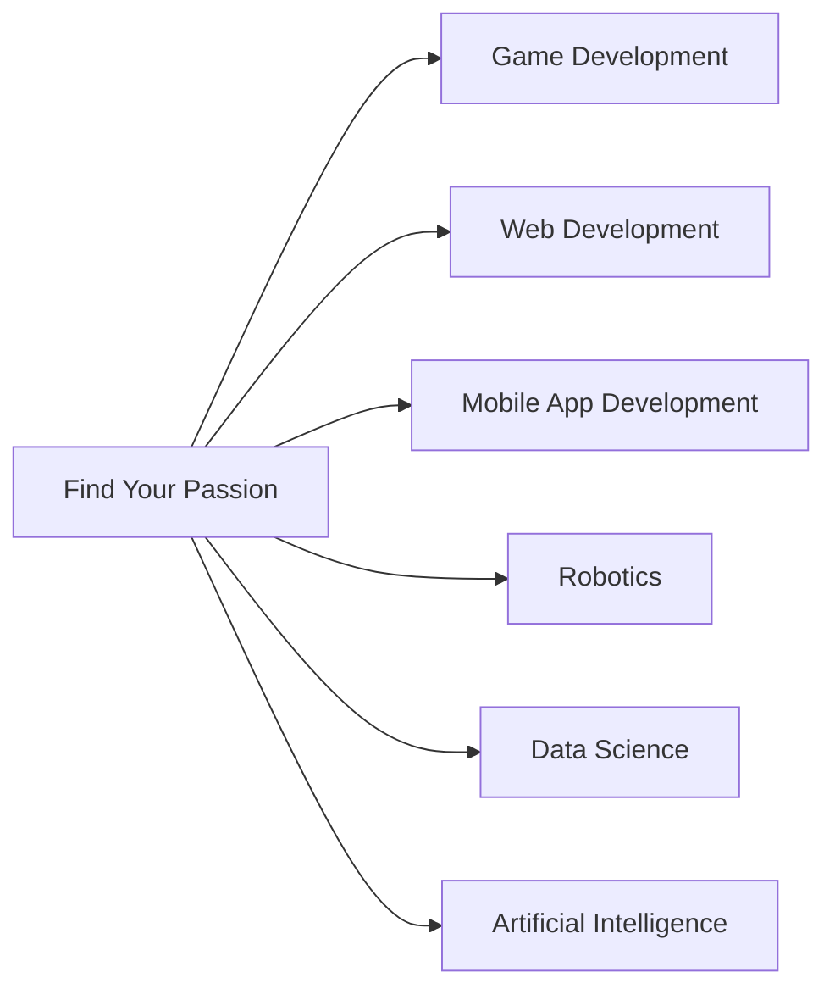

## 11.1.4 Finding Your Passion

Embarking on a journey in the world of programming is like setting sail on an adventure across a vast ocean. There are countless islands to explore, each representing a unique area of technology. The key to a fulfilling journey is finding the island that excites you the most—your passion. In this section, we'll explore how you can discover your passion in programming and technology.

### The Importance of Passion

Passion is the fuel that keeps you going, even when the seas get rough. When you find something you love in coding, learning becomes fun and challenges become opportunities. Passionate coders are more likely to stick with their projects, continuously improve their skills, and innovate in their chosen fields. So, how do you find your passion in the vast world of programming?

### Exploring Different Areas

Let's take a look at some exciting areas in programming that you might explore:

#### Game Development

Do you love playing video games? Imagine creating your own! Game development involves designing, coding, and testing games. You can use tools like Flutter or other game engines to bring your ideas to life. Game development combines creativity with technical skills, making it perfect for those who enjoy storytelling, art, and problem-solving.

#### Web Development

The internet is a vast place, and web developers are the architects of the digital world. If you enjoy creating and designing, web development might be your calling. You'll learn to build websites and web applications using languages like HTML, CSS, and JavaScript. Web development allows you to express your creativity while solving real-world problems.

#### Mobile App Development

With smartphones and tablets everywhere, mobile app development is a booming field. Using Flutter, you can create apps that run on both Android and iOS devices. If you enjoy designing user interfaces and creating interactive experiences, mobile app development could be the perfect fit for you.

#### Robotics

Robotics combines coding with engineering to create machines that can perform tasks. If you're fascinated by robots and how they work, this field offers endless possibilities. You can program robots to do everything from simple movements to complex tasks, making it a great choice for those who enjoy hands-on projects and tinkering.

#### Data Science

Data is everywhere, and data scientists are the detectives who uncover its secrets. If you enjoy analyzing information and finding patterns, data science might be your passion. You'll learn to work with data, create visualizations, and even make predictions using statistical methods and machine learning.

#### Artificial Intelligence

Artificial Intelligence (AI) is about creating smart applications that can learn and make decisions. If you're interested in how computers can mimic human intelligence, AI offers exciting challenges and opportunities. You'll explore algorithms, neural networks, and other technologies that power intelligent systems.

### Mermaid.js Exploration Flowchart

To help visualize your journey in finding your passion, here's a flowchart that maps out different areas you can explore:

### Self-Discovery Activities

Finding your passion is a journey of self-discovery. Here are some activities to help you along the way:

#### Try Different Projects

Experiment with various projects in different fields. Build a simple game, create a website, or program a robot. Trying different things will help you discover what you enjoy the most.

#### Research and Learn

Read about different fields, watch tutorials, or attend workshops. The more you learn, the better you'll understand what excites you. Online platforms like YouTube, Khan Academy, and Coursera offer a wealth of resources.

#### Talk to Others

Speak with friends, family, teachers, or mentors who have experience in different areas. They can provide valuable insights and help you understand what each field involves.

#### Reflect on Interests

Ask yourself questions like "Do you enjoy designing how things look?" or "Do you like solving puzzles and logic problems?" Reflecting on your interests can guide you toward your passion.

### Interactive Exercise

Take a moment to list the coding projects you've enjoyed the most. What common themes or elements made them fun? Was it the creativity, the problem-solving, or the technical challenge? Identifying these elements can help you pinpoint your passion.

### Visual Aids

To inspire your exploration, imagine illustrations representing different areas of programming: robots assembling a car, a vibrant website design, a thrilling video game scene, and a colorful data chart. These visuals can spark your imagination and motivate you to explore further.

### Conclusion

Finding your passion in programming is a journey worth taking. By exploring different areas, trying new projects, and reflecting on your interests, you'll discover what excites you the most. Remember, the world of technology is vast and full of opportunities. Embrace your curiosity, and let your passion guide you to new adventures.

## Discover Your Passion Quiz!



### What is the main benefit of finding your passion in coding?

- [x] It makes learning fun and keeps you motivated.
- [ ] It guarantees a high-paying job.
- [ ] It allows you to avoid challenges.
- [ ] It ensures you become famous.

> **Explanation:** Finding your passion makes learning enjoyable and keeps you motivated to continue improving, which is essential for long-term success.

### Which area of programming involves designing and coding video games?

- [x] Game Development
- [ ] Web Development
- [ ] Data Science
- [ ] Robotics

> **Explanation:** Game Development is the field where you design and code video games, combining creativity with technical skills.

### What is a key activity to help discover your passion in programming?

- [x] Try different projects
- [ ] Avoid learning new things
- [ ] Stick to one area only
- [ ] Ignore feedback from others

> **Explanation:** Trying different projects allows you to explore various fields and discover what you enjoy the most.

### Which programming field involves building websites and web applications?

- [x] Web Development
- [ ] Mobile App Development
- [ ] Artificial Intelligence
- [ ] Robotics

> **Explanation:** Web Development involves creating websites and web applications using languages like HTML, CSS, and JavaScript.

### What should you do to learn more about different programming fields?

- [x] Research and learn
- [ ] Avoid asking questions
- [ ] Only rely on school lessons
- [ ] Ignore online resources

> **Explanation:** Researching and learning through various resources helps you understand different fields and find what excites you.

### What is the focus of data science?

- [x] Analyzing data and creating visualizations
- [ ] Building robots
- [ ] Designing video games
- [ ] Developing mobile apps

> **Explanation:** Data Science focuses on analyzing data, finding patterns, and creating visualizations to uncover insights.

### Which field involves programming robots to perform tasks?

- [x] Robotics
- [ ] Web Development
- [ ] Data Science
- [ ] Game Development

> **Explanation:** Robotics involves programming robots to perform tasks, combining coding with engineering.

### What is a good question to reflect on when finding your passion?

- [x] Do you enjoy solving puzzles and logic problems?
- [ ] Do you dislike learning new things?
- [ ] Are you afraid of challenges?
- [ ] Do you prefer to work alone always?

> **Explanation:** Reflecting on whether you enjoy solving puzzles and logic problems can help guide you toward your passion.

### What does mobile app development involve?

- [x] Making apps for phones and tablets
- [ ] Building websites
- [ ] Analyzing data
- [ ] Programming robots

> **Explanation:** Mobile App Development involves creating apps for phones and tablets, often using tools like Flutter.

### True or False: Talking to others with experience in different areas can help you find your passion.

- [x] True
- [ ] False

> **Explanation:** Talking to others with experience can provide valuable insights and help you understand what each field involves, aiding in finding your passion.


