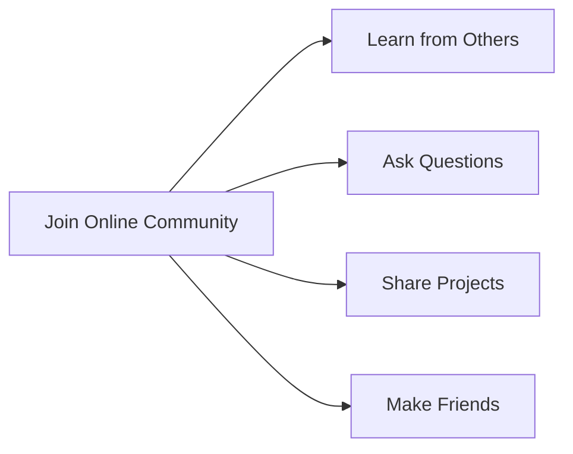

## 11.2.1 Online Coding Communities for Kids: Forums and Groups

In the exciting world of coding, learning doesn't just happen in isolation. One of the best ways to grow as a coder is by joining online communities where you can connect with other young coders, share your projects, ask questions, and collaborate on exciting new ideas. Let's dive into the world of online forums and groups and discover how they can enhance your coding journey!

### What are Online Communities?

Online communities are virtual spaces where people with shared interests come together to discuss ideas, solve problems, and support each other. For young coders, these communities offer a platform to learn, share, and grow. They are like digital playgrounds where you can meet others who are just as passionate about coding as you are!

### Popular Online Forums and Groups for Kids

Here are some popular online communities where young coders can thrive:

#### Scratch Community

The Scratch Community is a vibrant platform where kids can create and share projects using Scratch, a visual programming language designed for beginners. It's a fantastic place to explore creative coding projects, participate in challenges, and get inspired by what others are building.

- **Website:** [Scratch Community](https://scratch.mit.edu/)
- **Features:** Project sharing, forums, tutorials, and community events.

#### Reddit’s r/KidsCoding

Reddit is a vast network of communities, and r/KidsCoding is a subreddit dedicated to coding for kids. It's a place where young coders can ask questions, share their projects, and find resources tailored to their age group.

- **Website:** [r/KidsCoding](https://www.reddit.com/r/KidsCoding/)
- **Features:** Discussions, project showcases, and coding resources.

#### Discord Servers

Discord is a platform that hosts various servers, including those dedicated to young coders. These servers offer chat rooms where you can discuss coding topics, collaborate on projects, and even participate in coding competitions.

- **Example Server:** [Code With Friends](https://discord.gg/codewithfriends)
- **Features:** Real-time chat, voice channels, and collaborative coding sessions.

#### Stack Overflow

While Stack Overflow is more advanced, it can be a valuable resource for specific coding questions. It's a question-and-answer site where you can find solutions to coding problems and learn from experienced developers.

- **Website:** [Stack Overflow](https://stackoverflow.com/)
- **Features:** Q&A format, coding challenges, and a vast library of coding solutions.

### Benefits of Joining Online Communities

Joining online communities offers numerous benefits for young coders:

- **Learning from Others:** Gain insights and knowledge from experienced and peer coders. You can learn new techniques, discover best practices, and stay updated with the latest trends in coding.

- **Getting Help:** Whenever you're stuck on a problem, these communities are there to help. You can ask questions and receive support from fellow coders who have faced similar challenges.

- **Sharing Projects:** Showcase your work and receive valuable feedback. Sharing your projects not only boosts your confidence but also helps you improve through constructive criticism.

- **Making Friends:** Connect with others who share similar interests. Building friendships with fellow coders can lead to exciting collaborations and lifelong connections.

### Community Engagement Diagram

Here's a visual representation of how engaging with online communities can benefit you:

### Interactive Exercise

Let's put what we've learned into practice! Visit one of the recommended online communities, create an account (with parental guidance if necessary), and introduce yourself. Share a little about your coding projects and what you hope to learn from the community. This is a great way to start building connections and getting involved!

### Visual Aids

To help you get started, here are some screenshots of popular online communities’ interfaces and examples of typical posts or interactions:

- **Scratch Community Interface:** A colorful and user-friendly platform where you can easily navigate through projects and forums.
- **Reddit’s r/KidsCoding Posts:** Examples of questions and project showcases that you might find on the subreddit.
- **Discord Server Chat:** A glimpse into real-time discussions and collaborative coding sessions.

By joining these communities, you're not just learning to code; you're becoming part of a global network of young innovators who are shaping the future of technology. So, dive in, explore, and let your coding journey continue to flourish!

## Quiz Time!



### What is an online community?

- [x] A virtual space where people with shared interests gather to discuss ideas and support each other.
- [ ] A place where you can only play games.
- [ ] A website for watching videos.
- [ ] A platform for shopping online.

> **Explanation:** Online communities are virtual spaces where people with similar interests come together to share ideas, solve problems, and support each other.

### Which platform is specifically designed for kids to create and share coding projects?

- [x] Scratch Community
- [ ] Stack Overflow
- [ ] LinkedIn
- [ ] GitHub

> **Explanation:** The Scratch Community is designed for kids to create and share projects using the Scratch programming language.

### What can you do on Reddit’s r/KidsCoding?

- [x] Ask questions and share coding projects.
- [ ] Buy coding books.
- [ ] Watch coding tutorials.
- [ ] Play coding games.

> **Explanation:** Reddit’s r/KidsCoding is a subreddit where young coders can ask questions, share projects, and find resources.

### What is a benefit of joining online coding communities?

- [x] Learning from others and gaining insights.
- [ ] Only playing games.
- [ ] Watching movies.
- [ ] Shopping for gadgets.

> **Explanation:** Online coding communities allow you to learn from others, gain insights, and improve your coding skills.

### Which platform is known for real-time chat and collaborative coding sessions?

- [x] Discord
- [ ] Facebook
- [ ] Instagram
- [ ] Pinterest

> **Explanation:** Discord hosts servers where young coders can engage in real-time chat and collaborative coding sessions.

### What is Stack Overflow primarily used for?

- [x] Asking and answering coding questions.
- [ ] Sharing photos.
- [ ] Streaming music.
- [ ] Buying software.

> **Explanation:** Stack Overflow is a question-and-answer site where developers can ask and answer coding-related questions.

### How can online communities help when you're stuck on a coding problem?

- [x] You can ask questions and receive support from fellow coders.
- [ ] You can only watch videos.
- [ ] You can buy solutions.
- [ ] You can play games to solve it.

> **Explanation:** Online communities provide a platform to ask questions and receive help from other coders who may have faced similar challenges.

### What is one way to make friends in online coding communities?

- [x] Connect with others who share similar interests.
- [ ] Only send friend requests.
- [ ] Buy gifts for members.
- [ ] Watch their videos.

> **Explanation:** By engaging with others who share your interests in coding, you can build friendships and collaborate on projects.

### What should you do before joining an online community?

- [x] Get parental guidance if necessary.
- [ ] Buy a new computer.
- [ ] Delete all your social media accounts.
- [ ] Change your email address.

> **Explanation:** It's important to have parental guidance when joining online communities to ensure safe and responsible participation.

### True or False: Sharing your projects in online communities can help you receive feedback and improve.

- [x] True
- [ ] False

> **Explanation:** Sharing your projects allows you to receive feedback from others, which can help you improve and grow as a coder.


