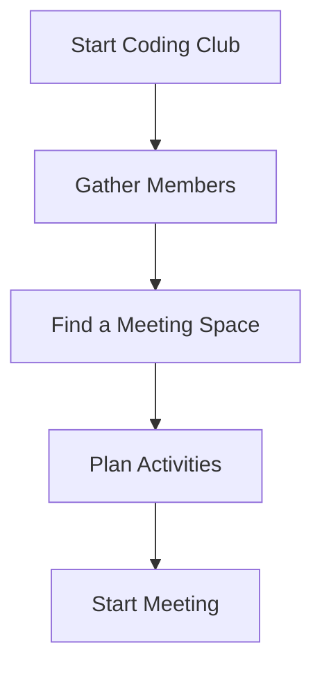

## 11.2.2 Local Coding Clubs

In the exciting world of coding, learning doesn't have to be a solitary journey. Local coding clubs offer a fantastic opportunity for young coders to come together, share their passion for technology, and learn collaboratively. Let's explore what local coding clubs are, the benefits they offer, and how you can find or start one in your community.

### What are Local Coding Clubs?

Local coding clubs are groups of kids and teens who meet regularly to work on coding projects, share knowledge, and support each other's learning. These clubs provide a welcoming environment where members can explore new technologies, tackle challenging projects, and develop their coding skills with the support of peers and mentors.

### Benefits of Joining a Local Club

Joining a local coding club can be a transformative experience, offering numerous benefits:

#### Face-to-Face Interaction

In today's digital age, face-to-face interaction is invaluable. Coding clubs provide a space where you can build strong friendships and improve your communication skills through in-person collaboration. Working together on projects fosters teamwork and helps you learn how to express your ideas clearly.

#### Mentorship Opportunities

Local coding clubs often have mentors, such as older students, teachers, or local professionals, who can provide guidance and expertise. Mentors can help you navigate complex coding challenges, introduce you to new tools and technologies, and inspire you with their experiences.

#### Hands-On Projects

One of the most exciting aspects of coding clubs is the opportunity to work on hands-on projects. Group projects are often more challenging and fun than individual ones, allowing you to tackle larger and more complex problems. Whether it's building a game, developing an app, or creating a website, the possibilities are endless.

#### Participation in Events

Many coding clubs participate in local hackathons, coding competitions, and workshops. These events are a great way to test your skills, learn from others, and gain recognition for your work. They also provide a platform to showcase your projects and receive feedback from a wider audience.

### How to Find or Start a Local Coding Club

If you're interested in joining a coding club, here are some ways to find one or start your own:

#### School Clubs

Check if your school has a coding or robotics club you can join. Many schools offer extracurricular activities focused on technology, providing a convenient way to get involved.

#### Libraries and Community Centers

Libraries and community centers often host coding clubs or can help you start one. They may provide resources, meeting spaces, and even facilitators to support your club's activities.

#### Online Search

Use platforms like Meetup to search for local coding groups. These platforms can connect you with existing clubs in your area and provide information about upcoming meetings and events.

#### Starting a Club

If you can't find a club that suits your interests, consider starting your own! Here are some steps to get you started:

1. **Gather Members:** Talk to friends, classmates, or neighbors who might be interested in joining.
2. **Find a Meeting Space:** Look for a suitable location, such as a school classroom, library, or community center.
3. **Plan Activities:** Decide on the types of projects and activities your club will focus on. You might start with a simple group project or a coding challenge.
4. **Start Meeting:** Set a regular meeting schedule and begin your coding adventures!

Here's a visual representation of the steps to start a coding club:

### Interactive Exercise

Let's brainstorm! Imagine you're planning the first meeting of your local coding club. What kind of group project would you like to work on? Perhaps a simple game, a website for your club, or a fun coding challenge? Write down your ideas and share them with your potential club members.

### Visual Aids

To inspire you, here are some images of coding club activities:

- Group coding sessions where members collaborate on projects.
- Presentations where club members showcase their work.
- Project showcases where completed projects are displayed for others to see.

Joining or starting a local coding club can be a rewarding experience, offering opportunities to learn, grow, and make lasting friendships. So, take the plunge and become part of a community that shares your passion for coding!

## Quiz Time!



### What is a local coding club?

- [x] A group of kids who meet regularly to work on coding projects.
- [ ] An online forum for discussing coding.
- [ ] A professional coding bootcamp.
- [ ] A solo coding practice session.

> **Explanation:** Local coding clubs are groups where kids meet in person to collaborate on coding projects.

### What is one benefit of joining a local coding club?

- [x] Face-to-face interaction with peers.
- [ ] Access to online coding tutorials.
- [ ] Discounts on coding software.
- [ ] Free coding books.

> **Explanation:** Local coding clubs offer face-to-face interaction, which helps build communication skills and friendships.

### How can you find a local coding club?

- [x] Check your school for a coding club.
- [ ] Visit a local bookstore.
- [ ] Search for coding podcasts.
- [ ] Look for coding apps.

> **Explanation:** Schools often have coding clubs, making them a great place to start looking.

### What role do mentors play in coding clubs?

- [x] They provide guidance and expertise.
- [ ] They organize social events.
- [ ] They sell coding equipment.
- [ ] They write code for the club.

> **Explanation:** Mentors offer guidance and share their expertise to help club members learn and grow.

### What is a common activity in coding clubs?

- [x] Working on group projects.
- [ ] Watching coding movies.
- [ ] Shopping for gadgets.
- [ ] Playing video games.

> **Explanation:** Coding clubs often focus on collaborative group projects that enhance learning.

### What is a hackathon?

- [x] A coding event where participants work on projects.
- [ ] A type of computer virus.
- [ ] A coding tutorial series.
- [ ] A video game competition.

> **Explanation:** Hackathons are events where coders collaborate on projects, often within a limited time.

### What is the first step in starting a coding club?

- [x] Gather interested members.
- [ ] Buy coding books.
- [ ] Design a club logo.
- [ ] Create a website.

> **Explanation:** The first step is to gather members who are interested in joining the club.

### Where can coding clubs often find meeting spaces?

- [x] Libraries and community centers.
- [ ] Shopping malls.
- [ ] Movie theaters.
- [ ] Amusement parks.

> **Explanation:** Libraries and community centers often provide spaces for clubs to meet.

### What should you do if you can't find a local coding club?

- [x] Consider starting your own club.
- [ ] Give up on coding.
- [ ] Only code online.
- [ ] Wait for someone else to start one.

> **Explanation:** If you can't find a club, starting your own is a proactive way to create a coding community.

### True or False: Coding clubs only focus on individual projects.

- [ ] True
- [x] False

> **Explanation:** Coding clubs often focus on group projects, which encourage collaboration and learning.


