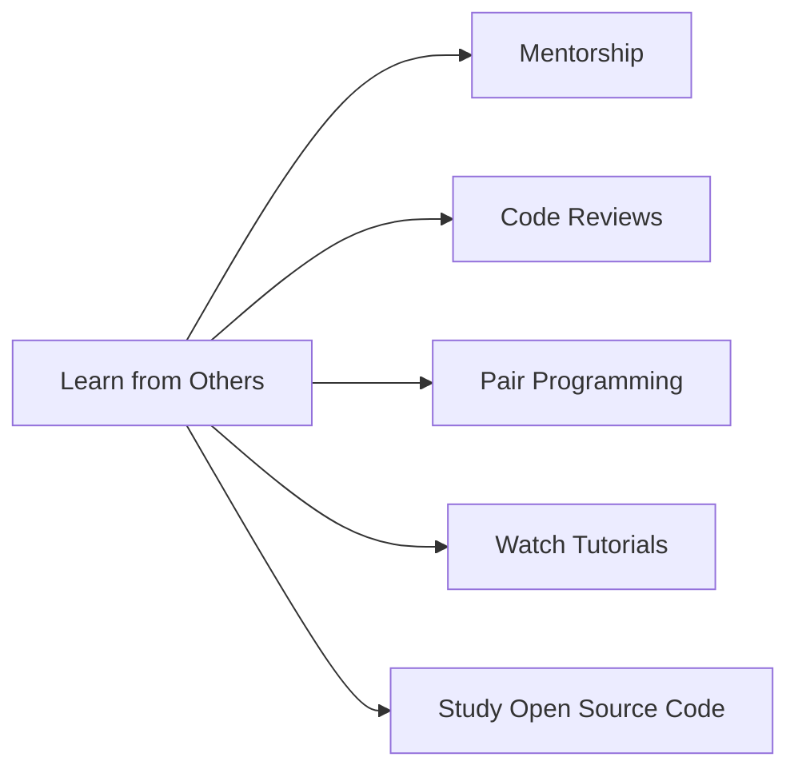

## 11.2.4 Learning from Others: Accelerate Your Coding Journey

In the world of coding, learning from others is a powerful way to enhance your skills and gain new insights. By observing and interacting with experienced developers, you can accelerate your learning, gain fresh perspectives, and ignite your creativity. Let's explore the various ways you can learn from others and take your coding journey to the next level.

### Importance of Learning from Others

Learning from others is not just about acquiring new skills; it's about broadening your horizons and seeing problems from different angles. When you engage with experienced coders, you gain access to their wealth of knowledge and experience. This can help you avoid common pitfalls, adopt best practices, and discover innovative solutions to coding challenges.

### Ways to Learn from Others

#### Mentorship

Mentorship is a valuable way to learn from someone who has more experience. A mentor can be a teacher, an older student, or a professional developer. They can provide guidance, share their experiences, and offer advice on your coding projects. Having a mentor can boost your confidence and help you navigate the complexities of coding.

**Interactive Exercise:** Reach out to a teacher or a more experienced coder and ask if they would be willing to mentor you. You could start by asking for help on a specific project or for advice on improving your skills.

#### Code Reviews

Participating in or observing code reviews is an excellent way to learn best practices and receive constructive feedback. During a code review, experienced developers examine your code and suggest improvements. This process helps you understand what works well and what could be improved, enhancing your coding skills.

**Tip:** If you're working on a project, ask a more experienced coder to review your code. Pay attention to their feedback and try to implement their suggestions.

#### Pair Programming

Pair programming involves two coders working together on the same project. This collaborative approach allows you to share ideas, solve problems together, and learn from each other's strengths. It's a great way to improve your coding skills while building teamwork abilities.

**Visual Aid:** Imagine two coders sitting side by side, each with a keyboard, discussing and writing code together. This is pair programming in action!

#### Watching Tutorials and Live Coding

Watching video tutorials, live streams, or coding demonstrations is a fantastic way to learn by observing others. These resources often provide step-by-step guidance on how to tackle specific coding challenges, allowing you to see how experienced developers approach problems.

**Suggestion:** Find a coding tutorial on a topic you're interested in and follow along. Try to replicate the code on your own and experiment with making changes.

#### Studying Open Source Code

Open source projects are a treasure trove of learning opportunities. By examining the code written by experienced developers, you can learn new techniques, understand complex algorithms, and see how large projects are structured.

**Real-World Example:** Consider the story of Alex, a young developer who improved their skills by contributing to an open-source project. By studying the code and working with experienced contributors, Alex learned new programming techniques and gained valuable experience.

### Mermaid.js Learning Flow Diagram

To visualize the different ways you can learn from others, here's a flow diagram:

### Interactive Exercise

Try reaching out to a potential mentor or partner for a small coding project. You could also participate in a code review session, either by having your code reviewed or by observing a review of someone else's code. These experiences can provide valuable insights and help you grow as a coder.

### Visual Aids

Imagine a scene where a young coder is sitting with a mentor, discussing a coding project. Or picture two coders engaged in pair programming, sharing ideas and solving problems together. These scenarios illustrate the power of learning from others.

### Conclusion

Learning from others is a crucial part of your coding journey. By engaging with experienced developers through mentorship, code reviews, pair programming, tutorials, and open-source projects, you can accelerate your learning and enhance your skills. Embrace these opportunities and watch your coding abilities soar!

## Quiz Time!



### What is one benefit of having a mentor in coding?

- [x] Gaining guidance and advice from someone experienced
- [ ] Learning to code without any help
- [ ] Avoiding collaboration with others
- [ ] Focusing only on individual projects

> **Explanation:** A mentor provides guidance and advice, helping you navigate the complexities of coding and enhancing your learning experience.

### How can code reviews help improve your coding skills?

- [x] By receiving constructive feedback and learning best practices
- [ ] By avoiding feedback from others
- [ ] By focusing only on your own code
- [ ] By working in isolation

> **Explanation:** Code reviews provide constructive feedback and help you learn best practices, improving your coding skills.

### What is pair programming?

- [x] Two coders working together on the same project
- [ ] Coding alone without any help
- [ ] Watching tutorials without practicing
- [ ] Avoiding collaboration with others

> **Explanation:** Pair programming involves two coders working together, sharing ideas and solving problems collaboratively.

### How can watching tutorials and live coding sessions benefit you?

- [x] By observing how experienced developers approach coding challenges
- [ ] By avoiding learning from others
- [ ] By focusing only on reading books
- [ ] By ignoring video resources

> **Explanation:** Watching tutorials and live coding sessions allows you to observe how experienced developers tackle coding challenges, enhancing your learning.

### What can you learn from studying open-source code?

- [x] New techniques and project structures
- [ ] How to code without any guidance
- [ ] How to work in isolation
- [ ] How to avoid collaboration

> **Explanation:** Studying open-source code helps you learn new techniques and understand how large projects are structured.

### What is the main goal of learning from others in coding?

- [x] To accelerate learning and gain new perspectives
- [ ] To avoid collaboration
- [ ] To focus only on individual projects
- [ ] To ignore feedback

> **Explanation:** Learning from others helps accelerate your learning and provides new perspectives, enhancing your coding skills.

### How can mentorship boost your confidence in coding?

- [x] By providing guidance and support from experienced individuals
- [ ] By avoiding any help
- [ ] By focusing only on self-study
- [ ] By ignoring advice

> **Explanation:** Mentorship provides guidance and support, boosting your confidence and helping you navigate coding challenges.

### What is a key benefit of pair programming?

- [x] Sharing ideas and solving problems together
- [ ] Working alone without collaboration
- [ ] Avoiding teamwork
- [ ] Ignoring others' input

> **Explanation:** Pair programming allows you to share ideas and solve problems collaboratively, enhancing your coding experience.

### Why is it important to participate in code reviews?

- [x] To receive feedback and improve your coding practices
- [ ] To avoid feedback
- [ ] To focus only on your own code
- [ ] To work in isolation

> **Explanation:** Participating in code reviews helps you receive feedback and improve your coding practices, enhancing your skills.

### True or False: Learning from others can help you avoid common coding pitfalls.

- [x] True
- [ ] False

> **Explanation:** True. Learning from others can help you avoid common coding pitfalls by gaining insights from their experiences.


