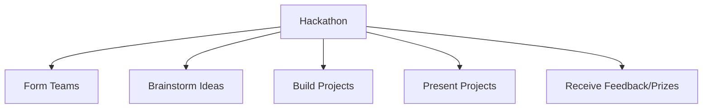

## 11.3.1 What is a Hackathon?

Welcome to the exciting world of hackathons! If you've ever wondered what it's like to be part of a fast-paced, collaborative coding event, you're in the right place. In this section, we'll explore what hackathons are, their purpose, the different types you might encounter, and the benefits of participating in one. Let's dive in!

### Definition of a Hackathon

A hackathon is an event where people come together to collaborate intensively on software projects, usually within a set time frame like 24-48 hours. Imagine a room filled with enthusiastic coders, designers, and innovators, all working together to create something amazing from scratch. The energy is electric, and the possibilities are endless!

### Purpose of Hackathons

Hackathons are designed to encourage creativity, learning, teamwork, and rapid problem-solving. They provide a unique opportunity to:

- **Experiment with New Ideas:** Hackathons are a playground for innovation. Participants are encouraged to think outside the box and try new approaches to solving problems.
- **Learn and Grow:** Whether you're a beginner or an experienced coder, hackathons offer a chance to learn new skills and technologies in a hands-on environment.
- **Collaborate and Network:** Working in teams allows you to meet new people, share knowledge, and build connections that can last beyond the event.

### Types of Hackathons

Hackathons come in various forms, each offering a unique experience:

#### Local vs. Online

- **Local Hackathons:** These are in-person events where participants gather in a physical location. They offer face-to-face interaction and the chance to immerse yourself in the event's atmosphere.
- **Online Hackathons:** Virtual hackathons allow participants from around the world to join in. They offer flexibility and the opportunity to collaborate with a diverse group of people.

#### Theme-Based Hackathons

Some hackathons focus on specific themes, such as:

- **Education:** Projects aimed at improving learning experiences.
- **Health:** Innovations in healthcare and wellness.
- **Gaming:** Creating new games or enhancing existing ones.
- **Sustainability:** Solutions for environmental challenges.

#### Competitive vs. Non-Competitive

- **Competitive Hackathons:** These events often include prizes for the best projects, adding an element of competition.
- **Non-Competitive Hackathons:** Focused on learning and collaboration, these hackathons emphasize the experience over winning.

### Hackathon Workflow

Here's a visual representation of a typical hackathon workflow:

### Benefits of Participating in Hackathons

Participating in a hackathon offers numerous benefits:

- **Skill Development:** Improve your coding, design, and problem-solving skills under time constraints.
- **Networking:** Meet other coders, mentors, and potential collaborators.
- **Creativity and Innovation:** Explore new ideas and technologies in a supportive environment.
- **Sense of Accomplishment:** Experience the satisfaction of completing a project and potentially winning prizes.

### A Day in the Life of a Hackathon Participant

Imagine waking up early, excited for the day ahead. You arrive at the hackathon venue, where you're greeted by the buzz of anticipation. After forming a team, you dive into brainstorming ideas, fueled by creativity and caffeine. As the hours fly by, you and your teammates code, design, and troubleshoot, turning your vision into reality. Finally, you present your project to a panel of judges, feeling proud of what you've accomplished. Whether you win a prize or not, the experience is invaluable.

### Interactive Exercise

Ready to join a hackathon? Research upcoming hackathons you can participate in and make a list of ones that interest you. Consider factors like location, theme, and whether they're competitive or non-competitive. This is your chance to take the first step into the world of hackathons!

### Visual Aids

To help you visualize the excitement of hackathons, imagine a room filled with teams huddled around laptops, whiteboards covered in ideas, and the sound of keyboards clicking away. Picture the smiles and high-fives as projects come together, and the applause as teams present their creations.

Hackathons are more than just coding events; they're a celebration of creativity, collaboration, and innovation. Whether you're a seasoned coder or just starting, participating in a hackathon can be a transformative experience. So why not give it a try?

## Quiz Time!



### What is a hackathon?

- [x] An event where people collaborate intensively on software projects within a set time frame.
- [ ] A solo coding competition.
- [ ] A long-term project development event.
- [ ] A conference for discussing coding theories.

> **Explanation:** A hackathon is an event where participants work together intensively on software projects, typically within a short time frame like 24-48 hours.

### What is one of the main purposes of a hackathon?

- [x] To encourage creativity and rapid problem-solving.
- [ ] To work individually on personal projects.
- [ ] To learn about hardware components.
- [ ] To attend lectures on coding.

> **Explanation:** Hackathons aim to foster creativity, learning, teamwork, and rapid problem-solving among participants.

### Which of the following is a type of hackathon?

- [x] Theme-based hackathon
- [ ] Solo hackathon
- [ ] Lecture-based hackathon
- [ ] Hardware-only hackathon

> **Explanation:** Theme-based hackathons focus on specific topics like education, health, gaming, or sustainability.

### What is a benefit of participating in a hackathon?

- [x] Networking with other coders and mentors.
- [ ] Working alone without any collaboration.
- [ ] Avoiding new technologies.
- [ ] Focusing solely on winning prizes.

> **Explanation:** Hackathons provide opportunities to network with other coders, mentors, and potential collaborators.

### What is the difference between local and online hackathons?

- [x] Local hackathons are in-person, while online hackathons are virtual.
- [ ] Local hackathons are longer than online ones.
- [ ] Online hackathons have more prizes.
- [ ] Local hackathons are only for beginners.

> **Explanation:** Local hackathons involve face-to-face interaction, while online hackathons allow participants to join virtually from anywhere.

### What is a competitive hackathon?

- [x] An event where participants compete for prizes.
- [ ] An event focused solely on learning.
- [ ] A hackathon without any themes.
- [ ] A solo coding event.

> **Explanation:** Competitive hackathons include prizes for the best projects, adding an element of competition.

### What is a non-competitive hackathon?

- [x] An event focused on learning and collaboration.
- [ ] An event with a strict prize structure.
- [ ] A hackathon with no themes.
- [ ] A solo coding event.

> **Explanation:** Non-competitive hackathons emphasize learning and collaboration over winning.

### What is the first step in a hackathon workflow?

- [x] Forming teams
- [ ] Presenting projects
- [ ] Receiving feedback
- [ ] Building projects

> **Explanation:** The first step in a hackathon is typically forming teams to collaborate on projects.

### What is a common theme for hackathons?

- [x] Sustainability
- [ ] Solo coding
- [ ] Hardware assembly
- [ ] Lecture series

> **Explanation:** Sustainability is a common theme for hackathons, focusing on environmental challenges.

### True or False: Hackathons are only for experienced coders.

- [ ] True
- [x] False

> **Explanation:** Hackathons are open to coders of all experience levels, providing opportunities for learning and collaboration.


