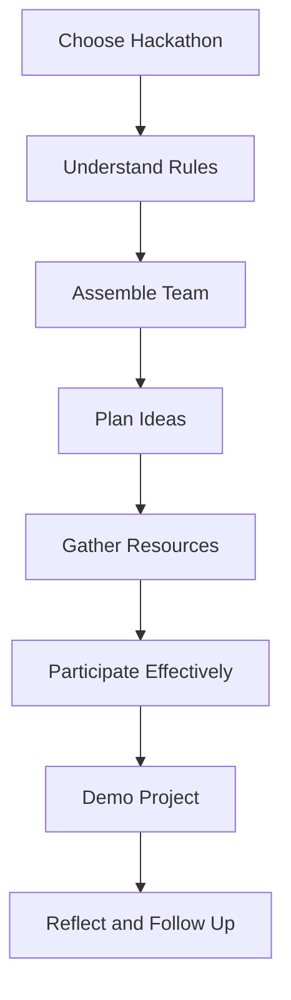

## 11.3.2 Preparing for a Hackathon

Participating in a hackathon can be an exhilarating experience, offering a unique opportunity to learn, collaborate, and create something amazing in a short period. Whether you're a seasoned coder or just starting, preparing effectively can make all the difference. Let's explore how you can gear up for a hackathon and make the most of this exciting event.

### Before the Hackathon

#### Choose the Right Hackathon

The first step in your hackathon journey is selecting the right event. Consider the following factors:

- **Interests:** Look for hackathons that align with your passions, whether it's game development, app creation, or solving real-world problems.
- **Skill Level:** Ensure the hackathon is suitable for your current coding abilities. Some events are beginner-friendly, while others may require more advanced skills.
- **Availability:** Check the dates and duration to ensure you can commit fully to the event.

By choosing a hackathon that matches your interests and skills, you'll be more motivated and likely to succeed.

#### Understand the Rules

Every hackathon has its own set of rules and guidelines. It's crucial to:

- **Read the Guidelines:** Familiarize yourself with the event's rules, themes, and judging criteria. This will help you tailor your project to meet the expectations.
- **Clarify Doubts:** If anything is unclear, don't hesitate to reach out to the organizers for clarification.

Understanding the rules will ensure you stay on track and avoid any disqualifications.

#### Assemble a Team

Hackathons are often team-based, so assembling a group with diverse skills can be beneficial:

- **Find Complementary Skills:** Look for team members who can bring different strengths, such as coding, design, or project management.
- **Communicate Early:** Discuss roles and responsibilities before the event to ensure everyone is on the same page.

A well-rounded team can tackle challenges more effectively and bring creative ideas to life.

#### Plan Ideas

Before the hackathon begins, brainstorm potential project ideas:

- **Align with the Theme:** Ensure your ideas fit the hackathon's theme or challenge.
- **Outline the Project:** Create a rough outline of your project, including key features and goals.

Having a plan will give you a head start and help you focus your efforts during the event.

#### Gather Resources

Make sure you have all the necessary tools and resources ready:

- **Software and Hardware:** Ensure your computer, software, and any other tools are installed and working properly.
- **Documentation:** Gather any reference materials or documentation you might need.

Being prepared with the right resources will save you time and stress during the hackathon.

### During the Hackathon

#### Time Management

With limited time to complete your project, managing your time effectively is crucial:

- **Create a Schedule:** Allocate time for different tasks, such as coding, testing, and refining.
- **Set Milestones:** Break the project into smaller tasks and set deadlines for each.

A well-structured schedule will help you stay on track and ensure you complete your project on time.

#### Communication

Effective communication is key to a successful hackathon experience:

- **Use Tools:** Utilize communication tools like Slack or Discord to keep in touch with your team.
- **Regular Check-ins:** Schedule regular check-ins to discuss progress and address any issues.

Good communication will keep your team coordinated and motivated.

#### Stay Focused

With so much to do, it's important to prioritize:

- **Essential Features First:** Focus on the core features that are necessary for your project.
- **Avoid Distractions:** Minimize distractions to maintain your focus and productivity.

By staying focused, you'll be able to deliver a polished and functional project.

#### Take Breaks

While it's tempting to work non-stop, taking breaks is essential:

- **Short Breaks:** Take short breaks to rest your mind and recharge.
- **Stay Healthy:** Remember to eat, hydrate, and stretch.

Regular breaks will help you avoid burnout and keep your energy levels up.

### After the Hackathon

#### Demo Your Project

Once the hackathon is over, it's time to showcase your work:

- **Prepare a Presentation:** Create a concise and engaging presentation or demo of your project.
- **Highlight Key Features:** Focus on the most impressive aspects of your project.

A well-prepared demo will leave a lasting impression on judges and participants.

#### Reflect on the Experience

Take time to reflect on your hackathon experience:

- **Discuss with Your Team:** Talk about what worked well and what could be improved.
- **Learn from Mistakes:** Identify any mistakes and think about how to avoid them in the future.

Reflection will help you grow and prepare better for future hackathons.

#### Follow Up

After the event, maintain the connections you've made:

- **Connect with Participants:** Reach out to team members, mentors, and other participants.
- **Explore Collaboration Opportunities:** Consider continuing your project or starting new ones with your new connections.

Building a network will open up new opportunities and support your coding journey.

### Mermaid.js Preparation Flowchart

To visualize the preparation process, here's a flowchart:

### Interactive Exercise

Create a checklist of preparations you need to make before attending your first hackathon. Consider including:

- Hackathon selection criteria
- Team member roles and responsibilities
- Project ideas and outlines
- Necessary tools and resources

### Visual Aids

- **Sample Checklists:** Provide examples of checklists for hackathon preparation.
- **Team Formation Illustrations:** Visualize how to assemble a team with complementary skills.
- **Project Planning Documents:** Show examples of project outlines and planning documents.

By following these steps and preparing thoroughly, you'll be ready to tackle any hackathon with confidence and creativity!

## Quiz Time!



### What is the first step in preparing for a hackathon?

- [x] Choose the right hackathon
- [ ] Assemble a team
- [ ] Plan ideas
- [ ] Gather resources

> **Explanation:** Choosing the right hackathon is the first step, as it sets the foundation for all other preparations.

### Why is it important to understand the rules of a hackathon?

- [x] To tailor your project to meet expectations
- [ ] To find team members
- [ ] To gather resources
- [ ] To create a schedule

> **Explanation:** Understanding the rules ensures your project aligns with the hackathon's guidelines and avoids disqualification.

### What should you consider when assembling a team for a hackathon?

- [x] Complementary skills
- [ ] Similar interests
- [ ] Same age group
- [ ] Proximity to each other

> **Explanation:** A team with complementary skills can tackle challenges more effectively and bring diverse ideas to the project.

### What is a key aspect of time management during a hackathon?

- [x] Creating a schedule
- [ ] Avoiding breaks
- [ ] Working non-stop
- [ ] Focusing on minor details

> **Explanation:** Creating a schedule helps allocate time efficiently for different tasks, ensuring project completion.

### How can effective communication be maintained during a hackathon?

- [x] Using communication tools
- [ ] Avoiding distractions
- [ ] Focusing on individual tasks
- [ ] Taking frequent breaks

> **Explanation:** Communication tools like Slack or Discord help keep the team coordinated and informed.

### Why is it important to take breaks during a hackathon?

- [x] To avoid burnout
- [ ] To finish faster
- [ ] To work non-stop
- [ ] To focus on minor details

> **Explanation:** Taking breaks helps maintain energy levels and prevents burnout, leading to better productivity.

### What should be the focus when demoing your project after a hackathon?

- [x] Highlighting key features
- [ ] Discussing mistakes
- [ ] Listing all features
- [ ] Explaining the rules

> **Explanation:** Highlighting key features makes the demo engaging and showcases the most impressive aspects of the project.

### What is the purpose of reflecting on the hackathon experience?

- [x] To learn from mistakes
- [ ] To find new team members
- [ ] To gather resources
- [ ] To create a schedule

> **Explanation:** Reflection helps identify areas for improvement and prepares you better for future hackathons.

### How can you maintain connections after a hackathon?

- [x] Connect with participants
- [ ] Avoid communication
- [ ] Focus on individual tasks
- [ ] Take frequent breaks

> **Explanation:** Connecting with participants opens up new opportunities and supports your coding journey.

### True or False: It's important to gather resources before the hackathon begins.

- [x] True
- [ ] False

> **Explanation:** Gathering resources beforehand ensures you have everything you need, saving time and reducing stress during the event.


