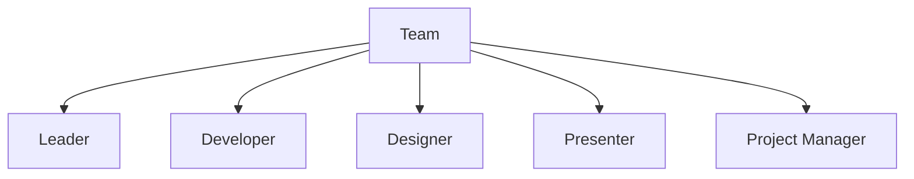

## 11.3.3 Teamwork and Collaboration

Participating in a hackathon is an exciting opportunity to bring your coding skills to life while working with others to create something amazing. In this section, we'll explore the importance of teamwork and collaboration, the roles within a team, effective communication strategies, and how to resolve conflicts. By understanding these concepts, you'll be better prepared to contribute to a successful hackathon project.

### The Importance of Teamwork

Teamwork is the cornerstone of any successful hackathon. When you collaborate with others, you bring together a diverse set of skills, perspectives, and ideas. This diversity can lead to more innovative and well-rounded projects. Here are some key benefits of teamwork:

- **Diverse Perspectives:** Different team members bring unique viewpoints, which can lead to creative solutions.
- **Skill Sharing:** Team members can learn from each other, enhancing their own skills.
- **Efficiency:** Tasks can be divided among team members, allowing for faster progress.
- **Support:** Working in a team provides emotional and motivational support, especially during challenging times.

### Roles within a Team

In a hackathon, each team member typically takes on a specific role. Understanding these roles can help you organize your team effectively:

- **Leader:** The leader guides the team, makes key decisions, and ensures everyone is on track. They are responsible for setting goals and motivating the team.

- **Coder/Developer:** This person writes and tests the code. They focus on the technical aspects of the project, ensuring that the code is functional and efficient.

- **Designer:** The designer creates the visual elements and user interface of the project. They ensure that the project is not only functional but also visually appealing.

- **Presenter:** The presenter prepares and delivers the project presentation. They communicate the project's goals, features, and achievements to judges and other participants.

- **Project Manager:** The project manager organizes tasks, manages time, and ensures the project stays on schedule. They coordinate between team members and keep track of progress.

Here's a visual representation of these roles within a team:

### Effective Communication

Communication is key to successful teamwork. Here are some strategies to ensure effective communication within your team:

- **Regular Check-Ins:** Hold short meetings to discuss progress, challenges, and next steps. This keeps everyone informed and aligned.

- **Use Collaboration Tools:** Utilize platforms like GitHub for code sharing, Trello for task management, or Slack for communication. These tools help organize tasks and facilitate communication.

- **Respect and Listen:** Encourage team members to listen to each other’s ideas and respect different viewpoints. This fosters a positive and inclusive team environment.

### Conflict Resolution

Disagreements can arise in any team setting. Here are some basic strategies for resolving conflicts:

- **Open Discussion:** Encourage team members to discuss issues openly and honestly. This helps in understanding different perspectives.

- **Find Compromises:** Work towards solutions that satisfy all parties involved. Compromise is key to resolving conflicts amicably.

- **Stay Focused on Goals:** Remind the team of the common goal and how resolving conflicts can help achieve it.

### Interactive Exercise

Let's put these concepts into practice! Imagine you're part of a team working on a sample project. Assign roles to each team member and outline their responsibilities. Discuss how you would communicate and resolve any potential conflicts.

### Visual Aids

To further illustrate the importance of teamwork and collaboration, here are some visual aids:

- **Illustrations of Teams Working Together:** Visualize a team brainstorming ideas, coding together, and presenting their project.

- **Diagrams Showing Different Roles:** Use diagrams to highlight the responsibilities of each team member.

- **Examples of Collaboration Tools in Use:** Show screenshots or mock-ups of tools like GitHub, Trello, and Slack being used effectively.

By understanding the importance of teamwork and collaboration, you'll be well-equipped to participate in a hackathon and contribute to a successful project. Remember, the key to a great team is communication, respect, and a shared commitment to achieving your goals.

## Quiz Time!



### Why is teamwork important in hackathons?

- [x] It brings diverse perspectives and skills.
- [ ] It allows one person to do all the work.
- [ ] It makes the project more complicated.
- [ ] It reduces the need for communication.

> **Explanation:** Teamwork is important because it brings together diverse perspectives and skills, leading to more innovative and well-rounded projects.

### What role is responsible for guiding the team and making key decisions?

- [x] Leader
- [ ] Coder/Developer
- [ ] Designer
- [ ] Presenter

> **Explanation:** The leader guides the team, makes key decisions, and ensures everyone is on track.

### Which role focuses on writing and testing the code?

- [ ] Leader
- [x] Coder/Developer
- [ ] Designer
- [ ] Presenter

> **Explanation:** The coder/developer is responsible for writing and testing the code, focusing on the technical aspects of the project.

### What is the main responsibility of the designer in a team?

- [ ] Writing code
- [ ] Managing tasks
- [x] Creating visual elements and user interface
- [ ] Presenting the project

> **Explanation:** The designer creates the visual elements and user interface, ensuring the project is visually appealing.

### Which tool can be used for task management in a team?

- [ ] GitHub
- [x] Trello
- [ ] Slack
- [ ] Visual Studio Code

> **Explanation:** Trello is a tool used for task management, helping teams organize and track their tasks.

### What is a key strategy for resolving conflicts in a team?

- [x] Open discussion
- [ ] Ignoring the issue
- [ ] Letting the leader decide
- [ ] Avoiding communication

> **Explanation:** Open discussion is a key strategy for resolving conflicts, allowing team members to understand different perspectives.

### How can regular check-ins benefit a team?

- [x] They keep everyone informed and aligned.
- [ ] They increase the workload.
- [ ] They reduce the need for collaboration.
- [ ] They make the project more complicated.

> **Explanation:** Regular check-ins keep everyone informed and aligned, ensuring effective communication within the team.

### What is the role of the presenter in a team?

- [ ] Writing code
- [ ] Designing visuals
- [x] Preparing and delivering the project presentation
- [ ] Managing tasks

> **Explanation:** The presenter prepares and delivers the project presentation, communicating the project's goals and achievements.

### Which role is responsible for organizing tasks and managing time?

- [ ] Leader
- [ ] Coder/Developer
- [ ] Designer
- [x] Project Manager

> **Explanation:** The project manager organizes tasks, manages time, and ensures the project stays on schedule.

### True or False: Respecting and listening to team members' ideas is important for effective communication.

- [x] True
- [ ] False

> **Explanation:** Respecting and listening to team members' ideas is crucial for effective communication and fostering a positive team environment.


