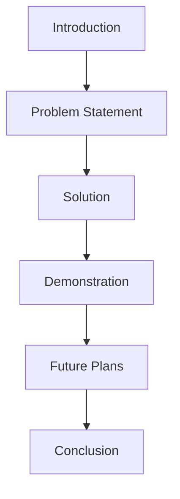

## 11.3.4 Showcasing Your Skills

Participating in a hackathon is an exciting opportunity to showcase your coding skills and creativity. It's not just about building a project; it's also about presenting it effectively to judges and peers. In this section, we'll explore how to present your work in a way that highlights your achievements and engages your audience.

### The Importance of Showcasing Skills

Presenting your project well can make a significant impact. It can impress judges, attract interest from other participants, and even open doors to mentorship opportunities. A well-delivered presentation demonstrates not only your technical skills but also your ability to communicate ideas clearly and confidently.

### Components of a Good Presentation

Creating a compelling presentation involves several key components. Let's break them down:

#### Introduction

Start with a brief introduction of yourself and your team. Share your names, roles, and a fun fact to create a connection with your audience. This sets the stage for your presentation and makes it more personal.

#### Problem Statement

Clearly explain the problem you aimed to solve or the challenge you addressed. Why is this problem important? Who does it affect? Providing context helps your audience understand the significance of your project.

#### Solution

Describe your project and how it solves the problem. Highlight the unique aspects of your solution and what makes it stand out. Use simple language and avoid technical jargon unless you explain it.

#### Demonstration

Show how your app works. Highlight key features and functionalities that address the problem. A live demonstration can be very effective, but make sure to practice it to avoid technical glitches.

#### Future Plans

Mention any potential improvements or next steps for your project. This shows that you are thinking ahead and are committed to refining your work.

#### Conclusion

Summarize your achievements and thank the audience for their attention. A strong conclusion leaves a lasting impression and reinforces the key points of your presentation.

### Presentation Tips

Here are some tips to help you deliver a successful presentation:

- **Keep It Simple:** Use clear and concise language. Explain technical terms if you need to use them.
- **Be Enthusiastic:** Show passion and excitement about your project. Enthusiasm is contagious and can engage your audience.
- **Practice:** Rehearse your presentation multiple times to ensure smooth delivery and timing. Practice in front of friends or family to get feedback.
- **Engage the Audience:** Encourage questions and be prepared to answer them confidently. This interaction can provide valuable feedback and insights.

### Mermaid.js Presentation Structure Diagram

To help you visualize the structure of your presentation, here's a diagram using Mermaid.js:

### Interactive Exercise

Now it's your turn! Draft a simple outline of your project presentation. Fill in each section with relevant information about your project. Use the structure we've discussed to organize your thoughts.

### Visual Aids

Consider using slides or demo videos to enhance your presentation. Visual aids can help illustrate your points and keep your audience engaged. Here are some examples of effective presentations:

- **Slides:** Use clear and simple slides with bullet points and images to support your speech.
- **Demo Videos:** A short video demonstration can be a powerful way to show your app in action.

### Conclusion

Showcasing your skills at a hackathon is a valuable experience that can boost your confidence and open up new opportunities. By following these guidelines, you'll be well-prepared to present your project effectively and make a lasting impression.

## Quiz Time!



### What is the first component of a good presentation?

- [x] Introduction
- [ ] Problem Statement
- [ ] Solution
- [ ] Conclusion

> **Explanation:** The introduction is the first component where you briefly introduce yourself and your team.

### Why is it important to explain the problem statement in your presentation?

- [x] To provide context and show the significance of your project
- [ ] To show off technical skills
- [ ] To fill time in the presentation
- [ ] To confuse the audience

> **Explanation:** Explaining the problem statement helps the audience understand why your project is important.

### What should you highlight during the demonstration of your app?

- [x] Key features and functionalities
- [ ] Only the technical details
- [ ] The problems you faced
- [ ] The length of your code

> **Explanation:** Highlighting key features and functionalities shows how your app addresses the problem.

### What is a good way to conclude your presentation?

- [x] Summarize achievements and thank the audience
- [ ] Introduce new problems
- [ ] Start a new topic
- [ ] Apologize for any mistakes

> **Explanation:** A strong conclusion summarizes your achievements and thanks the audience, leaving a positive impression.

### How can you engage your audience during the presentation?

- [x] Encourage questions and be prepared to answer them
- [ ] Ignore the audience
- [ ] Use complex jargon
- [ ] Speak very quickly

> **Explanation:** Encouraging questions and being prepared to answer them engages the audience and provides valuable feedback.

### What should you do if you need to use technical jargon in your presentation?

- [x] Explain it clearly
- [ ] Assume everyone understands
- [ ] Avoid it completely
- [ ] Use it frequently

> **Explanation:** If you need to use technical jargon, explain it clearly to ensure everyone understands.

### Why is practicing your presentation important?

- [x] To ensure smooth delivery and timing
- [ ] To memorize every word
- [ ] To impress the audience with speed
- [ ] To avoid using slides

> **Explanation:** Practicing helps ensure smooth delivery and timing, making the presentation more effective.

### What should you do if you encounter a technical glitch during your demonstration?

- [x] Stay calm and try to resolve it quickly
- [ ] Panic and stop the presentation
- [ ] Blame the audience
- [ ] Skip the demonstration

> **Explanation:** Staying calm and trying to resolve the issue quickly is the best approach.

### What is the purpose of mentioning future plans in your presentation?

- [x] To show commitment to refining your work
- [ ] To end the presentation quickly
- [ ] To confuse the audience
- [ ] To avoid questions

> **Explanation:** Mentioning future plans shows that you are thinking ahead and committed to improving your project.

### True or False: Enthusiasm in your presentation can engage your audience.

- [x] True
- [ ] False

> **Explanation:** Enthusiasm is contagious and can engage your audience, making your presentation more impactful.


