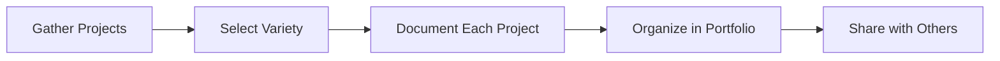

## 11.4.1 Collecting Your Projects

As you continue your coding journey, one of the most exciting steps is creating a portfolio. A portfolio is like a treasure chest of your coding adventures, showcasing your skills, creativity, and growth as a coder. Let's explore how to collect and organize your projects into a portfolio that truly represents you!

### What is a Portfolio?

A portfolio is a collection of your best work. For coders, it's a way to display the projects you've worked on, highlighting your abilities, progress, and interests. Think of it as your personal showcase, where you can proudly present your achievements to the world.

### Selecting Projects

When building your portfolio, it's important to choose a variety of projects that demonstrate different skills. Here are some ideas:

- **Mobile Apps:** Include apps you've built using Flutter or other frameworks. Highlight unique features or challenges you overcame.
- **Websites:** Showcase any websites you've developed, whether they're simple static pages or dynamic, interactive sites.
- **Games:** If you've created games, this is a great way to show your creativity and problem-solving skills.
- **Robotics Projects:** If you've dabbled in hardware, include any robotics or microcontroller projects.

### Documenting Projects

Once you've selected your projects, it's time to document them. This helps others understand what you've done and what you've learned.

#### Descriptions

For each project, write a brief description. Explain its purpose, main features, and what you learned during the process. This gives context to your work and shows your growth as a coder.

#### Screenshots and Videos

Visuals are powerful! Include screenshots, demo videos, or GIFs to showcase your project's functionality. This helps viewers quickly grasp what your project is about.

#### Code Snippets

Provide links to your source code, such as GitHub repositories. This allows others to explore your code and see how you implemented various features.

#### Challenges and Solutions

Every project has its challenges. Describe any obstacles you encountered and how you overcame them. This shows your problem-solving skills and resilience.

### Organizing Your Portfolio

Once you've gathered and documented your projects, it's time to organize them into a portfolio. Here's a simple flowchart to guide you:

### Interactive Exercise

Let's put this into practice! Create a list of your favorite projects to include in your portfolio. For each project, note down:

- A brief description
- Key features
- Any challenges and solutions
- Links to code repositories
- Screenshots or videos

### Visual Aids

To inspire you, here are examples of well-organized portfolios. Notice how different sections are highlighted and how the presentation style varies:

- **Project Overview:** A summary of each project with key details.
- **Visual Gallery:** A collection of screenshots or videos.
- **Code Access:** Links to repositories for deeper exploration.
- **Personal Reflection:** Insights into what was learned and future goals.

### Best Practices

- **Keep it Updated:** Regularly update your portfolio with new projects and improvements to existing ones.
- **Be Honest:** Showcase your true abilities and be honest about your contributions.
- **Seek Feedback:** Share your portfolio with friends, family, or mentors for feedback and suggestions.

### Conclusion

Building a coding portfolio is a rewarding experience that allows you to reflect on your journey and share your achievements with others. It's a dynamic showcase of your skills and creativity, and it will grow with you as you continue to learn and explore new coding adventures.

## Showcase Your Skills with a Portfolio!



### What is a coding portfolio?

- [x] A collection of projects that demonstrate a coder’s abilities, progress, and interests.
- [ ] A list of coding languages a person knows.
- [ ] A resume for applying to coding jobs.
- [ ] A diary of daily coding activities.

> **Explanation:** A coding portfolio is a collection of projects that showcase a coder's skills, creativity, and growth over time.

### Why should you include a variety of projects in your portfolio?

- [x] To highlight different skills and interests.
- [ ] To make the portfolio look bigger.
- [ ] To confuse the viewer.
- [ ] To fill up space.

> **Explanation:** Including a variety of projects demonstrates your range of skills and interests, making your portfolio more impressive and comprehensive.

### What should be included in the documentation of each project?

- [x] Descriptions, screenshots, code snippets, challenges, and solutions.
- [ ] Only the code snippets.
- [ ] Just the project title.
- [ ] A list of errors encountered.

> **Explanation:** Comprehensive documentation includes descriptions, visuals, code access, and insights into challenges and solutions, providing a full picture of the project.

### How can visuals enhance your portfolio?

- [x] They help viewers quickly understand the project's functionality.
- [ ] They make the portfolio heavier.
- [ ] They distract from the code.
- [ ] They are not necessary.

> **Explanation:** Visuals like screenshots and videos provide a quick and engaging way for viewers to understand what your project does.

### What is the purpose of providing links to source code in your portfolio?

- [x] To allow others to explore your code and see your implementation.
- [ ] To hide your work from others.
- [ ] To make the portfolio longer.
- [ ] To confuse viewers.

> **Explanation:** Sharing source code links lets others explore your work in detail, showcasing your coding skills and thought process.

### Why is it important to describe challenges and solutions in your project documentation?

- [x] It shows your problem-solving skills and resilience.
- [ ] It makes the project seem more difficult.
- [ ] It adds unnecessary information.
- [ ] It is not important.

> **Explanation:** Describing challenges and solutions highlights your ability to overcome obstacles, demonstrating your problem-solving skills.

### What should you do after organizing your projects into a portfolio?

- [x] Share it with others for feedback.
- [ ] Delete it.
- [ ] Keep it private.
- [ ] Forget about it.

> **Explanation:** Sharing your portfolio with others for feedback helps you improve and gain new insights.

### How often should you update your portfolio?

- [x] Regularly, with new projects and improvements.
- [ ] Once a year.
- [ ] Never.
- [ ] Only when you remember.

> **Explanation:** Regular updates ensure your portfolio reflects your latest skills and projects, keeping it relevant and impressive.

### What is a good practice when presenting your portfolio?

- [x] Be honest about your abilities and contributions.
- [ ] Exaggerate your skills.
- [ ] Hide your weaknesses.
- [ ] Copy others' work.

> **Explanation:** Honesty about your abilities and contributions builds trust and accurately represents your skills.

### True or False: A coding portfolio is only useful for professional coders.

- [ ] True
- [x] False

> **Explanation:** False. A coding portfolio is valuable for anyone learning to code, as it showcases growth and skills, and can be used for educational and personal development purposes.


