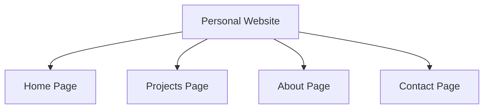

## 11.4.2 Creating a Personal Website

In today's digital world, having a personal website is like having your own corner of the internet. It's a place where you can showcase your coding projects, share your skills, and tell the world about your passion for technology. Let's explore how you can create your very own personal website to host your coding portfolio!

### Benefits of a Personal Website

A personal website serves as a digital hub for your projects and achievements. Here are some reasons why having one is beneficial:

- **Showcase Your Work:** Easily display your projects, making it simple for others to see what you've accomplished.
- **Build Your Brand:** Create a professional image that reflects your skills and interests.
- **Share Your Story:** Tell others about your journey in coding, what you enjoy, and your future goals.
- **Connect with Others:** Provide a way for people to contact you, whether for collaboration, feedback, or opportunities.

### Basic Structure of a Personal Website

A well-organized website typically includes the following pages:

- **Home Page:** This is the first page visitors see. Introduce yourself and provide a brief overview of your skills and interests.
- **Projects Page:** Showcase your portfolio with detailed descriptions, screenshots, and links to your projects.
- **About Page:** Share more about your background, what you enjoy about coding, and your goals.
- **Contact Page:** Provide ways for visitors to get in touch, such as email or social media links.

Here's a visual representation of the website structure:



### Tools and Platforms for Building a Website

There are several tools and platforms you can use to create your personal website. Here are a few options:

- **Wix or Weebly:** These are user-friendly website builders with drag-and-drop interfaces, making them suitable for beginners. You can create a professional-looking site without needing to code.
- **GitHub Pages:** A free platform for hosting static websites directly from a GitHub repository. It's a great way to learn about version control and web hosting.
- **WordPress:** A flexible platform with more customization options. It requires a bit more learning but offers a wide range of themes and plugins.
- **Flutter for Web:** Use Flutter to build a web-based personal portfolio with the skills you’ve learned. This option allows you to create a highly customized and interactive site.

### Step-by-Step Guide for a Simple Personal Website Using GitHub Pages

Let's walk through creating a simple personal website using GitHub Pages:

1. **Create a GitHub Account:** If you don’t have one, sign up at [GitHub](https://github.com/).

2. **Create a New Repository:** Name it as `username.github.io`. This is important because GitHub uses this naming convention to host your site.

3. **Add HTML Content:** Create a basic `index.html` file with HTML structure. Here's a simple example:

   ```html
   <!DOCTYPE html>
   <html>
   <head>
       <title>My Coding Portfolio</title>
   </head>
   <body>
       <h1>Welcome to My Portfolio</h1>
       <p>Hello! I'm [Name], and I love coding.</p>
       <a href="projects.html">See My Projects</a>
   </body>
   </html>
   ```

4. **Create Additional Pages:** Add `projects.html`, `about.html`, and `contact.html` with relevant content. For example, your `projects.html` might look like this:

   ```html
   <!DOCTYPE html>
   <html>
   <head>
       <title>My Projects</title>
   </head>
   <body>
       <h1>My Projects</h1>
       <p>Here are some of the projects I've worked on:</p>
       <ul>
           <li><a href="https://github.com/username/project1">Project 1</a></li>
           <li><a href="https://github.com/username/project2">Project 2</a></li>
       </ul>
   </body>
   </html>
   ```

5. **Commit and Push Changes:** Upload the files to the repository. You can do this using Git commands or directly through the GitHub website.

6. **Visit the Website:** Navigate to `https://username.github.io` to see your live site. It might take a few minutes for the site to become available.

### Interactive Exercise

Now it's your turn! Choose a platform and set up a basic personal website. Add at least one project to your projects page. Experiment with different layouts and styles to make your site unique.

### Visual Aids

Here are some screenshots to help guide you through the process:

- **GitHub Repository Setup:** 
- **Website Builder Interface:** 
- **Example Personal Website:** 

### Best Practices and Tips

- **Keep It Simple:** Start with a basic design and add complexity as you become more comfortable.
- **Be Consistent:** Use consistent colors, fonts, and styles throughout your site.
- **Update Regularly:** Keep your site up-to-date with your latest projects and achievements.
- **Seek Feedback:** Ask friends or family to review your site and provide feedback.

Creating a personal website is a fantastic way to showcase your skills and projects. It's a project that will grow with you as you learn more about coding and web development. Have fun building your digital presence!

## Quiz Time!



### What is one benefit of having a personal website?

- [x] It allows you to showcase your projects and skills.
- [ ] It automatically writes code for you.
- [ ] It replaces the need for a resume.
- [ ] It guarantees job offers.

> **Explanation:** A personal website acts as a digital hub where you can showcase your projects and skills, making it easy to share your work with others.

### Which page is typically the first one visitors see on a personal website?

- [x] Home Page
- [ ] Projects Page
- [ ] About Page
- [ ] Contact Page

> **Explanation:** The Home Page is usually the first page visitors see, where you introduce yourself and provide an overview of your skills and interests.

### What is GitHub Pages used for?

- [x] Hosting static websites directly from a GitHub repository.
- [ ] Creating dynamic websites with databases.
- [ ] Designing complex animations.
- [ ] Building mobile apps.

> **Explanation:** GitHub Pages is a free platform for hosting static websites directly from a GitHub repository.

### What should you name your GitHub repository to use GitHub Pages?

- [x] username.github.io
- [ ] my-portfolio
- [ ] personal-website
- [ ] coding-projects

> **Explanation:** To use GitHub Pages, you should name your repository `username.github.io`.

### Which of the following is a user-friendly website builder suitable for beginners?

- [x] Wix
- [ ] Flutter
- [ ] Django
- [ ] React

> **Explanation:** Wix is a user-friendly website builder with a drag-and-drop interface, making it suitable for beginners.

### What is the purpose of the Projects Page on a personal website?

- [x] To showcase your portfolio with detailed descriptions and links to projects.
- [ ] To provide contact information.
- [ ] To introduce yourself.
- [ ] To list your favorite websites.

> **Explanation:** The Projects Page is where you showcase your portfolio with detailed descriptions, screenshots, and links to your projects.

### What is one way to make your personal website more engaging?

- [x] Use consistent colors and styles throughout the site.
- [ ] Change the design every day.
- [ ] Use as many different fonts as possible.
- [ ] Avoid using images.

> **Explanation:** Using consistent colors and styles throughout your site makes it more visually appealing and engaging.

### What should you do after creating your website on GitHub Pages?

- [x] Visit `https://username.github.io` to see your live site.
- [ ] Delete the repository.
- [ ] Share the link only with close friends.
- [ ] Wait for GitHub to send you a confirmation email.

> **Explanation:** After creating your website on GitHub Pages, you can visit `https://username.github.io` to see your live site.

### Which platform allows you to build a web-based personal portfolio using the skills you've learned in this book?

- [x] Flutter for Web
- [ ] WordPress
- [ ] Wix
- [ ] Weebly

> **Explanation:** Flutter for Web allows you to build a web-based personal portfolio using the skills you've learned in this book.

### True or False: A personal website can help you connect with others for collaboration and opportunities.

- [x] True
- [ ] False

> **Explanation:** True. A personal website can provide a way for people to contact you, whether for collaboration, feedback, or opportunities.


