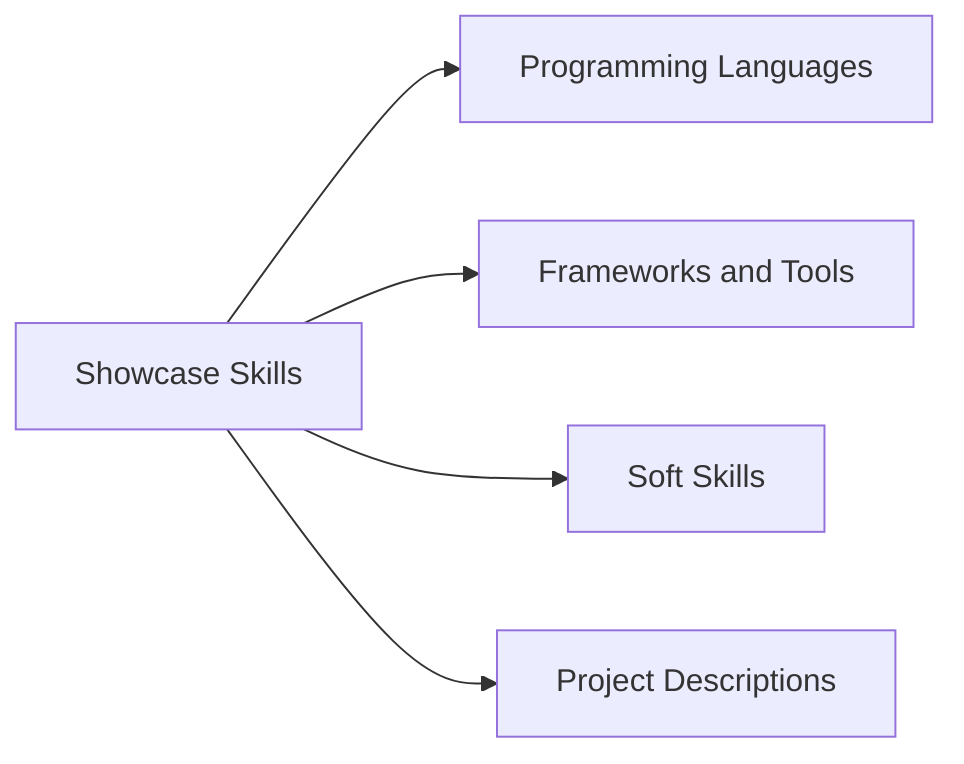
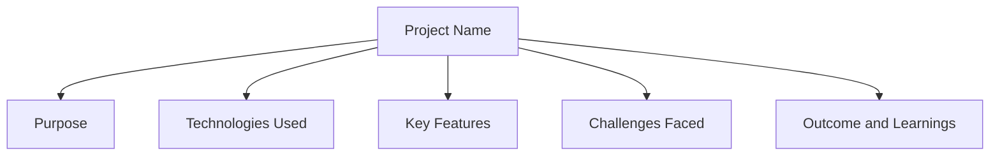

## 11.4.3 Presenting Your Skills

As you continue your coding journey, one of the most exciting steps is creating a portfolio to showcase your skills and projects. A well-crafted portfolio not only highlights your technical abilities but also tells the story of your growth as a coder. Let's explore how you can effectively present your skills to attract opportunities and demonstrate your capabilities.

### Showcase Varied Skills

Your portfolio should reflect the diverse range of skills you've developed. This includes not only the programming languages and frameworks you've learned but also the soft skills that are crucial in the tech world. Here's how you can organize your skills:

- **Programming Languages:** List the languages you are proficient in, such as Dart, Python, or JavaScript.
- **Frameworks and Tools:** Include frameworks like Flutter and tools like Git or Visual Studio Code.
- **Soft Skills:** Highlight skills like teamwork, problem-solving, and creativity, which are just as important as technical skills.

#### Visualizing Your Skills

To help you organize your skills, let's use a Mermaid.js diagram:

### Detailed Project Descriptions

Each project in your portfolio should have a detailed description that provides insight into your work. Here's a structure you can follow:

#### Project Name and Purpose

Start by introducing the project. What is it called, and what does it do? Explain the purpose behind creating it. For example:

- **Project Name:** Flutter Weather App
- **Purpose:** To provide users with real-time weather updates and forecasts.

#### Technologies Used

List the technologies you used to build the project. This could include programming languages, frameworks, libraries, and tools. For example:

- **Technologies Used:** Dart, Flutter, OpenWeatherMap API

#### Key Features

Highlight the main functionalities or unique aspects of the project. What makes it stand out? For example:

- **Key Features:** 
  - Real-time weather updates
  - Interactive weather maps
  - Customizable alerts

#### Challenges Faced

Discuss any difficulties you encountered during the project and how you overcame them. This shows your problem-solving skills. For example:

- **Challenges Faced:** Integrating the weather API was challenging due to data format differences. I overcame this by writing a custom parser.

#### Outcome and Learnings

Share what you achieved with the project and what you learned from the experience. For example:

- **Outcome and Learnings:** Successfully launched the app with over 1,000 downloads. Learned how to handle API data efficiently.

#### Visualizing Project Descriptions

Here's a Mermaid.js flowchart to help you visualize the structure of your project descriptions:

### Visual Hierarchy

Use headings, bullet points, and visuals to organize information clearly. This makes your portfolio easy to read and visually appealing. Consider using:

- **Headings:** To separate different sections.
- **Bullet Points:** For listing skills and features.
- **Visuals:** Such as screenshots or diagrams to illustrate your projects.

### Interactive Elements

Incorporate interactive elements to engage viewers. This could include:

- **Embedded Demos:** Show live demonstrations of your projects.
- **Live Project Links:** Provide links to your projects hosted online.
- **Clickable Prototypes:** Allow users to interact with your designs.

### Interactive Exercise

Now, it's your turn! Write a detailed description for one of your projects using the structure provided. Think about the purpose, technologies used, key features, challenges faced, and what you learned.

### Visual Aids

Here are examples of well-presented project descriptions and skill sections from professional portfolios. Use these as inspiration to craft your own:

- **Example 1:** A portfolio showcasing a mobile app with a clean layout and interactive demo.
- **Example 2:** A web developer's portfolio with detailed project descriptions and live links.

By following these guidelines, you'll create a portfolio that not only showcases your technical skills but also tells the story of your journey as a coder. Remember, your portfolio is a reflection of you, so make it personal and let your passion for coding shine through!

## Quiz Time!



### What should be included in a coding portfolio to showcase varied skills?

- [x] Programming languages, frameworks, tools, and soft skills
- [ ] Only programming languages
- [ ] Only frameworks and tools
- [ ] Only soft skills

> **Explanation:** A comprehensive portfolio should include a range of skills, including programming languages, frameworks, tools, and soft skills like teamwork and problem-solving.

### What is the purpose of providing detailed project descriptions in a portfolio?

- [x] To give insight into your work and demonstrate your abilities
- [ ] To fill up space in the portfolio
- [ ] To confuse the reader
- [ ] To hide your skills

> **Explanation:** Detailed project descriptions provide insight into your work, demonstrate your abilities, and show your problem-solving skills.

### Which of the following is NOT a key feature to highlight in a project description?

- [ ] Main functionalities
- [ ] Unique aspects
- [x] The color of the project
- [ ] Challenges faced

> **Explanation:** Key features should highlight the main functionalities and unique aspects of the project, not superficial details like color.

### Why is it important to discuss challenges faced in a project?

- [x] It shows your problem-solving skills
- [ ] It shows you had a difficult time
- [ ] It makes the project seem harder than it is
- [ ] It discourages others from trying

> **Explanation:** Discussing challenges faced demonstrates your problem-solving skills and how you overcame difficulties.

### What should you include in the "Outcome and Learnings" section of a project description?

- [x] What was achieved and what you learned
- [ ] Only what was achieved
- [ ] Only what you learned
- [ ] What you didn't achieve

> **Explanation:** The "Outcome and Learnings" section should include both what was achieved and what you learned from the project.

### How can you make your portfolio visually appealing?

- [x] Use headings, bullet points, and visuals
- [ ] Use only text
- [ ] Use bright colors everywhere
- [ ] Use as few visuals as possible

> **Explanation:** Using headings, bullet points, and visuals helps organize information clearly and makes the portfolio visually appealing.

### What interactive elements can be included in a portfolio?

- [x] Embedded demos, live project links, clickable prototypes
- [ ] Only text descriptions
- [ ] Only static images
- [ ] Only videos

> **Explanation:** Interactive elements like embedded demos, live project links, and clickable prototypes engage viewers and showcase your projects effectively.

### What is the benefit of using a Mermaid.js diagram in your portfolio?

- [x] To visually organize and present information clearly
- [ ] To make the portfolio look complicated
- [ ] To fill up space
- [ ] To confuse the reader

> **Explanation:** Mermaid.js diagrams help visually organize and present information clearly, making it easier for viewers to understand.

### What should you do in the interactive exercise suggested in this section?

- [x] Write a detailed description for one of your projects
- [ ] Write a list of your favorite programming languages
- [ ] Write a story about your coding journey
- [ ] Write a poem about coding

> **Explanation:** The interactive exercise involves writing a detailed description for one of your projects, following the provided structure.

### True or False: A portfolio should only focus on technical skills.

- [ ] True
- [x] False

> **Explanation:** A portfolio should showcase both technical skills and soft skills, as both are important in the tech world.


