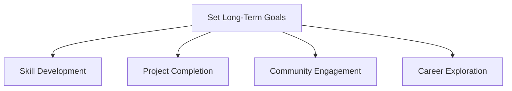

## 11.4.4 Setting Long-Term Coding Goals

Embarking on a coding journey is an exciting adventure filled with endless possibilities. As you continue to explore the world of programming, setting long-term goals can be your guiding star, helping you stay focused, motivated, and on track to achieve your dreams. In this section, we'll explore the importance of goal setting, the types of goals you can set, and how to create effective goals using the SMART framework.

### The Importance of Goal Setting

Setting goals is like creating a roadmap for your coding journey. It helps you:

- **Maintain Focus:** Goals give you a clear direction and help you prioritize your efforts.
- **Measure Progress:** By setting milestones, you can track your achievements and see how far you've come.
- **Stay Motivated:** Achieving goals provides a sense of accomplishment and encourages you to keep going.

### Types of Goals

When setting long-term goals, consider different areas of your coding journey:

#### Skill Development Goals

These goals focus on enhancing your coding abilities. Examples include:

- Learning new programming languages like Python or JavaScript.
- Mastering advanced Flutter features such as animations or state management.
- Understanding complex algorithms and data structures.

#### Project Goals

Project goals are about creating and completing coding projects. Examples include:

- Developing a more complex app, such as a game or a utility app.
- Contributing to open-source projects to gain real-world experience.
- Creating a portfolio of projects to showcase your skills.

#### Community Goals

Engaging with the coding community can be incredibly rewarding. Consider goals like:

- Joining a local or online coding club to meet other young coders.
- Participating in hackathons to challenge yourself and collaborate with others.
- Mentoring younger coders to share your knowledge and inspire others.

#### Career Goals

If you're thinking about a future career in technology, consider these goals:

- Exploring different careers in technology to find what interests you.
- Attending tech conferences or workshops to learn from industry experts.
- Building a professional portfolio to showcase your skills to potential employers.

### The SMART Goals Framework

To make your goals effective, use the SMART framework. SMART stands for Specific, Measurable, Achievable, Relevant, and Time-bound. Let's break it down:

- **Specific:** Clearly define what you want to achieve.
- **Measurable:** Determine how you will measure your progress.
- **Achievable:** Ensure your goal is realistic and attainable.
- **Relevant:** Make sure your goal aligns with your interests and aspirations.
- **Time-bound:** Set a deadline to achieve your goal.

#### Example of a SMART Goal

"I want to learn how to create animations in Flutter by completing two tutorials within the next month."

### Mermaid.js Goal-Setting Diagram

Here's a visual representation of setting long-term goals using Mermaid.js:

### Interactive Exercise: Set Your SMART Goals

Now it's your turn! Follow these steps to set three SMART goals related to coding:

1. **Identify Your Goals:** Think about what you want to achieve in the areas of skill development, projects, community, and career.
2. **Write Down Your Goals:** Use the SMART framework to make your goals specific, measurable, achievable, relevant, and time-bound.
3. **Create Actionable Steps:** Break down each goal into smaller steps you can take to achieve it.
4. **Set a Timeline:** Decide when you want to achieve each goal and mark it on your calendar.

### Visual Aids: Goal-Setting Worksheets

To help you get started, use the following goal-setting worksheet template:

| Goal Type          | Specific Goal                              | Action Steps                          | Timeline       |
|--------------------|--------------------------------------------|---------------------------------------|----------------|
| Skill Development  | Learn Flutter animations                   | Complete two tutorials                | 1 month        |
| Project Completion | Build a simple game app                    | Design, code, and test the app        | 3 months       |
| Community Engagement | Join an online coding club                | Research clubs, sign up, participate  | 2 weeks        |

### Conclusion

Setting long-term goals is a powerful way to guide your coding journey. By focusing on skill development, projects, community, and career, you can create a balanced and fulfilling path. Remember to use the SMART framework to make your goals clear and achievable. With determination and perseverance, you'll be amazed at what you can accomplish!

## Quiz Time!



### Why is setting goals important in your coding journey?

- [x] It helps maintain focus and measure progress.
- [ ] It makes coding more difficult.
- [ ] It ensures you never make mistakes.
- [ ] It guarantees you'll become a professional coder.

> **Explanation:** Setting goals helps maintain focus, measure progress, and stay motivated, which are essential for a successful coding journey.

### What is a skill development goal?

- [x] Learning new programming languages.
- [ ] Building a new app.
- [ ] Joining a coding club.
- [ ] Attending a tech conference.

> **Explanation:** Skill development goals focus on enhancing your coding abilities, such as learning new programming languages.

### Which of the following is a project goal?

- [ ] Learning Python.
- [x] Developing a more complex app.
- [ ] Joining a hackathon.
- [ ] Exploring careers in technology.

> **Explanation:** Project goals are about creating and completing coding projects, like developing a more complex app.

### What does the "S" in SMART goals stand for?

- [x] Specific
- [ ] Simple
- [ ] Standard
- [ ] Secure

> **Explanation:** The "S" in SMART goals stands for Specific, meaning the goal should be clearly defined.

### What is an example of a community goal?

- [ ] Learning algorithms.
- [ ] Building a portfolio.
- [x] Joining a coding club.
- [ ] Creating a game.

> **Explanation:** Community goals involve engaging with others, such as joining a coding club.

### What does "Measurable" mean in the SMART framework?

- [x] You can track your progress.
- [ ] The goal is easy to achieve.
- [ ] The goal is relevant to your interests.
- [ ] The goal has a set deadline.

> **Explanation:** "Measurable" means you can track your progress and know when you've achieved your goal.

### Which of the following is a career goal?

- [ ] Learning Flutter animations.
- [ ] Building a simple app.
- [ ] Joining a hackathon.
- [x] Exploring careers in technology.

> **Explanation:** Career goals involve exploring future career opportunities, such as exploring careers in technology.

### What does "Time-bound" mean in the SMART framework?

- [ ] The goal is easy to achieve.
- [ ] The goal is relevant to your interests.
- [x] The goal has a set deadline.
- [ ] The goal is clearly defined.

> **Explanation:** "Time-bound" means the goal has a specific deadline for completion.

### What is the purpose of setting a timeline for your goals?

- [x] To ensure you have a deadline to work towards.
- [ ] To make the goal more difficult.
- [ ] To avoid setting specific goals.
- [ ] To guarantee success.

> **Explanation:** Setting a timeline ensures you have a deadline to work towards, helping you stay focused and motivated.

### Is it important to involve parents or guardians when setting long-term goals?

- [x] True
- [ ] False

> **Explanation:** Involving parents or guardians ensures you have support and guidance, especially when engaging in online communities or setting up personal websites.


