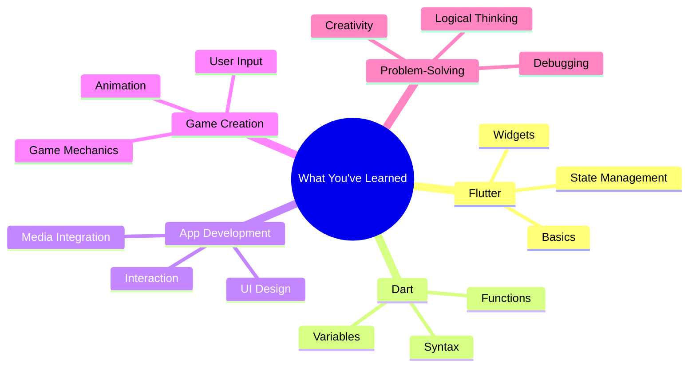

## 12.1.1 What You've Learned

As we reach the end of our coding adventure, it's time to pause and reflect on the incredible journey you've embarked upon. Learning to code is not just about understanding a programming language or building an app; it's about developing a mindset and a set of skills that will serve you throughout your life. Let's take a moment to review the key concepts, skills, and personal growth you've achieved.

### Review Key Concepts

Throughout this book, we've explored a variety of topics that have laid the foundation for your coding journey. Here's a summary of the main areas we've covered:

- **Flutter Basics:** You started by learning what Flutter is and how it can be used to create beautiful, cross-platform apps. You discovered the power of widgets and how they form the building blocks of any Flutter application.

- **Dart Programming:** Dart is the language that powers Flutter. You learned about its syntax, how to declare variables, and the importance of functions in organizing your code. Dart's simplicity and efficiency make it a great language for beginners.

- **App Development:** Building apps involves more than just writing code. You explored user interface (UI) design, learned how to make your apps interactive, and integrated media like images and sounds to enhance user experience.

- **Game Creation:** Creating games is a fun and engaging way to apply your coding skills. You delved into game mechanics, user input, and animations, learning how to bring your ideas to life in an interactive format.

- **Problem-Solving:** Coding is a powerful tool for solving problems. You developed logical thinking skills, learned how to debug your code, and used creativity to overcome challenges and create innovative solutions.

### Highlight Skill Development

As you progressed through the chapters, you acquired a range of skills that extend beyond coding:

- **Programming Skills:** You've become proficient in using Flutter and Dart to build functional and visually appealing apps. You've learned to write clean, efficient code and understand the importance of code organization.

- **Problem-Solving Abilities:** Coding challenges you to think critically and logically. You've honed your ability to break down complex problems into manageable parts and devise effective solutions.

- **Creative Thinking:** Building apps and games requires creativity. You've learned to think outside the box, experiment with new ideas, and bring your unique vision to life through code.

### Personal Growth

Learning to code is a journey of personal growth. Here are some ways it has impacted you:

- **Boosted Confidence:** As you've tackled coding challenges and built your own projects, your confidence in your abilities has grown. You now know that you can learn and master new skills.

- **Increased Patience:** Coding often requires patience and perseverance. You've learned to stay calm in the face of errors and persist until you find a solution.

- **Enhanced Problem-Solving:** Coding has taught you to approach problems methodically and logically, skills that are valuable in all areas of life.

### Mermaid.js Mind Map

To visualize the different areas of learning, here's a mind map that captures the essence of what you've learned:

### Interactive Exercise

Take a moment to reflect on your journey. List the top five things you've learned and explain how each has helped you in your projects. This exercise will help you appreciate your progress and identify areas where you excel.

### Visual Aids

To further summarize your achievements, here's an infographic highlighting the key skills and concepts you've mastered:

### Conclusion

As you look back on your journey, remember that learning to code is just the beginning. The skills and mindset you've developed will open doors to endless possibilities. Whether you continue building apps, explore new programming languages, or apply your skills in other areas, the future is bright. Keep coding, keep learning, and most importantly, keep having fun!

## Quiz Time!



### What is the primary programming language used with Flutter?

- [x] Dart
- [ ] JavaScript
- [ ] Python
- [ ] Ruby

> **Explanation:** Flutter uses Dart as its primary programming language, which is designed for building fast apps on any platform.

### Which of the following is a key component of Flutter apps?

- [x] Widgets
- [ ] HTML
- [ ] CSS
- [ ] SQL

> **Explanation:** Widgets are the building blocks of Flutter apps, used to create both the UI and the functionality.

### What skill is enhanced by debugging code?

- [x] Problem-solving
- [ ] Typing speed
- [ ] Drawing
- [ ] Singing

> **Explanation:** Debugging code enhances problem-solving skills as it involves identifying and fixing errors in the code.

### What is a benefit of learning to code?

- [x] Boosted confidence
- [ ] Instant wealth
- [ ] Guaranteed fame
- [ ] Free gadgets

> **Explanation:** Learning to code boosts confidence by empowering individuals to create and solve problems independently.

### Which concept involves making apps interactive?

- [x] User Input
- [ ] Syntax Highlighting
- [ ] Code Compilation
- [ ] File Compression

> **Explanation:** User input involves making apps interactive by allowing users to interact with the app through various means.

### What is a common use of functions in programming?

- [x] Organizing code
- [ ] Increasing file size
- [ ] Slowing down execution
- [ ] Deleting data

> **Explanation:** Functions are used to organize code into reusable blocks, making it easier to manage and understand.

### Which of the following is a creative aspect of coding?

- [x] Game Creation
- [ ] Data Entry
- [ ] File Sorting
- [ ] Password Reset

> **Explanation:** Game creation is a creative aspect of coding, allowing developers to design and build interactive experiences.

### What does UI stand for in app development?

- [x] User Interface
- [ ] Universal Input
- [ ] Unique Identifier
- [ ] Uninterrupted Internet

> **Explanation:** UI stands for User Interface, which is the part of the app that users interact with.

### How does coding help with personal growth?

- [x] Increases patience
- [ ] Guarantees success
- [ ] Provides shortcuts
- [ ] Eliminates challenges

> **Explanation:** Coding increases patience as it often requires persistence and problem-solving to overcome challenges.

### True or False: Learning to code can only be applied to technology-related fields.

- [ ] True
- [x] False

> **Explanation:** False. Learning to code develops skills like problem-solving and logical thinking, which are valuable in many fields beyond technology.


