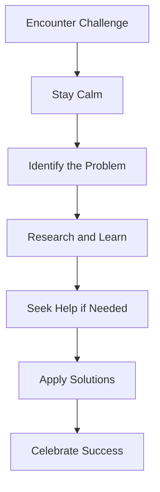

## 12.1.2 Overcoming Challenges

Embarking on a coding journey is like setting sail on an exciting adventure. Along the way, you'll encounter challenges that test your skills and determination. But fear not! These challenges are opportunities for growth and learning. Let's explore some common obstacles young coders face and discover strategies to overcome them, celebrating each victory along the way.

### Common Challenges in Coding

Coding is a rewarding but sometimes tricky endeavor. Here are some common challenges you might encounter:

- **Debugging Errors:** Finding and fixing errors in your code can be frustrating, but it's an essential part of the learning process.
- **Understanding Complex Concepts:** Some coding concepts can be difficult to grasp at first, requiring patience and practice.
- **Managing Time:** Balancing coding with other activities can be challenging, especially when you're eager to complete a project.

### Success Stories: Learning from Challenges

Every coder has faced challenges, and overcoming them often leads to significant breakthroughs. Here are a few success stories to inspire you:

- **Ava's Debugging Triumph:** Ava spent hours trying to fix a bug in her app. By staying persistent and seeking help from a coding forum, she finally solved the problem. This experience taught her valuable debugging skills and boosted her confidence.
- **Liam's Concept Clarity:** Liam struggled with understanding loops in his code. By breaking down the concept into smaller parts and practicing with simple examples, he gained clarity and was able to implement loops effectively in his projects.
- **Sophia's Time Management:** Sophia found it hard to manage her time between schoolwork and coding. By creating a schedule and setting small goals, she was able to balance her responsibilities and enjoy coding without stress.

### Strategies for Overcoming Obstacles

When faced with challenges, remember these strategies to help you overcome them:

#### Persistence

Persistence is key to success in coding. When you encounter a problem, don't give up! Keep trying different solutions and learn from each attempt. Remember, every coder has faced challenges, and persistence is what sets successful coders apart.

#### Seeking Help

Don't hesitate to ask for help when you're stuck. Reach out to mentors, teachers, or peers who can offer guidance. Online communities and forums are also great resources where you can find answers and support from fellow coders.

#### Breaking Down Problems

Large problems can seem overwhelming, but breaking them down into smaller, manageable tasks makes them easier to tackle. Focus on solving one part at a time, and soon you'll see progress.

#### Problem-Solving Flowchart

Here's a visual guide to help you navigate challenges:

### Interactive Exercise: Reflecting on Your Challenges

Take a moment to reflect on a specific challenge you faced while coding. Write about the problem, how you approached it, and the steps you took to overcome it. Celebrate your success and think about what you learned from the experience.

### Visual Aids: Overcoming Obstacles

Imagine yourself as a hero in a story, solving puzzles and fixing bugs in your code. Visualize the satisfaction of overcoming each challenge and the joy of seeing your project come to life.

### Conclusion

Challenges are an inevitable part of the coding journey, but they are also opportunities for growth and learning. By staying persistent, seeking help, and breaking down problems, you can overcome any obstacle. Celebrate each success, no matter how small, and remember that every challenge conquered is a step forward in your coding adventure.

## Quiz Time!



### What is a common challenge faced by young coders?

- [x] Debugging errors
- [ ] Writing perfect code
- [ ] Avoiding all mistakes
- [ ] Never needing help

> **Explanation:** Debugging errors is a common challenge that helps coders learn and improve their skills.

### What should you do when you encounter a coding challenge?

- [x] Stay persistent
- [ ] Give up immediately
- [ ] Avoid asking for help
- [ ] Ignore the problem

> **Explanation:** Staying persistent is crucial when facing coding challenges, as it leads to growth and learning.

### How can breaking down problems help in coding?

- [x] Makes them more manageable
- [ ] Makes them more complicated
- [ ] Increases frustration
- [ ] Hides the problem

> **Explanation:** Breaking down problems into smaller tasks makes them easier to tackle and solve.

### What is a benefit of seeking help when stuck?

- [x] Receiving guidance and support
- [ ] Proving you can't do it alone
- [ ] Wasting time
- [ ] Avoiding learning

> **Explanation:** Seeking help provides guidance and support, helping you learn and overcome challenges.

### What is the first step in the problem-solving flowchart?

- [x] Stay Calm
- [ ] Identify the Problem
- [ ] Research and Learn
- [ ] Apply Solutions

> **Explanation:** Staying calm is the first step, allowing you to approach the challenge with a clear mind.

### Why is persistence important in coding?

- [x] It leads to success
- [ ] It guarantees no mistakes
- [ ] It makes coding easy
- [ ] It avoids all challenges

> **Explanation:** Persistence is important because it helps coders overcome challenges and achieve success.

### What can you learn from overcoming coding challenges?

- [x] Valuable skills and confidence
- [ ] That coding is impossible
- [ ] That mistakes are bad
- [ ] That help is unnecessary

> **Explanation:** Overcoming challenges teaches valuable skills and boosts confidence in coding abilities.

### How can time management help in coding?

- [x] Balances responsibilities
- [ ] Increases stress
- [ ] Eliminates challenges
- [ ] Guarantees success

> **Explanation:** Effective time management helps balance responsibilities and reduces stress, making coding more enjoyable.

### What should you do after applying solutions to a challenge?

- [x] Celebrate Success
- [ ] Ignore the outcome
- [ ] Start a new challenge immediately
- [ ] Avoid reflection

> **Explanation:** Celebrating success acknowledges your hard work and encourages continued learning.

### True or False: Every coder faces challenges.

- [x] True
- [ ] False

> **Explanation:** True. Every coder faces challenges, and overcoming them is part of the learning process.


