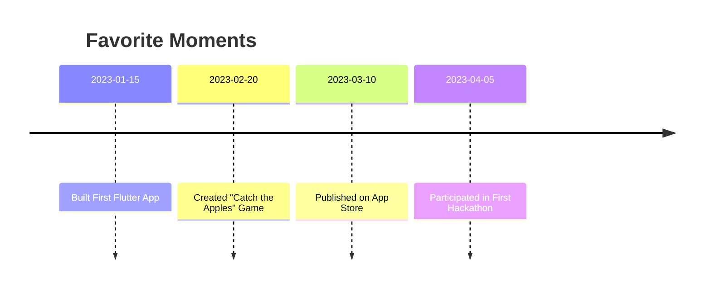

## 12.1.3 Your Favorite Moments

As we reach the end of our coding adventure together, it's time to pause and reflect on the journey you've taken. Coding is not just about writing lines of code; it's about the experiences, the challenges, and the triumphs that make the journey worthwhile. Let's take a moment to celebrate your favorite moments and the milestones you've achieved along the way.

### Memorable Experiences

Think back to the very beginning of your coding journey. Do you remember the excitement of writing your first line of code? Perhaps it was the moment when you saw "Hello, World!" appear on your screen, marking the start of your adventure into the world of programming. These initial steps are often the most thrilling, as they open the door to endless possibilities.

As you progressed, there were likely moments that stood out. Maybe it was the first time you successfully ran an app you built from scratch, or the joy of debugging a tricky error that had you stumped for hours. These experiences are not just about the technical skills you developed but also about the perseverance and problem-solving abilities you honed.

### Fun Projects

Throughout this book, you've worked on various projects, each with its own set of challenges and rewards. Which project did you find the most fun or interesting? Was it the "Catch the Apples" game where you learned about game mechanics and character movement? Or perhaps it was the animated storybook project that allowed your creativity to shine through animations and storytelling.

These projects are more than just exercises; they are opportunities to express yourself and bring your ideas to life. They are a testament to your ability to turn imagination into reality through code.

### Achievements

Every coder has milestones that mark their progress. What achievements are you most proud of? It could be completing a particularly challenging feature, like implementing a complex algorithm or designing a user-friendly interface. Maybe you participated in a hackathon and experienced the thrill of collaborating with others under time constraints.

These achievements are worth celebrating because they demonstrate your growth as a coder. They show that you have the skills and determination to tackle challenges and succeed.

### Timeline of Favorite Moments

Let's visualize your journey with a timeline of your favorite moments. This timeline captures key milestones and memorable experiences that have shaped your coding adventure.

### Interactive Exercise: Create a Scrapbook

To further celebrate your journey, why not create a scrapbook page or digital collage of your favorite coding moments? Include pictures, screenshots, and brief descriptions of each moment. This exercise is not only fun but also a great way to document your progress and reflect on how far you've come.

### Visual Aids

Visual aids can help bring your favorite moments to life. Consider including images of your app successes, team collaborations, and celebrations. These visuals serve as a reminder of the joy and satisfaction that coding can bring.

### Conclusion

Reflecting on your favorite moments is an important part of your coding journey. It allows you to appreciate the hard work and dedication you've put into learning and creating. As you look back on these experiences, remember that each moment, whether big or small, has contributed to your growth as a coder. Celebrate these achievements and use them as motivation to continue exploring and creating in the world of coding.

## Quiz Time!



### What is one of the first memorable experiences in coding?

- [x] Writing your first line of code
- [ ] Debugging a complex algorithm
- [ ] Publishing an app on the App Store
- [ ] Participating in a hackathon

> **Explanation:** Writing your first line of code, such as "Hello, World!", is often a memorable experience as it marks the beginning of your coding journey.

### Which project might be considered fun due to its creative aspect?

- [ ] Building a calculator app
- [x] Creating an animated storybook
- [ ] Developing a to-do list app
- [ ] Designing a quiz app

> **Explanation:** Creating an animated storybook is fun due to the creative aspect of storytelling and animation.

### What is a common achievement for young coders?

- [ ] Writing a novel
- [ ] Painting a masterpiece
- [x] Completing a challenging feature
- [ ] Winning a sports competition

> **Explanation:** Completing a challenging feature in a coding project is a common achievement that demonstrates growth and skill.

### What is the purpose of creating a timeline of favorite moments?

- [ ] To plan future projects
- [x] To visualize key milestones and memorable experiences
- [ ] To list all coding errors encountered
- [ ] To compare with other coders

> **Explanation:** A timeline helps visualize key milestones and memorable experiences, allowing you to reflect on your journey.

### What is an interactive exercise suggested in this section?

- [ ] Writing a new app
- [x] Creating a scrapbook or digital collage
- [ ] Designing a website
- [ ] Coding a new game

> **Explanation:** Creating a scrapbook or digital collage of favorite coding moments is an interactive exercise suggested in this section.

### Why are visual aids important in reflecting on your coding journey?

- [ ] They make the text look colorful
- [ ] They are required for coding
- [x] They help bring favorite moments to life
- [ ] They replace the need for coding

> **Explanation:** Visual aids help bring favorite moments to life, serving as a reminder of the joy and satisfaction coding can bring.

### What is a benefit of reflecting on your favorite coding moments?

- [ ] It helps you forget past challenges
- [ ] It allows you to stop coding
- [x] It helps appreciate your hard work and dedication
- [ ] It makes coding easier

> **Explanation:** Reflecting on favorite moments helps appreciate the hard work and dedication put into learning and creating.

### What is a suggested way to document your coding progress?

- [ ] Writing a diary
- [ ] Recording a podcast
- [x] Creating a scrapbook or digital collage
- [ ] Filming a documentary

> **Explanation:** Creating a scrapbook or digital collage is a suggested way to document coding progress and reflect on achievements.

### What is a key milestone mentioned in the timeline?

- [ ] Writing a book
- [ ] Winning a sports event
- [x] Publishing on the App Store
- [ ] Learning a new language

> **Explanation:** Publishing on the App Store is a key milestone mentioned in the timeline, marking a significant achievement.

### Reflecting on your coding journey helps you:

- [x] Appreciate your growth and achievements
- [ ] Forget about coding
- [ ] Avoid future challenges
- [ ] Stop learning

> **Explanation:** Reflecting on your coding journey helps appreciate your growth and achievements, motivating continued exploration.


