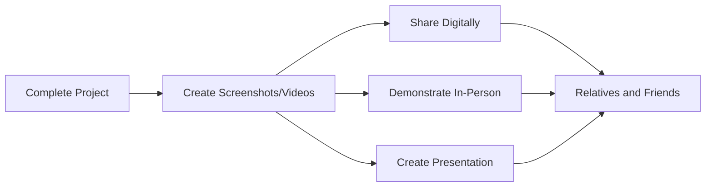

## 12.1.4 Sharing Your Coding Projects with Family and Friends

Congratulations on reaching this exciting stage in your coding journey! You've learned so much, created amazing projects, and now it's time to share your accomplishments with the people who matter most—your family and friends. Sharing your work not only helps others appreciate your efforts but also provides an opportunity to receive valuable feedback and inspire those around you. Let's explore the importance of sharing and discover fun and effective ways to showcase your projects.

### The Importance of Sharing

Sharing your coding projects is a wonderful way to celebrate your achievements and involve your loved ones in your journey. Here are some reasons why sharing is important:

- **Pride and Confidence:** When you share your work, you can take pride in what you've accomplished. It boosts your confidence and motivates you to continue learning and creating.
- **Feedback and Improvement:** Sharing allows you to receive feedback from others, which can help you improve your projects and develop new ideas.
- **Inspiration:** By showcasing your projects, you might inspire others to start their own coding adventures. Your enthusiasm can be contagious!
- **Support and Encouragement:** Sharing with family and friends creates a support network that encourages you to keep going, even when challenges arise.

### Ways to Share Your Projects

There are several creative ways to share your projects with family and friends. Let's explore some of them:

#### Demonstrations

One of the most engaging ways to share your projects is through live demonstrations. You can show your apps or games during family gatherings, playdates, or even virtual meetups. Here's how to make your demonstration effective:

- **Prepare Your Device:** Ensure your app or game is ready to run smoothly on your device. Test it beforehand to avoid any technical glitches.
- **Explain the Basics:** Start by explaining what your project is about and what inspired you to create it.
- **Highlight Key Features:** Focus on the most exciting or unique aspects of your project. Show how it works and what makes it special.
- **Encourage Interaction:** Invite your audience to try out your app or game. This makes the experience more interactive and fun.

#### Digital Sharing

In today's digital age, sharing your projects online is easier than ever. Here are some ways to share digitally:

- **Email or Messaging Apps:** Send links, screenshots, or short videos of your projects to family and friends via email or messaging apps.
- **Social Media:** If you have permission, share your projects on social media platforms. This can reach a wider audience and gather more feedback.
- **Online Portfolios:** Create an online portfolio to showcase your projects. This can be a simple website or a page on a platform like GitHub.

#### Presentations

Creating a presentation is a great way to explain your projects in detail. You can use slides to guide your audience through your coding process and highlight important features. Here's how to create an effective presentation:

- **Organize Your Content:** Plan the structure of your presentation. Start with an introduction, followed by the main features of your project, and conclude with your future plans.
- **Use Visuals:** Include screenshots, diagrams, or videos to make your presentation more engaging.
- **Practice Your Delivery:** Rehearse your presentation to ensure you can explain your project clearly and confidently.

### Sharing Process Diagram

To visualize the sharing process, here's a Mermaid.js diagram that outlines the steps involved in sharing your projects:

### Interactive Exercise: Prepare a Demo or Presentation

Now it's your turn! Choose your favorite project and prepare a short demo or presentation to share with your family or friends. Here are some tips to get started:

- **Select a Project:** Pick a project that you're proud of and excited to share.
- **Plan Your Demo:** Decide whether you'll do a live demonstration or create a presentation.
- **Gather Feedback:** After sharing, ask your audience for feedback. What did they like? What suggestions do they have?

### Tips for Effective Sharing

To make your sharing experience successful, keep these tips in mind:

- **Be Clear and Simple:** Use simple language to explain your project. Avoid technical jargon that might confuse your audience.
- **Highlight Key Features:** Focus on the most interesting parts of your project. What makes it unique or fun to use?
- **Engage the Audience:** Encourage questions and interaction. This makes the experience more enjoyable for everyone involved.

### Visual Aids

Including visual aids can enhance your sharing experience. Here are some ideas:

- **Photos:** Take pictures of yourself presenting your projects or demonstrating them live.
- **Screenshots:** Capture screenshots of your app or game in action to share with others.
- **Videos:** Record short videos of your project to showcase its features and functionality.

By sharing your coding projects with family and friends, you're not only celebrating your achievements but also inspiring others to explore the world of coding. Remember, every project you create is a step forward in your coding journey. Keep learning, keep creating, and most importantly, keep sharing!

## Quiz Time!



### Why is sharing your coding projects with family and friends important?

- [x] It boosts your confidence and motivates you.
- [ ] It makes your projects perfect.
- [ ] It ensures you never make mistakes.
- [ ] It guarantees everyone will love your work.

> **Explanation:** Sharing your projects helps boost your confidence, provides motivation, and allows you to receive feedback for improvement.

### What is one way to share your projects during family gatherings?

- [x] Live demonstrations
- [ ] Hiding your projects
- [ ] Keeping them secret
- [ ] Only sharing with strangers

> **Explanation:** Live demonstrations during family gatherings allow you to showcase your projects in an engaging way.

### How can you share your projects digitally?

- [x] Through email or messaging apps
- [ ] By writing them on paper
- [ ] By telling no one
- [ ] By keeping them offline

> **Explanation:** Sharing digitally through email or messaging apps is an effective way to reach family and friends.

### What should you include in a presentation about your project?

- [x] Screenshots and diagrams
- [ ] Only text
- [ ] No visuals
- [ ] Random images

> **Explanation:** Including screenshots and diagrams makes your presentation more engaging and easier to understand.

### What is a benefit of receiving feedback on your projects?

- [x] It helps you improve your projects.
- [ ] It makes your projects worse.
- [ ] It has no impact.
- [ ] It is always negative.

> **Explanation:** Feedback provides valuable insights that can help you improve your projects and develop new ideas.

### What should you focus on when explaining your project?

- [x] The most exciting features
- [ ] The least interesting parts
- [ ] Only the technical details
- [ ] Everything at once

> **Explanation:** Focusing on the most exciting features keeps your audience engaged and interested.

### How can you make your sharing experience more interactive?

- [x] Encourage questions and interaction
- [ ] Ignore your audience
- [ ] Talk continuously without pause
- [ ] Avoid eye contact

> **Explanation:** Encouraging questions and interaction makes the sharing experience more enjoyable for everyone.

### What is a good way to prepare for a live demonstration?

- [x] Test your app or game beforehand
- [ ] Avoid practicing
- [ ] Make last-minute changes
- [ ] Use an unfamiliar device

> **Explanation:** Testing your app or game beforehand ensures a smooth demonstration without technical issues.

### What should you do after sharing your project?

- [x] Ask for feedback
- [ ] Forget about it
- [ ] Delete your project
- [ ] Keep it a secret

> **Explanation:** Asking for feedback helps you understand what others think and how you can improve.

### True or False: Sharing your projects can inspire others to start coding.

- [x] True
- [ ] False

> **Explanation:** Sharing your projects can inspire others by showing them what is possible with coding.


