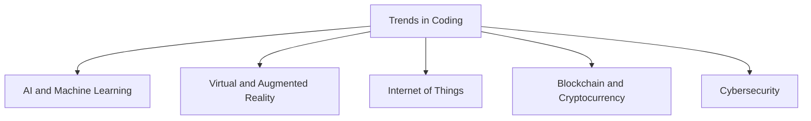

## 12.2.1 Trends in Coding

As we journey through the world of coding, it's important to look ahead and see how technology is evolving. The future holds exciting possibilities, and understanding current trends can inspire you to be part of this technological revolution. Let's explore some of the most exciting trends in coding and technology today!

### Artificial Intelligence (AI) and Machine Learning

Artificial Intelligence, or AI, is like giving computers a brain. It allows machines to learn from data and make decisions, much like humans do. Machine Learning is a part of AI where computers learn from examples and improve over time. 

**Real-World Example:** Have you ever used a voice assistant like Siri or Alexa? These are powered by AI. They learn from your voice commands to provide better responses over time. Another example is recommendation systems on platforms like Netflix or YouTube, which suggest shows or videos based on your viewing history.

**Interactive Exercise:** Imagine you are designing an app that uses AI. What kind of app would it be? How would AI make it smarter? Write a short paragraph about your idea.

### Virtual Reality (VR) and Augmented Reality (AR)

Virtual Reality (VR) creates a completely immersive digital environment, making you feel like you're in another world. Augmented Reality (AR), on the other hand, overlays digital information on the real world, enhancing what you see around you.

**Real-World Example:** VR is used in games like Beat Saber, where you can slash beats in a virtual world. AR is used in apps like Pokémon GO, where digital creatures appear in the real world through your phone's camera.

**Interactive Exercise:** Think about a game or app you love. How could VR or AR make it even more exciting? Describe your vision in a few sentences.

### Internet of Things (IoT)

The Internet of Things (IoT) connects everyday devices to the internet, allowing them to communicate and share data. This can include anything from smart home gadgets to wearable fitness trackers.

**Real-World Example:** Smart home systems like Google Home or Amazon Echo can control lights, thermostats, and even security cameras, all through voice commands or smartphone apps.

**Interactive Exercise:** Imagine your home is filled with IoT devices. What would you automate? Write a short paragraph about how IoT could make your daily life easier.

### Blockchain and Cryptocurrency

Blockchain is a secure way to record transactions across many computers, making it nearly impossible to alter. Cryptocurrency is digital money that uses blockchain technology.

**Real-World Example:** Bitcoin is a popular cryptocurrency that allows people to make transactions without a bank. Blockchain is also used in supply chain management to track products from creation to delivery.

**Interactive Exercise:** How do you think blockchain could change the way we do things in the future? Write a few sentences about your thoughts.

### Cybersecurity

As technology advances, protecting data and systems from digital threats becomes crucial. Cybersecurity involves safeguarding computers, networks, and data from unauthorized access or attacks.

**Real-World Example:** Antivirus software on your computer helps protect against malware and viruses. Companies also use cybersecurity measures to protect sensitive information from hackers.

**Interactive Exercise:** Why do you think cybersecurity is important? Write a short paragraph about how you would protect your personal information online.

### Visualizing Trends in Coding

To help visualize these trends, here's a diagram that shows how they are interconnected:

### Conclusion

The world of coding is constantly evolving, and these trends are just the beginning. By understanding and exploring these technologies, you can be part of creating the future. Whether it's developing smarter apps with AI, designing immersive experiences with VR and AR, or ensuring safety with cybersecurity, the possibilities are endless. Keep learning, stay curious, and who knows? You might just invent the next big thing!

## Quiz Time!



### What is Artificial Intelligence (AI)?

- [x] Technology that allows machines to learn and make decisions
- [ ] A type of virtual reality
- [ ] A programming language
- [ ] A type of cryptocurrency

> **Explanation:** AI is technology that allows machines to learn from data and make decisions, similar to human intelligence.

### What does Virtual Reality (VR) do?

- [x] Creates immersive digital environments
- [ ] Overlays digital information on the real world
- [ ] Connects devices to the internet
- [ ] Records transactions securely

> **Explanation:** VR creates immersive digital environments, making users feel like they are in a different world.

### What is the Internet of Things (IoT)?

- [x] Interconnected devices that communicate and share data
- [ ] A type of AI
- [ ] A virtual reality system
- [ ] A digital currency

> **Explanation:** IoT refers to interconnected devices that communicate and share data, often enhancing everyday objects with internet connectivity.

### What is Blockchain used for?

- [x] Recording transactions securely
- [ ] Creating virtual environments
- [ ] Connecting devices to the internet
- [ ] Enhancing cybersecurity

> **Explanation:** Blockchain is used for recording transactions securely across multiple computers, making it difficult to alter.

### Why is Cybersecurity important?

- [x] To protect data and systems from digital threats
- [ ] To create virtual environments
- [x] To safeguard computers and networks
- [ ] To connect devices to the internet

> **Explanation:** Cybersecurity is crucial for protecting data and systems from unauthorized access and digital threats.

### Which technology is used in smart home systems?

- [x] Internet of Things (IoT)
- [ ] Virtual Reality (VR)
- [ ] Blockchain
- [ ] Cryptocurrency

> **Explanation:** IoT is used in smart home systems to connect and control devices like lights and thermostats.

### What is an example of Augmented Reality (AR)?

- [x] Pokémon GO
- [ ] Bitcoin
- [x] Overlaying digital information on the real world
- [ ] Antivirus software

> **Explanation:** AR overlays digital information on the real world, as seen in games like Pokémon GO.

### What is a real-world application of AI?

- [x] Voice assistants like Siri or Alexa
- [ ] Smart home systems
- [ ] Blockchain transactions
- [ ] Virtual reality games

> **Explanation:** AI powers voice assistants like Siri or Alexa, allowing them to learn from user interactions.

### What is Cryptocurrency?

- [x] Digital money using blockchain technology
- [ ] A type of AI
- [ ] A virtual reality system
- [ ] A cybersecurity measure

> **Explanation:** Cryptocurrency is digital money that uses blockchain technology for secure transactions.

### True or False: Cybersecurity only protects against physical threats.

- [ ] True
- [x] False

> **Explanation:** Cybersecurity protects against digital threats, such as unauthorized access and cyber attacks, not just physical threats.


