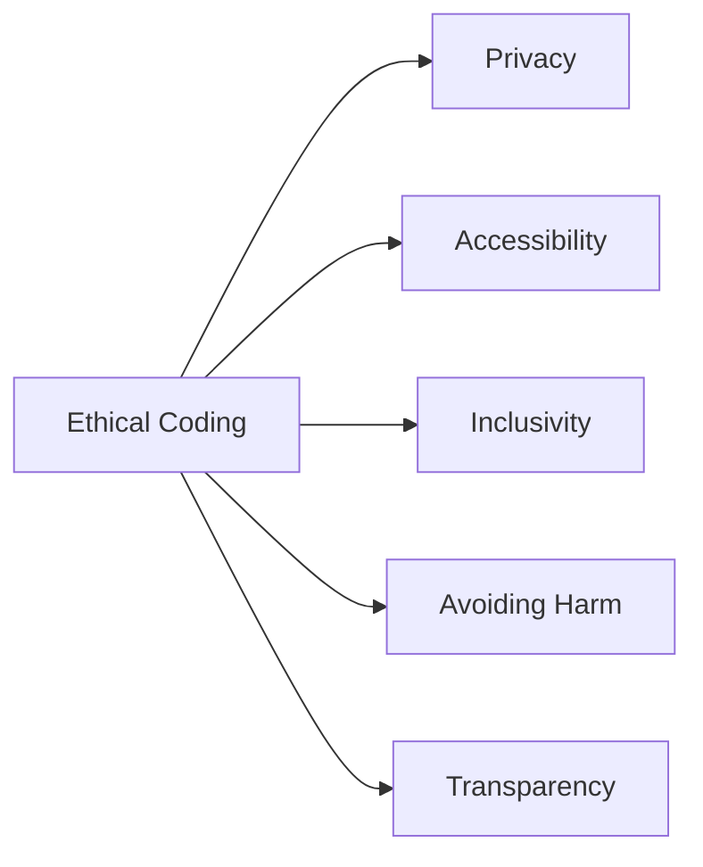

---

linkTitle: "12.2.3 Ethical Coding"
title: "Ethical Coding: Responsibility in Technology"
description: "Explore the principles of ethical coding, emphasizing the responsibility of creating technology that respects users and society."
categories:
- Technology
- Ethics
- Coding
tags:
- Ethical Coding
- Privacy
- Accessibility
- Inclusivity
- Transparency
date: 2024-10-25
type: docs
nav_weight: 12230

---

## 12.2.3 Ethical Coding: Responsibility in Technology

As young coders, you have the power to create amazing apps and games that can change the world. But with this power comes a great responsibility to ensure that your creations are not only fun and useful but also ethical. Ethical coding means writing software that respects users’ rights, promotes fairness, and avoids causing harm. Let's dive into what ethical coding is and why it's so important.

### What is Ethical Coding?

Ethical coding is about making choices that ensure your software is safe, fair, and respectful to everyone who uses it. It involves thinking about how your code affects people and society. Here are some key principles of ethical coding:

#### Key Principles of Ethical Coding

1. **Privacy:** Protecting users' personal information is crucial. This means being transparent about what data you collect and how you use it. Always ask for permission before accessing personal data and ensure that it's stored securely.

2. **Accessibility:** Everyone should be able to use your app, including people with disabilities. This means designing your app to be usable by people with different abilities and providing alternative ways to interact with your app if needed.

3. **Inclusivity:** Your software should respect and represent diverse populations. This means considering different cultures, languages, and perspectives when designing your app.

4. **Avoiding Harm:** Ensure that your app does not promote harmful behavior or spread misinformation. Think about the potential negative impacts of your app and how you can prevent them.

5. **Transparency:** Be honest about what your app does and how it uses data. Users should know exactly what they are agreeing to when they use your app.

Here's a visual representation of these principles:

### Real-World Examples

Let's look at some real-world examples where unethical coding practices led to negative consequences and how they could have been avoided:

- **Data Breaches:** When companies fail to protect user data, it can lead to data breaches where sensitive information is stolen. This can be avoided by implementing strong security measures and regularly updating them.

- **Biased Algorithms:** Sometimes, algorithms can be biased if they are not trained on diverse data sets. This can lead to unfair treatment of certain groups. To avoid this, ensure your data is diverse and test your algorithms for bias.

- **Misinformation:** Apps that spread misinformation can cause harm by misleading users. It's important to verify the information your app provides and correct any false information.

### Interactive Exercise

Let's practice making ethical decisions with a few scenarios. Think about each situation and decide how you would handle it ethically:

1. **Scenario 1:** Your app can track users' location to provide better services. Should you collect users’ location data? Why or why not?

2. **Scenario 2:** You are designing a game that includes characters from different cultures. How can you ensure that your game is inclusive and respectful?

3. **Scenario 3:** Your app collects user feedback to improve its features. How will you ensure that this data is kept private and secure?

### Visual Aids

To help you understand the impact of ethical vs. unethical coding practices, let's look at some illustrations:

- **Ethical Coding:** An app that clearly explains what data it collects and allows users to opt-out of data collection.
- **Unethical Coding:** An app that collects data without user consent and sells it to third parties.

### Conclusion

Ethical coding is an essential part of being a responsible coder. By following these principles, you can create apps that are not only innovative and fun but also safe and fair for everyone. Remember, the choices you make as a coder can have a big impact on the world, so always strive to code ethically.

## Quiz Time!



### What is ethical coding?

- [x] Writing software that respects users' rights and promotes fairness.
- [ ] Writing software that is profitable.
- [ ] Writing software that is complex.
- [ ] Writing software that is popular.

> **Explanation:** Ethical coding involves creating software that respects users' rights, promotes fairness, and avoids causing harm.

### Which principle of ethical coding involves protecting users' personal information?

- [x] Privacy
- [ ] Accessibility
- [ ] Inclusivity
- [ ] Transparency

> **Explanation:** Privacy is about protecting users' personal information and being transparent about data usage.

### Why is accessibility important in ethical coding?

- [x] It ensures apps are usable by everyone, including those with disabilities.
- [ ] It makes apps more profitable.
- [ ] It makes apps more complex.
- [ ] It ensures apps are popular.

> **Explanation:** Accessibility ensures that apps are usable by everyone, including those with disabilities, making them inclusive.

### What does inclusivity in coding mean?

- [x] Creating software that respects and represents diverse populations.
- [ ] Creating software that is profitable.
- [ ] Creating software that is complex.
- [ ] Creating software that is popular.

> **Explanation:** Inclusivity means creating software that respects and represents diverse populations.

### How can you avoid harm in your app?

- [x] Ensure your app does not promote harmful behavior or misinformation.
- [ ] Ensure your app is profitable.
- [ ] Ensure your app is complex.
- [ ] Ensure your app is popular.

> **Explanation:** Avoiding harm means ensuring your app does not promote harmful behavior or misinformation.

### What is transparency in ethical coding?

- [x] Being honest about what the app does and how it uses data.
- [ ] Making the app profitable.
- [ ] Making the app complex.
- [ ] Making the app popular.

> **Explanation:** Transparency involves being honest about what the app does and how it uses data.

### Which of the following is an example of unethical coding?

- [x] Collecting data without user consent.
- [ ] Protecting user data.
- [ ] Designing for accessibility.
- [ ] Being transparent about data usage.

> **Explanation:** Collecting data without user consent is an example of unethical coding.

### How can biased algorithms be avoided?

- [x] Ensure your data is diverse and test your algorithms for bias.
- [ ] Use only one type of data.
- [ ] Avoid testing algorithms.
- [ ] Ignore feedback.

> **Explanation:** Biased algorithms can be avoided by ensuring your data is diverse and testing your algorithms for bias.

### What should you do if your app spreads misinformation?

- [x] Verify the information and correct any false information.
- [ ] Ignore the misinformation.
- [ ] Promote the misinformation.
- [ ] Delete the app.

> **Explanation:** If your app spreads misinformation, you should verify the information and correct any false information.

### Ethical coding is important because:

- [x] It ensures software is safe, fair, and respectful to everyone.
- [ ] It makes software profitable.
- [ ] It makes software complex.
- [ ] It makes software popular.

> **Explanation:** Ethical coding is important because it ensures software is safe, fair, and respectful to everyone.


