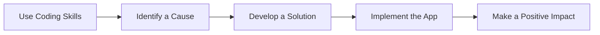

## 12.2.4 Inspiring Change

As you reach the end of your coding journey with this book, it's time to reflect on how you can use your newfound skills to make a difference in the world. Technology is a powerful tool that can be harnessed to address some of the most pressing challenges we face today. Whether it's improving education, promoting environmental sustainability, or enhancing healthcare, your coding skills can be a catalyst for positive change.

### Impact Through Technology

Technology has the potential to transform lives and communities. Here are some ways it can be used for social good:

- **Social Good:** Apps can connect people, provide access to resources, and support community initiatives. For example, platforms that facilitate volunteer work or connect donors with those in need.
- **Environmental Sustainability:** Technology can help monitor environmental changes, reduce waste, and promote sustainable practices. Apps that track carbon footprints or encourage recycling are great examples.
- **Education:** Educational apps can make learning accessible to everyone, regardless of location or economic status. They can provide interactive and personalized learning experiences.
- **Improving Quality of Life:** Health monitoring apps can help individuals manage their health better, while accessibility tools can make technology usable for everyone, including those with disabilities.

### Examples of Tech for Good

Let's look at some inspiring projects that have made a positive impact:

- **Disaster Response Tools:** Apps like "Zello" have been used to coordinate rescue efforts during natural disasters by turning smartphones into walkie-talkies.
- **Educational Apps:** "Khan Academy" provides free, world-class education to anyone, anywhere, using interactive lessons and exercises.
- **Health Monitoring Apps:** "MyFitnessPal" helps users track their diet and exercise, promoting healthier lifestyles.
- **Environmental Conservation Tools:** "iNaturalist" allows users to record and share observations of biodiversity, contributing to scientific research and conservation efforts.

### Encouraging Action

Think about the causes you care about. Is it climate change, education, health, or something else? How can you use your coding skills to support these causes? Here's a simple process to get you started:

### Role Models and Stories

Here are some stories of young coders and organizations that have used technology to drive change:

- **Emma Yang:** At just 12 years old, Emma created "Timeless," an app to help Alzheimer's patients recognize their loved ones using facial recognition technology.
- **Code.org:** This organization aims to expand access to computer science in schools and increase participation by women and underrepresented minorities.
- **Greta Thunberg's Climate Movement:** While not a coder, Greta's use of social media to mobilize millions for climate action shows the power of technology in advocacy.

### Interactive Exercise

Now it's your turn! Choose a cause you're passionate about and outline how you could create an app or tool to support it. Consider the following steps:

1. **Identify the Problem:** What specific issue do you want to address?
2. **Brainstorm Solutions:** How can technology help solve this problem?
3. **Design Your App:** What features will your app have? How will it work?
4. **Plan Implementation:** What steps will you take to build and launch your app?

### Visual Aids

> "The best way to predict the future is to invent it." – Alan Kay

### Conclusion

As you continue your coding journey, remember that your skills have the power to change the world. Whether you build an app that helps your local community or contribute to a global cause, every line of code you write can make a difference. Stay curious, stay motivated, and keep coding for good!

## Quiz Time!



### How can technology be used for social good?

- [x] By connecting people and providing access to resources
- [ ] By creating more video games
- [ ] By increasing screen time
- [ ] By making technology more expensive

> **Explanation:** Technology can be used for social good by connecting people, providing access to resources, and supporting community initiatives.

### Which app helps coordinate rescue efforts during natural disasters?

- [x] Zello
- [ ] Instagram
- [ ] Snapchat
- [ ] TikTok

> **Explanation:** Zello is used to coordinate rescue efforts during natural disasters by turning smartphones into walkie-talkies.

### What is the primary goal of educational apps?

- [x] To make learning accessible to everyone
- [ ] To replace teachers
- [ ] To make learning more difficult
- [ ] To increase school fees

> **Explanation:** Educational apps aim to make learning accessible to everyone, regardless of location or economic status.

### What is "Timeless" designed to help with?

- [x] Alzheimer's patients recognize their loved ones
- [ ] Cooking recipes
- [ ] Playing music
- [ ] Shopping online

> **Explanation:** "Timeless" is an app designed to help Alzheimer's patients recognize their loved ones using facial recognition technology.

### What is the first step in creating an app for a cause you care about?

- [x] Identify the Problem
- [ ] Design the App
- [ ] Plan Implementation
- [ ] Launch the App

> **Explanation:** The first step is to identify the problem you want to address with your app.

### Who is Greta Thunberg?

- [x] A climate activist who uses social media for advocacy
- [ ] A famous coder
- [ ] A video game developer
- [ ] A movie star

> **Explanation:** Greta Thunberg is a climate activist known for using social media to mobilize millions for climate action.

### What does "iNaturalist" help with?

- [x] Recording and sharing observations of biodiversity
- [ ] Streaming movies
- [ ] Shopping online
- [ ] Playing games

> **Explanation:** "iNaturalist" helps users record and share observations of biodiversity, contributing to scientific research and conservation efforts.

### What is the role of Code.org?

- [x] To expand access to computer science in schools
- [ ] To sell computer hardware
- [ ] To create video games
- [ ] To provide internet services

> **Explanation:** Code.org aims to expand access to computer science in schools and increase participation by women and underrepresented minorities.

### What is a key benefit of using technology for environmental sustainability?

- [x] It helps monitor environmental changes and promote sustainable practices
- [ ] It increases pollution
- [ ] It makes technology more expensive
- [ ] It reduces the need for recycling

> **Explanation:** Technology can help monitor environmental changes and promote sustainable practices, contributing to environmental sustainability.

### True or False: Your coding skills can be a catalyst for positive change.

- [x] True
- [ ] False

> **Explanation:** True. Your coding skills can be a catalyst for positive change by addressing challenges and creating solutions that benefit communities and the world.


