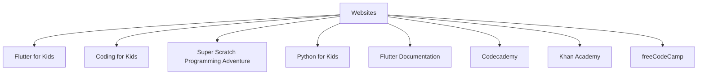

## 12.3.1 Books and Tutorials

As you reach the end of this book, it's important to remember that your coding journey is just beginning. There are countless resources available to help you continue learning and growing as a programmer. In this section, we'll explore some recommended books and online tutorials that can guide you further into the world of coding, particularly with Flutter and other programming languages. Whether you're interested in building more complex apps, exploring new languages, or diving deeper into computer science concepts, there's something here for everyone.

### Recommended Books

Books are a fantastic way to deepen your understanding of coding concepts at your own pace. Here are some highly recommended books that cater to young learners:

#### "Flutter for Kids" by John Smith
This book is a beginner-friendly guide specifically designed for kids who want to learn how to build apps using Flutter. It breaks down complex concepts into simple, easy-to-understand lessons, complete with fun projects that you can build along the way. You'll learn about widgets, layouts, and how to create interactive applications.

#### "Coding for Kids" by Carol Vorderman
"Coding for Kids" offers an introduction to various programming languages and concepts. It's a great starting point for young coders who want to explore different areas of programming. The book includes colorful illustrations and step-by-step instructions that make learning coding fun and engaging.

#### "Super Scratch Programming Adventure" by The LEAD Project
If you're interested in game development and visual programming, this book is perfect for you. "Super Scratch Programming Adventure" uses the Scratch programming language to teach the basics of coding through interactive stories and games. It's a hands-on approach that encourages creativity and problem-solving.

#### "Python for Kids" by Jason R. Briggs
Python is a powerful and versatile programming language, and this book makes it accessible to young learners. "Python for Kids" introduces Python programming through engaging examples and exercises. You'll learn how to write simple programs, create games, and even build your own applications.

### Online Tutorials and Websites

In addition to books, there are numerous online resources that offer interactive tutorials and courses. These platforms provide a hands-on learning experience and allow you to practice coding in real-time.

#### Flutter Documentation
The official Flutter documentation is an invaluable resource for anyone looking to master Flutter. It provides comprehensive guides, tutorials, and API references that cover everything from basic setup to advanced app development techniques. It's a great place to find answers to specific questions and explore new features.

#### Codecademy
Codecademy offers interactive coding lessons on a variety of programming languages, including Dart and Python. The platform's hands-on approach allows you to write code directly in your browser and see the results instantly. It's an excellent way to practice coding and build your skills.

#### Khan Academy
Khan Academy provides free courses on computer programming and web development. Their interactive lessons cover a wide range of topics, from basic HTML and CSS to more advanced JavaScript and SQL. The platform also includes projects and challenges to test your knowledge.

#### freeCodeCamp
freeCodeCamp is a comprehensive platform that offers tutorials and projects for learning web development and more. It features a structured curriculum that guides you through various coding concepts, with plenty of opportunities to apply what you've learned through real-world projects.

### Interactive Exercise

To make the most of these resources, choose one book and one online tutorial to start with. Set a small goal for what you want to learn next, such as building a simple app or mastering a new programming concept. This approach will help you stay focused and motivated as you continue your coding journey.

### Visual Aids

To help you visualize these resources, here's a diagram that maps out the recommended books and websites:

This diagram illustrates the variety of learning paths available to you. Each book and website offers unique insights and opportunities to expand your coding skills.

### Conclusion

Continuing your education in coding is an exciting adventure. With the right resources, you can explore new technologies, develop your skills, and create amazing projects. Remember to take your time, enjoy the process, and don't be afraid to experiment and make mistakes. Every step you take brings you closer to becoming a proficient coder.

## Quiz Time!



### Which book is specifically designed for kids to learn Flutter?

- [x] "Flutter for Kids" by John Smith
- [ ] "Coding for Kids" by Carol Vorderman
- [ ] "Super Scratch Programming Adventure" by The LEAD Project
- [ ] "Python for Kids" by Jason R. Briggs

> **Explanation:** "Flutter for Kids" by John Smith is a beginner-friendly guide to building apps with Flutter, specifically designed for kids.

### What programming language is taught in "Python for Kids"?

- [x] Python
- [ ] Java
- [ ] C++
- [ ] JavaScript

> **Explanation:** "Python for Kids" by Jason R. Briggs introduces Python programming through engaging examples and exercises.

### Which online platform offers interactive coding lessons on Dart and Python?

- [x] Codecademy
- [ ] Khan Academy
- [ ] freeCodeCamp
- [ ] Flutter Documentation

> **Explanation:** Codecademy offers interactive coding lessons on a variety of programming languages, including Dart and Python.

### What is the main focus of "Super Scratch Programming Adventure"?

- [x] Game development and visual programming
- [ ] Web development
- [ ] Data science
- [ ] Mobile app development

> **Explanation:** "Super Scratch Programming Adventure" focuses on game development and visual programming using the Scratch language.

### Which resource provides comprehensive guides and API references for Flutter?

- [x] Flutter Documentation
- [ ] Codecademy
- [ ] Khan Academy
- [ ] freeCodeCamp

> **Explanation:** The official Flutter documentation provides comprehensive guides, tutorials, and API references for Flutter.

### What type of projects can you work on with freeCodeCamp?

- [x] Web development projects
- [ ] Mobile app projects
- [ ] Game development projects
- [ ] Robotics projects

> **Explanation:** freeCodeCamp offers tutorials and projects for learning web development and more.

### Which book offers an introduction to various programming languages and concepts?

- [x] "Coding for Kids" by Carol Vorderman
- [ ] "Flutter for Kids" by John Smith
- [ ] "Super Scratch Programming Adventure" by The LEAD Project
- [ ] "Python for Kids" by Jason R. Briggs

> **Explanation:** "Coding for Kids" by Carol Vorderman offers an introduction to various programming languages and concepts.

### What is the main benefit of using Khan Academy for learning programming?

- [x] Free courses on computer programming and web development
- [ ] Paid courses on advanced programming
- [ ] Certification programs
- [ ] In-person workshops

> **Explanation:** Khan Academy provides free courses on computer programming and web development.

### Which book is suitable for learning programming through interactive stories and games?

- [x] "Super Scratch Programming Adventure" by The LEAD Project
- [ ] "Flutter for Kids" by John Smith
- [ ] "Coding for Kids" by Carol Vorderman
- [ ] "Python for Kids" by Jason R. Briggs

> **Explanation:** "Super Scratch Programming Adventure" uses interactive stories and games to teach programming with Scratch.

### True or False: The diagram provided in this section helps visualize the recommended learning resources.

- [x] True
- [ ] False

> **Explanation:** The diagram helps visualize the recommended books and websites, illustrating the variety of learning paths available.


