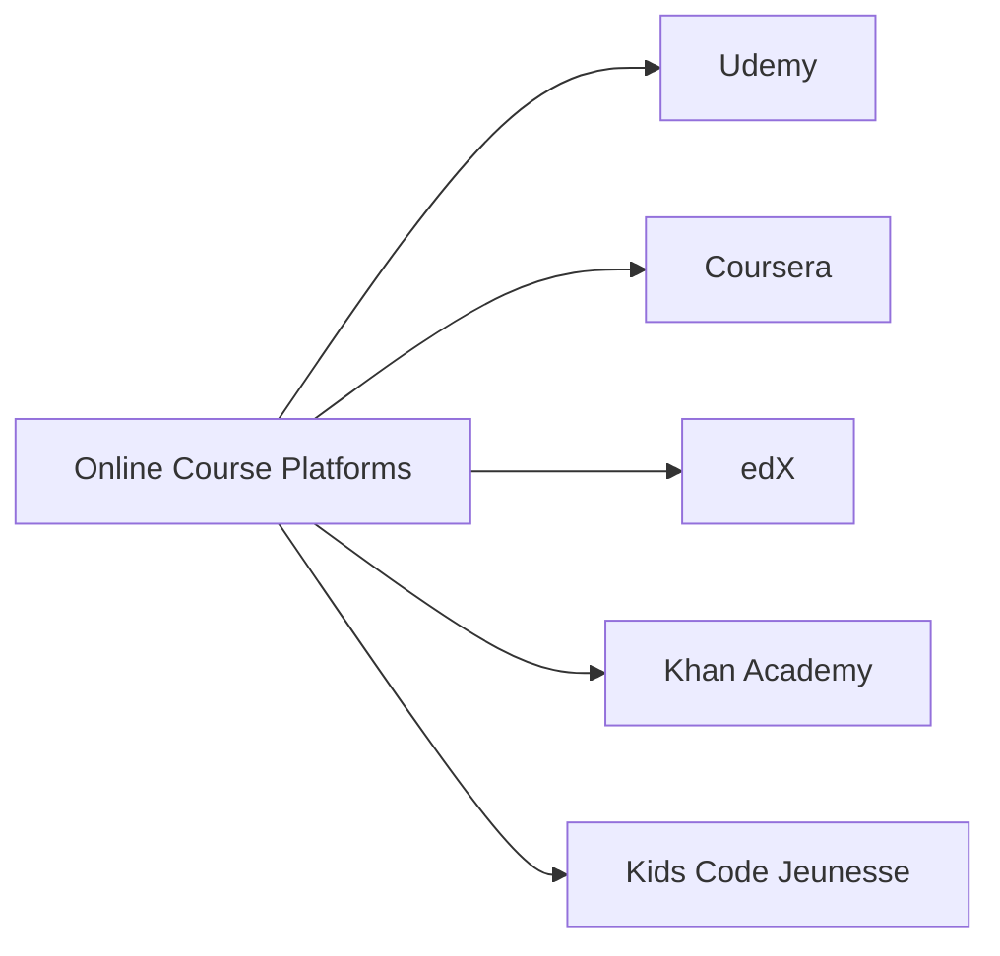

## 12.3.2 Online Courses

As you continue your coding journey, online courses offer a fantastic way to deepen your knowledge and skills. These courses provide structured learning paths that can help you explore new areas of coding, reinforce what you've learned, and even discover new passions. Let's dive into the world of online courses and see how they can benefit you.

### Paid vs. Free Courses

When it comes to online courses, you'll find both paid and free options. Each has its advantages, and the choice depends on your needs and resources.

- **Paid Courses:** These often provide more comprehensive content, including video lectures, quizzes, and projects. They may also offer certificates upon completion, which can be valuable for showcasing your skills. Paid courses often have more up-to-date content and access to instructors for questions and feedback.

- **Free Courses:** These are a great way to start learning without any financial commitment. While they might not be as in-depth as paid courses, they still offer valuable knowledge and can be a good introduction to a new topic. Free courses are perfect for exploring different areas before deciding to invest in a more detailed paid course.

### Popular Platforms for Learning

Several online platforms offer courses specifically designed for young learners interested in coding. Here are some popular ones:

#### Udemy

Udemy is a well-known platform offering a wide range of courses on various topics, including Flutter, Dart, Python, and web development. Courses are often created by industry professionals and come with lifetime access, allowing you to learn at your own pace.

- **Example Course:** "Flutter for Beginners: Build Your First App"
- **Features:** Video lectures, downloadable resources, and a certificate of completion.

#### Coursera

Coursera partners with universities and organizations to provide courses on computer science, artificial intelligence, and more. Many courses are free to audit, with the option to pay for a certificate.

- **Example Course:** "Introduction to Computer Science" by Harvard University
- **Features:** University-level content, peer-reviewed assignments, and community forums.

#### edX

edX offers courses from top universities and institutions worldwide. You can find courses on various programming languages and technologies, often with the option to earn a verified certificate.

- **Example Course:** "CS50's Introduction to Computer Science" by Harvard University
- **Features:** Interactive learning, real-world projects, and expert instructors.

#### Khan Academy

Khan Academy provides free courses on computer programming and web development. It's an excellent resource for young learners, with interactive exercises and a focus on foundational skills.

- **Example Course:** "Intro to JS: Drawing & Animation"
- **Features:** Interactive coding challenges, video tutorials, and progress tracking.

#### Kids Code Jeunesse

Kids Code Jeunesse specializes in courses for young learners, focusing on creativity and problem-solving through coding. Their courses are designed to be fun and engaging, encouraging kids to explore and experiment.

- **Example Course:** "Creative Coding with Scratch"
- **Features:** Project-based learning, community support, and resources for teachers and parents.

### Mermaid.js Course Platform Diagram

To visualize the relationship between these platforms, here's a simple diagram:

### Interactive Exercise

Now that you know about these platforms, it's time for a little exercise! Choose one of the platforms mentioned above, browse through the available courses, and find one that interests you. Enroll in the course and start learning something new. Remember, the goal is to have fun and explore!

### Visual Aids

To help you get started, here are some screenshots of course platforms and sample course pages. These visuals can give you an idea of what to expect when you visit these sites.

- **Udemy Course Page:** A screenshot showing the course title, instructor, and course content.
- **Coursera Course Overview:** A snapshot of the course syllabus and enrollment options.
- **Khan Academy Dashboard:** An image of the interactive coding exercises and progress tracking.

### Testimonials from Young Learners

Hearing from other young learners can be inspiring. Here are a few testimonials from kids who have taken online courses:

- **Emma, Age 12:** "I loved the Flutter course on Udemy! It was easy to follow, and I built my first app in no time."
- **Liam, Age 10:** "Khan Academy's programming lessons are so much fun. I learned how to make animations with JavaScript!"
- **Sophia, Age 13:** "Coursera's computer science course challenged me, but I learned so much about coding and problem-solving."

### Conclusion

Online courses are a powerful tool for learning and growth. Whether you're just starting or looking to expand your skills, there's a course out there for you. Remember to choose courses that match your interests and learning style, and don't be afraid to explore new topics. Happy learning!

## Quiz Time!



### What is one advantage of paid online courses?

- [x] They often provide more comprehensive content and access to instructors.
- [ ] They are always free to access.
- [ ] They require less time commitment.
- [ ] They are only available for advanced learners.

> **Explanation:** Paid courses often offer more comprehensive content, including access to instructors for questions and feedback, which can enhance the learning experience.

### Which platform offers courses from universities and organizations?

- [ ] Udemy
- [x] Coursera
- [ ] Khan Academy
- [ ] Kids Code Jeunesse

> **Explanation:** Coursera partners with universities and organizations to provide courses on various subjects, including computer science.

### What is a feature of Khan Academy's courses?

- [ ] Lifetime access to courses
- [ ] University-level content
- [x] Interactive coding challenges
- [ ] Certificates of completion

> **Explanation:** Khan Academy offers interactive coding challenges, which help learners practice and apply their skills in a hands-on way.

### Which platform is known for offering project-based learning for young learners?

- [ ] Udemy
- [ ] Coursera
- [ ] edX
- [x] Kids Code Jeunesse

> **Explanation:** Kids Code Jeunesse specializes in project-based learning, encouraging creativity and problem-solving through coding.

### What is a common feature of free online courses?

- [ ] They always offer certificates of completion.
- [x] They provide valuable knowledge without financial commitment.
- [ ] They are only available for beginners.
- [ ] They require a subscription.

> **Explanation:** Free courses offer valuable knowledge without requiring a financial commitment, making them accessible to a wide audience.

### Which platform offers a course titled "CS50's Introduction to Computer Science"?

- [ ] Udemy
- [ ] Khan Academy
- [x] edX
- [ ] Kids Code Jeunesse

> **Explanation:** edX offers the course "CS50's Introduction to Computer Science," which is a popular introductory course from Harvard University.

### What should you consider when choosing between paid and free courses?

- [x] Your learning needs and available resources
- [ ] The number of courses available
- [ ] The length of the course
- [ ] The popularity of the platform

> **Explanation:** When choosing between paid and free courses, consider your learning needs and available resources to find the best fit for you.

### Which platform provides courses with peer-reviewed assignments?

- [ ] Udemy
- [x] Coursera
- [ ] Khan Academy
- [ ] Kids Code Jeunesse

> **Explanation:** Coursera courses often include peer-reviewed assignments, allowing learners to receive feedback from their peers.

### What is an advantage of enrolling in an online course?

- [x] Learning at your own pace
- [ ] Limited access to course materials
- [ ] No interaction with instructors
- [ ] Courses are only available during specific times

> **Explanation:** One of the advantages of online courses is the ability to learn at your own pace, allowing flexibility in your learning schedule.

### True or False: All online courses provide certificates upon completion.

- [ ] True
- [x] False

> **Explanation:** Not all online courses provide certificates upon completion. Some courses, especially free ones, may not offer certificates.


